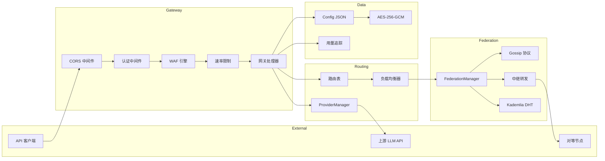
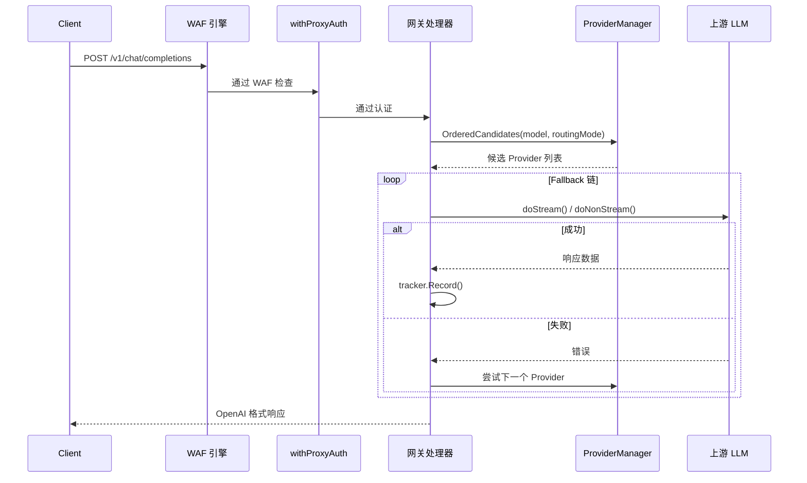
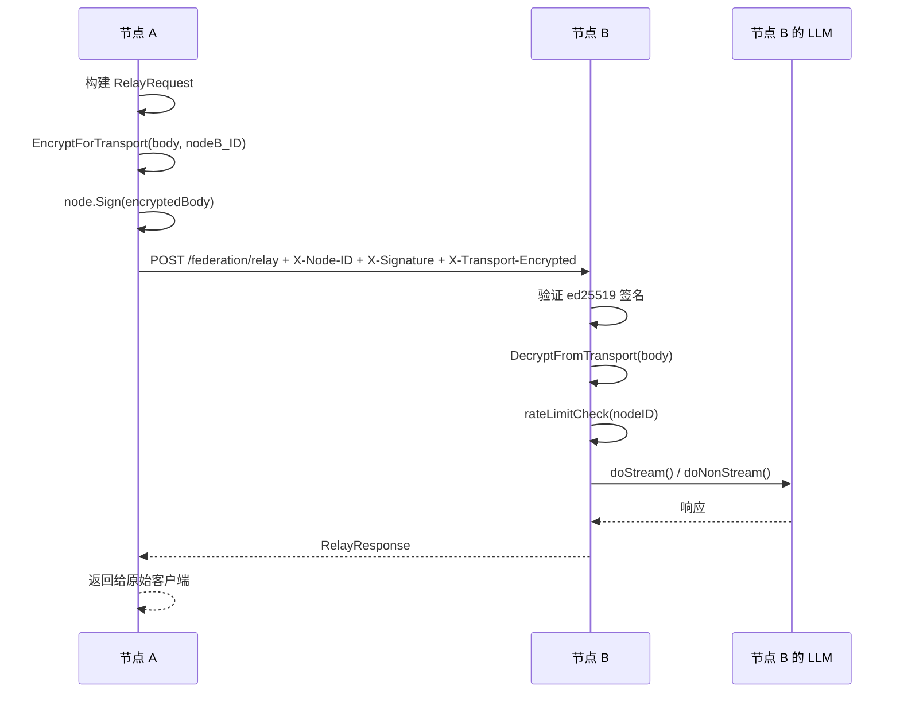

# 系统架构

## 概述

OpenModelPool 是一个去中心化 AI 模型共享池（Decentralized AI Model Sharing Pool），使独立节点能够在对等网络中汇聚、路由和共享 LLM 计算资源。它对外暴露 OpenAI/Anthropic 兼容的 API 接口，内部通过多 Provider 路由、联邦信任池和去中心化中继实现跨节点资源共享。

系统采用 Go 标准库单二进制架构（无外部 Web 框架），所有持久化数据以 JSON 文件存储在 `data/` 目录，加密敏感字段使用 AES-256-GCM，通信层支持 Ed25519 签名认证和传输加密。四层 WAF 引擎保护所有 API 代理路径，动态负载均衡器基于延迟/CPU/内存/错误率/连接数五维评分选择最优节点。

## 技术栈

**语言与运行时**
- Go 1.26

**框架**
- Go 标准库 `net/http`（HTTP 服务器，无第三方 Web 框架）
- Go `embed`（嵌入 HTML/JS 管理界面）
- Go `crypto/ed25519`（节点身份签名）
- Go `crypto/aes` + `crypto/cipher`（AES-256-GCM 加密）

**关键依赖**
- `golang-jwt/jwt/v5` — JWT 认证
- `golang.org/x/crypto` — bcrypt 密码哈希
- `tyler-smith/go-bip39` — BIP39 助记词
- `chromedp` — 浏览器自动化（Web Session 登录）

**数据存储**
- JSON 文件存储（`data/` 目录）
- AES-256-GCM 加密敏感字段
- HMAC-SHA256 数据完整性校验

**外部集成**
- OpenAI / Anthropic / DeepSeek / Qwen / Sider / Coze 等 LLM API
- Cloudflare Tunnel（域名绑定）
- GitHub Releases（版本更新）
- 公共 IPFS 网关（贡献账本镜像）

## 项目结构

```
/workspace/
├── main.go                          # 应用入口
├── init.go                          # 初始化编排
├── server.go                        # HTTP 路由与服务器
├── config.go                        # 持久化配置（debounced JSON）
├── types.go                         # 全局类型定义
│
├── client.go                        # 上游 AI Provider 客户端
├── anthropic_api.go                  # Anthropic API 兼容层
├── provider.go                      # ProviderManager（CRUD + 路由）
├── providers.go                     # 35 个预设 Provider 定义
├── handlers.go                      # HTTP 处理器
├── handlers_missing.go              # 补充处理器
│
├── auth.go                          # JWT 认证 + bcrypt
├── admin.go                         # 管理 API 处理器
├── middleware.go                     # 中间件链
├── waf.go                           # 四层 WAF 引擎
├── ratelimit.go                     # 令牌桶速率限制
├── encryptor.go                     # AES-256-GCM 加密器
│
├── node.go                          # Ed25519 节点身份
├── federation.go                    # 联邦管理器 + 信任池
├── gossip.go                        # P2P Gossip 协议
├── discovery.go                     # GitHub/Seed 节点发现
├── relay.go                         # 去中心化中继
├── transport_encryption.go          # 传输加密（AES-256-GCM）
├── dht_kademlia.go                  # Kademlia DHT 路由表
│
├── network.go                       # P2P 网络管理
├── network_relay.go                 # 网络反向代理中继
├── network_seed.go                  # Seed 节点发现服务
├── network_global_pool.go           # 全局计算池
├── network_loadbalancer.go          # 动态负载均衡器
├── network_balance.go               # 贡献/消费平衡引擎
├── network_region_impl.go           # 地理区域检测
├── network_keys.go                  # 四密钥架构
├── network_quota.go                 # 动态配额计算
│
├── governance.go                    # 多签治理
├── reputation.go                    # 节点声誉评分
├── invite.go                        # 签名邀请链
├── message.go                       # P2P 消息
├── algorithm_chain.go               # 算法治理参数
├── algorithm_governance.go          # 提案/投票
├── genesis.go                       # 创世块（网络锚点）
│
├── tracker.go                       # 用量追踪 + EWMA
├── health.go                        # Provider 健康检查
├── multiuser.go                     # 多用户/Consumer 管理
├── credits.go                       # 配额分配
├── quota_priority.go                # 跨池消费优先级
├── pricing_impl.go                  # 模型定价表
├── token_estimator.go               # Token 估算
│
├── platform_adapter.go              # 协议翻译层（RequestIR）
├── platform_discovery.go            # 平台自动发现
├── ipfs_ledger.go                   # IPFS 账本接口
├── free_pool.go                     # 免费 LLM API 同步
│
├── tunnel.go                        # Cloudflare Tunnel
├── vmess.go                         # VMess 代理管理
├── browser_login.go                 # 浏览器自动化登录
├── update.go                        # 一键版本更新
│
├── conn_tracker.go                  # 连接计数器
├── data_integrity.go                # HMAC 数据完整性
├── embed.go                         # 嵌入式 HTML/JS
├── logger.go                        # 结构化日志
├── metrics.go                       # Prometheus 兼容指标
├── performance.go                   # 性能优化（WorkerPool/内存监控）
├── stubs.go                         # 初始化占位函数
│
├── ledger/                          # 账本子包
│   ├── types.go                     # 贡献/信任/惩罚类型
│   ├── trust_manager.go             # 信任级别管理
│   ├── gossip_ledger.go             # Gossip 账本 + 签名交易链
│   ├── free_ledger.go               # 免费贡献账本
│   ├── capability_verifier.go       # 能力验证
│   └── ipfs_client.go               # IPFS 网关客户端
│
├── docs/                            # 设计文档
└── data/                            # 运行时数据（JSON 持久化）
```

**入口点**
- `main.go` — 应用启动，调用 `initCore()` → `initAllFederation()` → `initAllNetwork()` → `startBackgroundTasks()` → `runServer()`
- `server.go` — HTTP 路由注册和 HTTPS 服务器
- `init.go` — 初始化编排，35+ 单例组件的创建顺序

## 子系统

### API 网关
**目的**: 接收 OpenAI/Anthropic 格式请求，路由到最优 Provider
**位置**: `handlers.go`, `client.go`, `anthropic_api.go`, `server.go`
**关键文件**: `handlers.go`（网关入口）, `client.go`（上游请求）, `provider.go`（路由选择）
**依赖**: Config, ProviderManager, Tracker, WAFEngine, RateLimiter, MultiUserManager
**被依赖**: 所有外部 API 消费者

### 联邦网络
**目的**: 跨节点资源共享、信任传播、中继转发
**位置**: `federation.go`, `gossip.go`, `relay.go`, `discovery.go`, `transport_encryption.go`
**关键文件**: `federation.go`（信任池管理）, `relay.go`（中继处理）, `gossip.go`（P2P 同步）
**依赖**: NodeIdentity, Encryptor, Config
**被依赖**: API 网关（远程 Provider 查找）

### 安全防护
**目的**: 请求认证、速率限制、WAF 防护、传输加密
**位置**: `auth.go`, `waf.go`, `ratelimit.go`, `middleware.go`, `encryptor.go`, `transport_encryption.go`
**关键文件**: `waf.go`（四层 WAF）, `middleware.go`（中间件链）, `auth.go`（JWT/ bcrypt）
**依赖**: Config, Encryptor
**被依赖**: 所有 HTTP 端点

### 数据持久化
**目的**: JSON 文件存储、加密、完整性校验、debounced 写入
**位置**: `config.go`, `encryptor.go`, `data_integrity.go`, `tracker.go`
**关键文件**: `config.go`（持久化配置）, `data_integrity.go`（HMAC 校验）
**依赖**: Encryptor
**被依赖**: 几乎所有组件

### 账本子系统
**目的**: 贡献记录、信任评分、IPFS 镜像、能力验证
**位置**: `ledger/`
**关键文件**: `gossip_ledger.go`（签名交易链）, `trust_manager.go`（信任级别）
**依赖**: 无外部依赖（纯标准库）
**被依赖**: FederationManager, ReputationManager

## 图表

### 系统架构



### Chat Completion 请求流程



### 联邦中继流程


