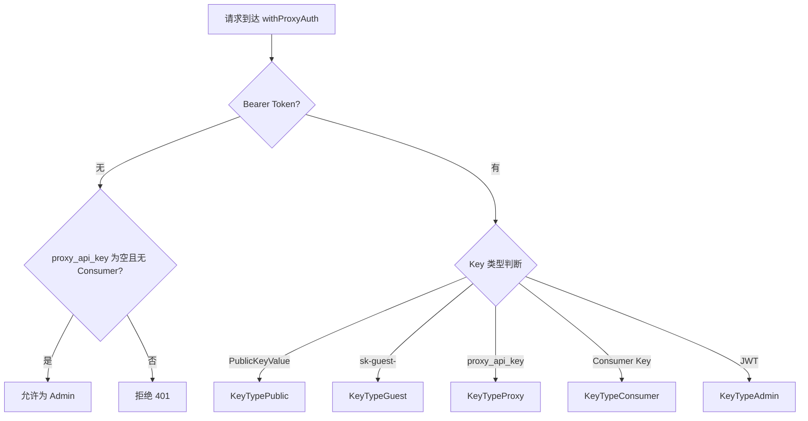

# KeySystem

四密钥架构是 OpenModelPool 的访问控制体系，定义了不同类型 API Key 的权限和配额。

## 什么是 KeySystem？

KeySystem v2.0 定义了四种 API Key 类型，每种类型对应不同的访问范围和配额限制。系统根据 Key 类型决定可访问的 Provider 集合和资源配额。

**关键特征**:
- 4 种 Key 类型：Proxy、Guest、Public、Provider
- 每种类型有独立的配额和访问控制
- Guest Key 有本地配额限制
- Cross-pool 消费优先级：private → shared → remote_shared

## 代码位置

| 方面 | 位置 |
|------|------|
| Key 类型定义 | `network_keys.go` — `KeyType*` 常量 |
| Key 验证 | `network_keys.go` — `ClassifyKey()` |
| Guest Key 管理 | `network_keys.go` — `GuestKeyStore` |
| 配额优先级 | `quota_priority.go` — `quotaPriorityManager` |
| 代理认证 | `middleware.go` — `withProxyAuth()` |

## 四种 Key 类型

| Key 类型 | 前缀 | 来源 | 访问范围 | 配额 |
|----------|------|------|----------|------|
| Proxy | 自定义 | `proxy_api_key` 配置 | 所有 Provider | 无限制 |
| Guest | `sk-guest-` | Admin 创建 | 非私有 Provider | 本地配额限制 |
| Public | 自定义 | `PublicKeyValue` 配置 | 共享池 Provider | 全局配额 |
| Provider | `sk-` | Consumer 注册 | 根据访问控制 | 每日限制 |

## 认证流程

## 关系

| 关联概念 | 关系 | 描述 |
|---------|------|------|
| Provider | 访问控制 | Provider.AccessControl 决定各 Key 类型的访问权限 |
| MultiUser | Consumer Key | 多用户管理器创建和验证 Consumer Key |
| QuotaPriority | 配额优先级 | 跨池消费从私有 → 共享 → 远程共享 |
