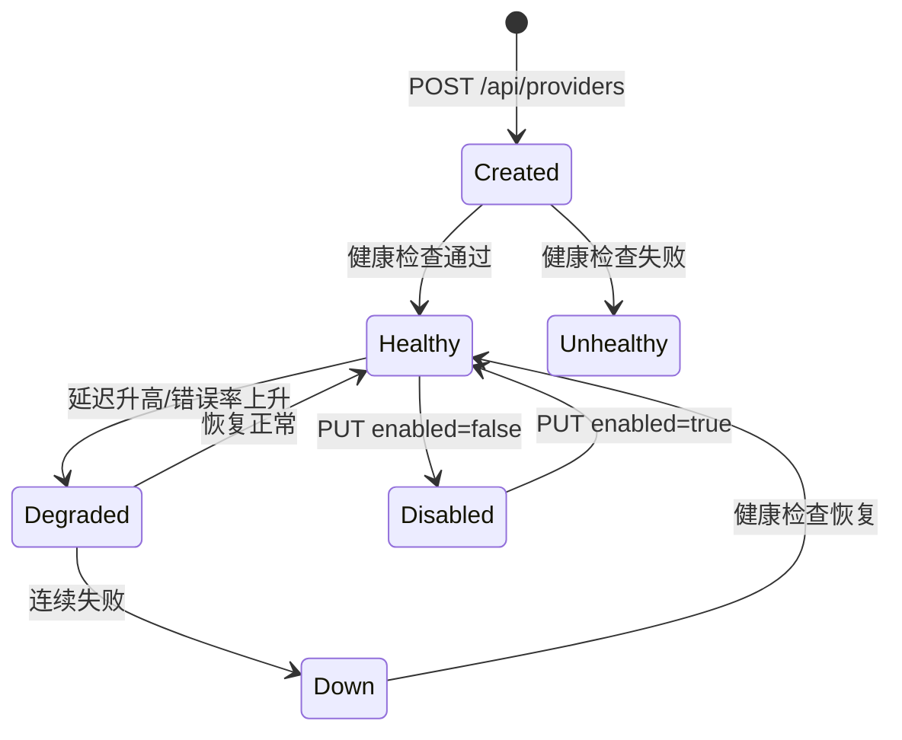

# Provider

Provider 代表一个上游 AI 模型提供者（如 OpenAI、DeepSeek、Anthropic），包含连接配置、模型列表、路由策略和访问控制。

## 什么是 Provider？

Provider 是 OpenModelPool 的核心路由单元。每个 Provider 对应一个上游 LLM API 端点，拥有独立的 API Key、模型列表和优先级配置。系统根据路由模式在多个 Provider 间选择最优候选，失败时自动 Fallback 到下一个。

**关键特征**:
- 支持 5 种类型：`openai_compatible`、`anthropic`、`sider`、`web_session`、`coze`
- 多 API Key 支持（轮询/优先级选择）
- 每日 Token 配额限制
- 访问控制（公开/私有/共享）

## 代码位置

| 方面 | 位置 |
|------|------|
| 类型定义 | `types.go` — `Provider` struct |
| 管理器 | `provider.go` — `ProviderManager` |
| 上游客户端 | `client.go` — `doNonStream()`/`doStream()` |
| 预设定义 | `providers.go` — 35 个预设 |
| 健康检查 | `health.go` — `HealthChecker` |

## 结构

```go
type Provider struct {
    ID, Name, Type, BaseURL, APIKey string
    Enabled bool
    Models []ModelDef
    Priority int
    TokenLimit int64
    RateLimitEnabled bool
    DailyRequestLimit int64
    APIKeys []APIKeyConfig
    WebSession *WebSessionConfig
    Proxy string
    AccessControl ProviderAccessControl
    // ...
}
```

### 路由模式

| 模式 | 排序依据 | 描述 |
|------|----------|------|
| `priority` | Provider.Priority | 数值越小优先级越高 |
| `cheapest` | Input + Output 定价 | 按成本排序 |
| `fastest` | EWMA 延迟 | 按历史延迟排序 |
| `auto` | 加权综合评分 | 0.4*优先级 + 0.25*成本 + 0.2*延迟 + 0.15*剩余配额 |

## 生命周期



## 关系

| 关联概念 | 关系 | 描述 |
|---------|------|------|
| TrustPool | 被共享 | Provider 可标记 ShareToPool 供联邦使用 |
| MultiUser | 被访问 | Consumer 通过 API Key 访问 Provider |
| HealthChecker | 被监控 | 后台定期探测 Provider 可用性 |
