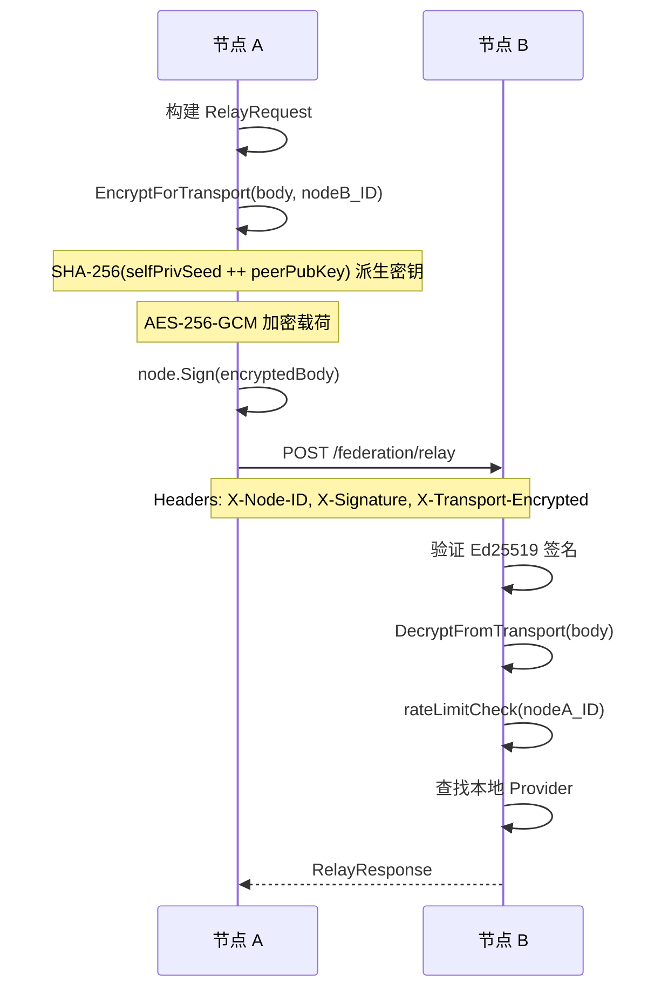

# Relay

Relay 是去中心化中继机制，使请求能够在联邦节点间转发，实现跨节点资源共享。

## 什么是 Relay？

当一个节点无法本地处理某个模型请求时，它可以将请求中继到拥有该模型的信任节点。中继请求经过 Ed25519 签名认证，可选 AES-256-GCM 传输加密，确保中继节点无法读取加密载荷。

**关键特征**:
- 单跳中继（请求方 → 资源方）
- Ed25519 签名验证（防伪造）
- AES-256-GCM 传输加密（中继节点不可见内容）
- 每节点速率限制（60 req/min）
- 签名时间戳防重放（5 分钟窗口）

## 代码位置

| 方面 | 位置 |
|------|------|
| 入站处理 | `relay.go` — `handleRelayRequest()` |
| 出站请求 | `relay.go` — `RelayToRemote()`/`RelayStreamToRemote()` |
| 传输加密 | `transport_encryption.go` — `EncryptForTransport()`/`DecryptFromTransport()` |
| 网络中继 | `network_relay.go` — `handleNetworkRelay()` |
| 速率限制 | `relay.go` — `rateLimitCheck()` |

## 流程

### 出站中继（节点 A → 节点 B）

### 传输加密细节

| 方面 | 描述 |
|------|------|
| 算法 | AES-256-GCM |
| 密钥派生 | SHA-256(senderPrivKey.Seed() ++ receiverPubKey) |
| 线上格式 | TransportEncryptedMessage JSON（encrypted_payload, sender_pub_key, nonce, timestamp） |
| 防重放 | 时间戳窗口 5 分钟 |

## 关系

| 关联概念 | 关系 | 描述 |
|---------|------|------|
| TrustPool | 节点查找 | 中继目标从信任池中选择 |
| NodeIdentity | 签名认证 | 出站签名、入站验证 |
| TransportEncryption | 加密传输 | 可选端到端加密 |
