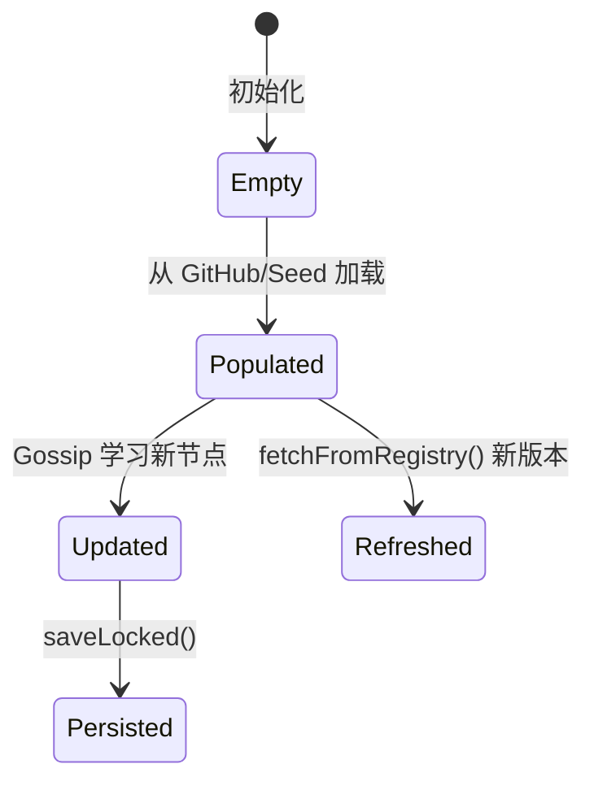

# TrustPool

TrustPool 是联邦网络中节点间的信任关系集合，记录了哪些节点被信任、它们的能力和共享资源。

## 什么是 TrustPool？

TrustPool 代表一个节点所信任的对等节点集合。它通过 GitHub Registry、Seed 节点或 Gossip 协议学习新节点，维护版本号追踪变更，并持久化到本地 JSON 文件。

**关键特征**:
- 版本化追踪（Version 字段，每次变更递增）
- 三种发现来源：GitHub Registry、Seed 节点、Gossip 学习
- HMAC-SHA256 完整性保护持久化文件
- DHT 集成（Kademlia 256-bit 路由表）

## 代码位置

| 方面 | 位置 |
|------|------|
| 类型定义 | `types.go` — `TrustPool` struct |
| 管理器 | `federation.go` — `FederationManager` |
| 发现 | `discovery.go` — `fetchFromRegistry()`/`fetchFromSeedNodes()` |
| 同步 | `gossip.go` — `GossipManager` |
| 持久化 | `federation.go` — `saveLocked()`/`load()` |

## 结构

```go
type TrustPool struct {
    Version   int
    UpdatedAt string
    Registry  string
    Nodes     []NodeInfo
}
```

### NodeInfo 关键字段

| 字段 | 类型 | 描述 |
|------|------|------|
| `NodeID` | string | `mmx-` 前缀节点标识 |
| `Endpoint` | string | 节点 API 地址 |
| `PubKey` | string | Ed25519 公钥（base64） |
| `SharedModels` | []string | 该节点共享的模型列表 |
| `SharedProviders` | []SharedProvider | 该节点共享的 Provider 列表 |
| `Reputation` | int | 声誉评分 |
| `Status` | string | online/offline |

## 不变量

1. **NodeID 前缀**: 所有 NodeID 必须以 `mmx-` 开头
2. **版本单调递增**: 每次变更 Version 必须递增
3. **无重复 NodeID**: 池中不存在相同 NodeID 的节点

## 生命周期



## 关系

| 关联概念 | 关系 | 描述 |
|---------|------|------|
| FederationManager | 被管理 | FederationManager 持有 TrustPool |
| GossipManager | 同步来源 | Gossip 协议传播新节点 |
| Relay | 路由依据 | 中继请求查找 TrustPool 中的节点 |
| DHT | 索引加速 | Kademlia DHT 加速节点查找 |
