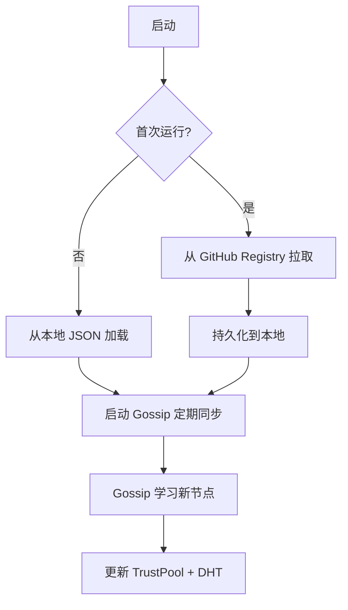

# 联邦网络

P2P 联邦子系统，使节点能够发现、信任和共享资源。

## 结构

```
联邦网络/
├── federation.go             # FederationManager（信任池 + DHT + 中继）
├── gossip.go                 # GossipManager（P2P 状态同步）
├── discovery.go              # GitHub Registry + Seed 节点发现
├── relay.go                  # 去中心化中继处理
├── network_relay.go          # 网络反向代理中继
├── transport_encryption.go   # 传输加密（AES-256-GCM）
├── dht_kademlia.go           # Kademlia 256-bit DHT
├── node.go                   # NodeIdentity（Ed25519 + BIP39）
├── governance.go             # 多签治理
├── invite.go                 # 签名邀请链
├── message.go                # P2P 消息
├── reputation.go             # 节点声誉
└── genesis.go                # 创世块
```

## 关键文件

| 文件 | 目的 |
|------|------|
| `federation.go` | 核心管理器：信任池 CRUD、认证中间件 `withFederationAuth`、DHT 集成 |
| `relay.go` | 中继入口/出口：签名验证、速率限制、传输加密/解密 |
| `gossip.go` | 定期同步：全量池交换、增量通告、PEX 对等提示 |
| `node.go` | 身份管理：Ed25519 签名、BIP39 助记词、公钥导出 |

## 认证中间件

`withFederationAuth` 支持三种认证路径（按优先级）：

1. **节点身份**: `X-Node-ID` + `X-Node-Signature` + `X-Node-Timestamp`（Ed25519 签名，5 分钟窗口）
2. **JWT Token**: `Authorization: Bearer <jwt>`（标准管理员认证）
3. **联邦密钥**: `X-Federation-Secret`（P2P 共享密钥）

例外：`GET /federation/pool` 对可信 Seed 节点跳过认证。

## 节点发现流程



## 依赖

**本模块依赖**:
- `encryptor.go` — 传输加密密钥派生
- `config.go` — 联邦配置
- `node.go` — Ed25519 身份

**依赖本模块的**:
- `handlers.go` — 网关通过中继查找远程 Provider
- `admin.go` — 联邦管理 API
