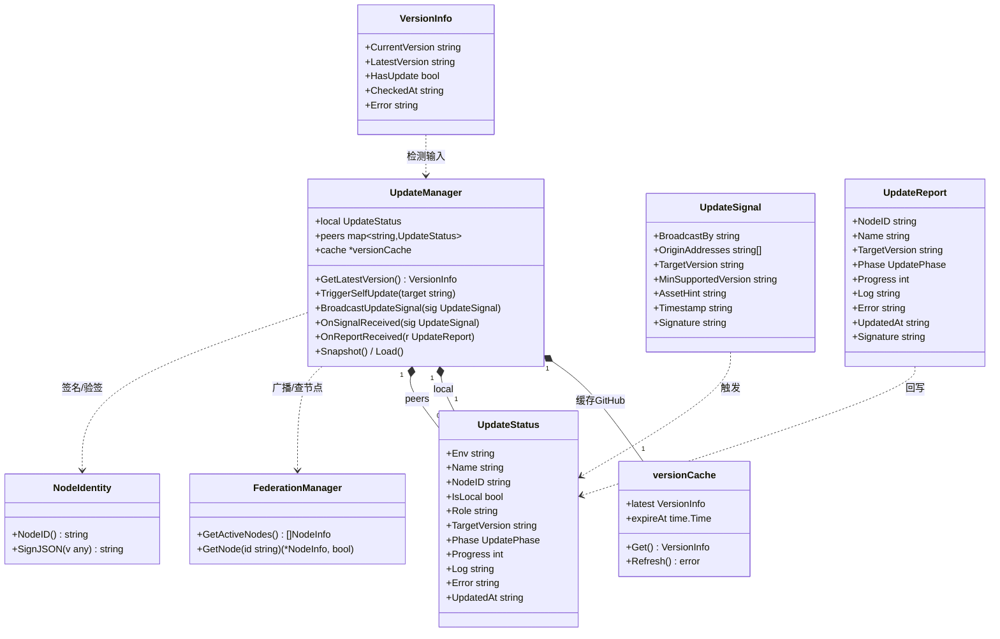
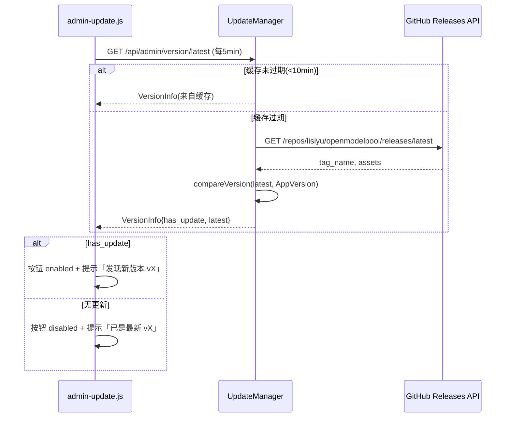
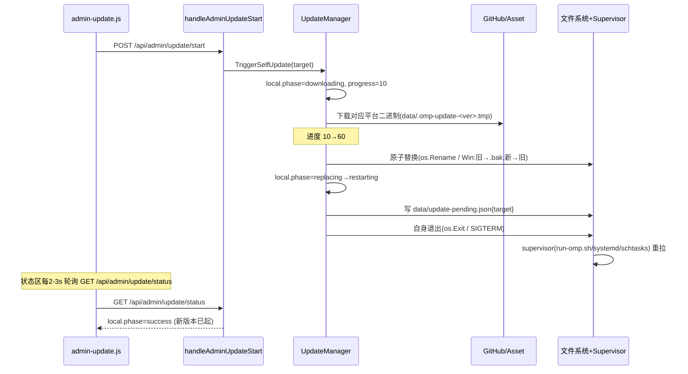
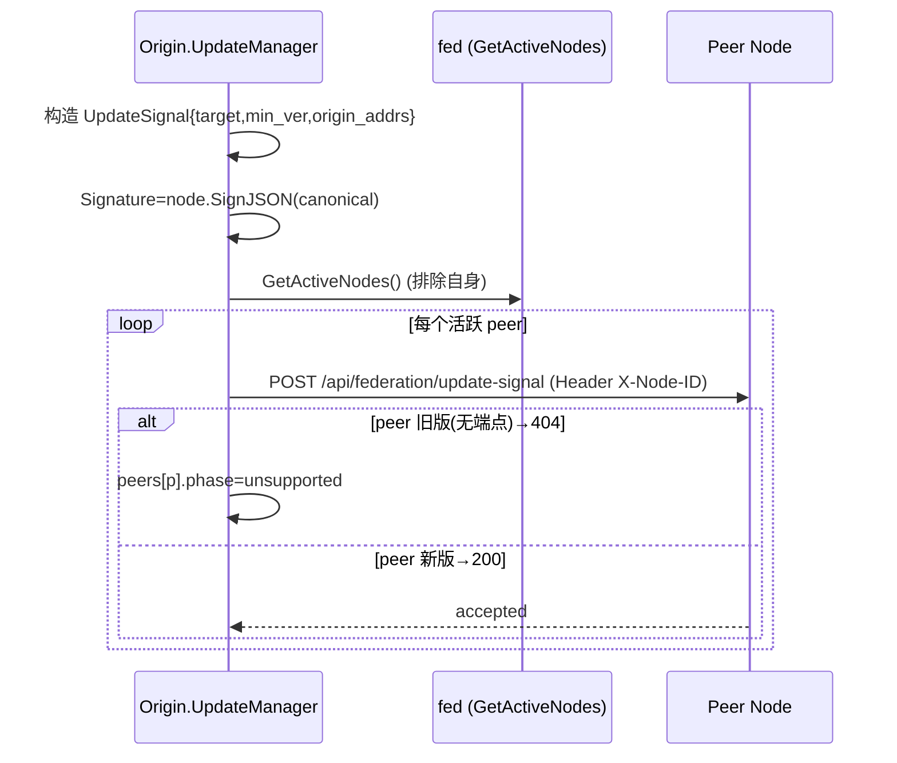
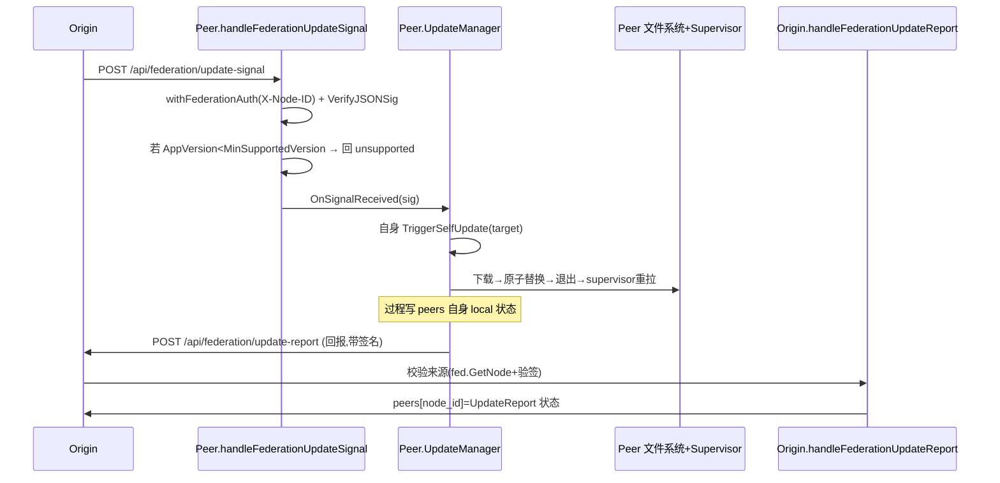
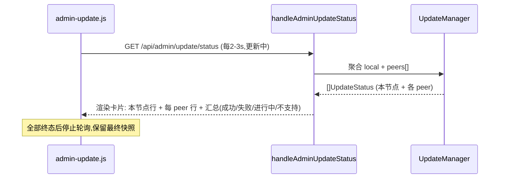
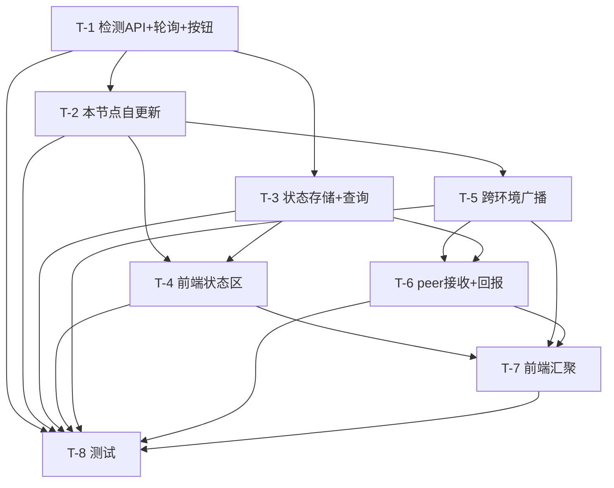

# ARCH：OpenModelPool 管理员页面「一键更新版本」增量设计文档

> 角色：架构师 高见远（Bob）｜类型：增量架构 + 任务分解（仅设计，不含实现代码）
> 基线：PRD-auto-update.md（许清楚，已确认）｜代码基线：omp_clone @ AppVersion 4.1.7
> 目标形态：在 `admin.html`「提交 PR」按钮之后，新增「🔄 版本更新」卡片，提供
> ① 新版本检测＋按钮三态、② 点击本节点一键自更新、③ 本节点状态实时反馈、
> ④（P1）跨环境广播更新信号、⑤（P1）peer 自更新回报、⑥（P1）中心汇聚展示。

---

## 0. 结论摘要（先给结论）

- **前端**：沿用原生 JS（不引框架）。新增 `admin-update.js`（嵌入二进制），在 `admin.html` 第 859 行后插入独立卡片，按钮态由「检测轮询」驱动。
- **后端**：Go，复用现有 `setupRoutes()` 注册 + `withAuth` / `withFederationAuth` 鉴权风格。核心逻辑集中在新文件 `update.go`（`UpdateManager`）。
- **版本检测**：新增 `GET /api/admin/version/latest`，后端用 **GitHub Releases 公开 API** + **10min 内存缓存** + 复用 `GetSharedHTTPClient()`；前端每 **5min** 轮询一次，规避 GitHub 60/min 限流。
- **本节点自更新**：`POST /api/admin/update/start` → 下载对应平台二进制到临时文件 → **原子替换**（`os.Rename`，Windows 先备 `.bak` 再换名）→ 记录 `data/update-pending.json` → 向自身发退出信号，**交由既有 supervisor（run-omp.sh / systemd / omp-manager.ps1 计划任务）重拉**。原子替换保证旧版始终可运行（Q3 不自动回滚）。
- **跨环境（P1）**：复用联邦通道。`POST /api/federation/update-signal`（包 `withFederationAuth` + `node.SignJSON` 签名）向 `fed.GetActiveNodes()` 广播；peer 收到后执行自身自更新，再 `POST /api/federation/update-report` 回报给源节点（Q1 仅活跃节点，Q5 复用联邦身份验签，Q4 旧版 404→标记「不支持」）。
- **状态存储**：`UpdateManager`（内存 `sync.Map` + 持久化快照 `data/update_status.json`）。本节点自更新会重启进程，持久化保证 peer 回报不丢失；中心 `GET /api/admin/update/status` 聚合「本节点 + 各 peer」。
- **依赖**：**无新增第三方包**。仅用 Go 标准库 + 既有内部函数（`GetSharedHTTPClient`、`node.SignJSON`、`VerifyJSONSig`、`saveWithIntegrity/loadWithIntegrity`、`fed.GetActiveNodes`、`fed.GetNode`）。

---

## 1. 实现方案 + 框架选型

### 1.1 技术难点与对策

| 难点 | 对策 |
|---|---|
| GitHub API rate limit（未认证 60 次/min） | 后端缓存 GitHub 响应 **10min**，前端轮询间隔 **5min**，复用单例 `GetSharedHTTPClient()`；可带 `If-Modified-Since`/`ETag` 进一步减流 |
| 跨平台二进制下载与「原子替换」 | 下载到 `data/.omp-update-<ver>.tmp`，校验（可选 SHA256）后 `os.Rename` 覆盖；Windows 无法 rename 运行中的 exe → 先 `rename 旧→.bak` 再 `新→旧` |
| 重启自身且不丢端口 / 不被 fallback 抢 8000（run-omp.sh 坑） | 不自杀式 `exec`；改为**原子替换后退出当前进程**，由 supervisor（run-omp.sh `while true` / systemd `Restart=always` / Windows 计划任务 `RestartCount 999`）自动重拉。进程退出→重拉间隔（秒级）远小于 run-omp.sh fallback 的 5s 复检窗口，且 fallback 仅在 8000 空闲时才起，风险可控。持久化 `update-pending.json` 让重启后自我核对版本 |
| 跨环境更新的鉴权与防伪造（Q5） | 复用 v4.1.7 联邦身份：`withFederationAuth`（X-Node-ID 命中 trust pool）+ payload `node.SignJSON` 签名、`VerifyJSONSig(发送者.PubKey)` 校验。不引新密钥、不裸奔 |
| 旧版 peer 兼容（Q4） | 更新信号带 `MinSupportedVersion`；旧版无该端点→404→中心标记「不支持/跳过」；新版本 peer 若 `AppVersion < MinSupportedVersion` 也主动回 `unsupported`。绝不卡死 |
| 自更新重启导致内存状态丢失 | `UpdateManager` 状态**持久化**到 `data/update_status.json`（复用 `saveWithIntegrity/loadWithIntegrity`），进程重启后重建；peer 回报在重启后继续累积 |

### 1.2 架构模式与选型

- **前端**：原生 JS（与 `admin-network.js` 一致），`<script src="/admin-update.js">` 注入；轮询驱动按钮三态；更新进行中切换为「状态区轮询」（~2-3s）。
- **后端**：单体 Go HTTP 服务，延续现有 handler / `setupRoutes()` 风格。新增 `update.go` 承载领域逻辑，避免污染 `admin.go` / `federation.go`。
- **跨环境通道**：**不复用 gossip 信任池同步协议**（避免污染 discovery / trust-pool），而是新增独立的联邦端点（`/api/federation/update-signal`、`/api/federation/update-report`），复用 `withFederationAuth` 与 `fed` 的节点查询/验签能力——与 `handleFederationAnnounce` 同构。
- **状态实时性**：采用**前端轮询**而非新增 SSE（与 `admin-network.js` 的 `setInterval` 轮询一致，降低改动面）。`P0-3` 的「实时刷新」即状态区每 2-3s 拉一次 `GET /api/admin/update/status`。

---

## 2. 文件列表（增量新增 / 修改）

| 文件 | 操作 | 说明 |
|---|---|---|
| `ARCH-auto-update.md` | 新增 | 本文档 |
| `admin.html` | 修改 | 第 859 行（`提交 PR` 链接块结束）之后插入「🔄 版本更新」独立卡片；在 `</body>` 前增加 `<script src="/admin-update.js"></script>` |
| `admin-update.js` | **新增** | 前端逻辑：5min 轮询检测、按钮三态切换、点击触发、状态区渲染（本节点 + peer 汇聚） |
| `embed.go` | 修改 | `//go:embed` 指令追加 `admin-update.js`（否则二进制不含该文件） |
| `admin.go` | 修改 | 新增 `handleAdminUpdateJS(w, r)` → `serveEmbeddedJS(w, r, "admin-update.js")` |
| `server.go` | 修改 | `setupRoutes()` 注册 5 条新路由（见 §3.2） |
| `update.go` | **新增** | 核心：`UpdateManager`、`CheckLatestVersion`（GitHub+缓存）、`compareVersion`、`TriggerSelfUpdate`、`BroadcastUpdateSignal`、`HandleUpdateSignal`、`HandleUpdateReport`、持久化 |
| `federation.go` | 轻改（可选） | 将 `BroadcastUpdateSignal` 与接收分发放在 `update.go` 亦可；若按「广播助手集中」惯例，可在此新增 `broadcastUpdateSignal`（调用 `fed.GetActiveNodes`、`node.SignJSON`）。**推荐放 `update.go`，federation.go 仅复用 `fed` API，不改亦可** |
| `network.go` | 不改（推荐） | 跨环境走联邦端点，不触碰 notify 机制；如坚持复用 notify 机制才需改（不推荐） |
| `main.go` | 参考/微调 | `AppVersion` 已是唯一当前版本来源（无需新导出）；建议新增常量 `MinSupportedUpdateVersion = "4.1.7"` 用于能力协商（Q4） |
| `data/update_status.json` | 运行时生成 | `UpdateManager` 状态快照（持久化，重启保活） |
| `data/update-pending.json` | 运行时生成 | 待重启目标版本标记，启动自核对 |

> 说明：所有新增 `.go` 均为 `package main`，直接复用全局单例 `fed`、`netMgr`、`node`、`cfg` 与既有辅助函数（`writeJSON`/`readJSON`/`writeError`/`GetSharedHTTPClient`/`saveWithIntegrity`/`loadWithIntegrity`）。

---

## 3. 数据结构和接口

### 3.1 数据结构（Go struct + JSON Schema）

```go
// 版本检测结果（GET /api/admin/version/latest）
type VersionInfo struct {
    CurrentVersion string `json:"current_version"` // 如 "4.1.7"
    LatestVersion  string `json:"latest_version"`  // 如 "4.2.0"
    HasUpdate      bool   `json:"has_update"`
    CheckedAt      string `json:"checked_at"`      // RFC3339 UTC
    Error          string `json:"error,omitempty"` // 检测失败原因
}

// 更新阶段（状态机）
// idle | downloading | replacing | restarting | success | failed | unsupported | needs_manual_restart
type UpdatePhase string

// 单个环境（本节点或某 peer）的更新状态
type UpdateStatus struct {
    Env           string      `json:"env"`             // "local" 或 node_id
    Name          string      `json:"name"`            // 展示名（本机名 / peer 名）
    NodeID        string      `json:"node_id,omitempty"`
    IsLocal       bool        `json:"is_local"`
    Role          string      `json:"role"`            // "origin" | "peer"
    TargetVersion string      `json:"target_version"`
    Phase         UpdatePhase `json:"phase"`
    Progress      int         `json:"progress"`        // 0-100
    Log           string      `json:"log"`             // 进度/日志摘要
    Error         string      `json:"error,omitempty"`
    UpdatedAt     string      `json:"updated_at"`      // RFC3339
}

// 跨环境更新信号（origin → peer）
type UpdateSignal struct {
    BroadcastBy         string   `json:"broadcast_by"`          // 源节点 NodeID
    OriginAddresses     []string `json:"origin_addresses"`      // 用于 report-back
    TargetVersion       string   `json:"target_version"`
    MinSupportedVersion string   `json:"min_supported_version"` // Q4 能力协商
    AssetHint           string   `json:"asset_hint,omitempty"`  // 可选：预解析的下载名提示
    Timestamp           string   `json:"timestamp"`             // RFC3339（防重放）
    Signature           string   `json:"signature"`            // node.SignJSON(canonical)
}

// peer → origin 回报
type UpdateReport struct {
    NodeID        string      `json:"node_id"`
    Name          string      `json:"name"`
    TargetVersion string      `json:"target_version"`
    Phase         UpdatePhase `json:"phase"`
    Progress      int         `json:"progress"`
    Log           string      `json:"log"`
    Error         string      `json:"error,omitempty"`
    UpdatedAt     string      `json:"updated_at"`
    Signature     string      `json:"signature"`
}

// 更新管理器（单例）
type UpdateManager struct {
    mu     sync.RWMutex
    local  UpdateStatus
    peers  map[string]UpdateStatus // node_id -> status
    cache  *versionCache           // GitHub 响应缓存
}
```

**JSON Schema 要点（校验用）**
- `VersionInfo.has_update = compareVersion(latest, current) > 0`
- `UpdateStatus.phase` 取值受限枚举；`progress ∈ [0,100]`
- `UpdateSignal.signature` 为对规范化串 `BroadcastBy|TargetVersion|MinSupportedVersion|Timestamp` 的 ed25519 签名（与 `handleNetworkPeersNotify` 的 `canonical` 思路一致）

### 3.2 接口 / API 清单

| 方法 & 路径 | 鉴权 | Handler | 说明 |
|---|---|---|---|
| `GET /api/admin/version/latest` | `withAuth` | `handleAdminVersionLatest` | 返回 `VersionInfo`（读缓存，必要时查 GitHub） |
| `POST /api/admin/update/start` | `withAuth` + `rateLimitByIP(3,"update_start")` | `handleAdminUpdateStart` | 触发**本节点自更新**并**广播信号**给活跃 peer；异步执行，立即返回 `{accepted:true, target}` |
| `GET /api/admin/update/status` | `withAuth` | `handleAdminUpdateStatus` | 返回 `[]UpdateStatus`（本节点 + 各 peer 汇聚） |
| `POST /api/federation/update-signal` | `withFederationAuth` + `rateLimitByIP(30,"update_signal")` | `handleFederationUpdateSignal` | peer 收到更新信号→执行自身自更新→回报 |
| `POST /api/federation/update-report` | `withFederationAuth` + `rateLimitByIP(30,"update_report")` | `handleFederationUpdateReport` | peer 把结果回报给 origin，origin 写入 `peers` 状态 |
| `GET /admin-update.js` | 公开 | `handleAdminUpdateJS` | 返回嵌入的 `admin-update.js` |

> `handleAdminUpdateStart` 内部顺序：① 写 `local` 状态 `downloading`；② `BroadcastUpdateSignal` 异步下发；③ `TriggerSelfUpdate`（下载→替换→退出由 supervisor 重拉）。自更新在独立 goroutine，HTTP 立即返回。

### 3.3 类图（Mermaid）



---

## 4. 程序调用流程（时序图）

### ① 前端轮询检测（P0-1）



### ② 点击触发本节点自更新（P0-2 / P0-3）



### ③ 跨环境广播更新信号（P1-1）



### ④ peer 接收并自更新 + 回报（P1-2）



### ⑤ 中心状态汇聚查询（P1-3）



---

## 5. 依赖包列表

**无新增第三方依赖。**

- 后端：仅 Go 标准库（`net/http`、`os`、`io`、`encoding/json`、`crypto/sha256`、`path/filepath`、`sync`、`time`）+ 既有内部函数：
  - `GetSharedHTTPClient()`（gossip.go，复用 HTTP 客户端/超时）
  - `node.NodeID()` / `node.SignJSON()`（联邦身份签名）
  - `VerifyJSONSig(pubKey, payload, sig)`（gossip.go，验签，同 `handleFederationAnnounce`）
  - `fed.GetActiveNodes()` / `fed.GetNode(id)`（federation.go，节点查询）
  - `saveWithIntegrity()` / `loadWithIntegrity()`（持久化，同 federation_pool.json）
  - `writeJSON` / `readJSON` / `writeError`（既有响应辅助）
- 前端：原生 JS，无框架、无构建步骤（与现有 admin-*.js 一致）。

---

## 6. 任务列表（T-1 ~ T-8，按实现顺序 + 依赖）

| ID | 任务 | 涉及文件（增量） | 依赖 | 优先级 |
|---|---|---|---|---|
| **T-1** | **版本检测 API + 前端轮询 + 按钮三态**（P0-1） | `update.go`(CheckLatestVersion/versionCache/compareVersion)、`server.go`(路由)、`admin.go`(handler)、`embed.go`(嵌入)、`admin.html`(卡片+脚本)、`admin-update.js`(轮询+按钮) | 无 | P0 |
| **T-2** | **本节点自更新执行**（下载→原子替换→退出→supervisor 重拉，复用脚本/supervisor；写 pending + 本地状态） | `update.go`(TriggerSelfUpdate)、`main.go`(MinSupportedUpdateVersion)、`scripts`(不改，复用 run-omp.sh/omp-manager.ps1) | T-1 | P0 |
| **T-3** | **更新状态存储 + 查询 API**（`UpdateManager` 内存+持久化；`GET /api/admin/update/status`） | `update.go`(UpdateManager/Snapshot/Load)、`server.go`、`admin.go` | T-1 | P0 |
| **T-4** | **前端状态区渲染（本节点）**（展开状态区、徽标、进度/日志、2-3s 轮询） | `admin.html`(状态区容器)、`admin-update.js`(渲染逻辑) | T-2, T-3 | P0 |
| **T-5** | **跨环境广播更新信号**（联邦端点 + 广播函数 + 能力协商） | `update.go`(BroadcastUpdateSignal/HandleUpdateSignal)、`server.go`、`federation.go`(可选)、`main.go` | T-2 | P1 |
| **T-6** | **peer 接收自更新 + 回报**（接收信号→自更新→report-back；旧版→unsupported） | `update.go`(HandleUpdateSignal/HandleUpdateReport)、`server.go`、`admin.go` | T-2, T-3, T-5 | P1 |
| **T-7** | **前端汇聚展示（本节点 + 各 peer）**（汇总行、peer 行、重试入口预留） | `admin.html`、`admin-update.js` | T-4, T-5, T-6 | P1 |
| **T-8** | **测试**（单元 + 集成：版本比较、原子替换、失败路径、旧版 peer 404→unsupported、重启后状态保活） | `update_test.go`、`server` 集成测试、手动联调脚本 | T-1..T-7 | P0/P1 |

> 依赖图（Mermaid）：



> P2（失败重试/回滚提示 P2-1、更新历史 P2-2、企微/邮件通知 P2-3）不在 T-1~T-8 范围，作为后续 LOOP 迭代；其中更新历史可直接复用 T-3 的持久化基础（追加 `data/update_history.jsonl`）。

---

## 7. 共享知识（跨文件约定）

1. **版本比较函数（唯一实现点）**
   `compareVersion(a, b string) int`（在 `update.go`）：去掉前缀 `v`，按 `.` 分段整数比较，短版本补 0（如 `4.1` < `4.1.7`）。
   复用方：① 检测 `HasUpdate`；② 信号 `MinSupportedVersion` 协商；③ 启动自核对。

2. **原子替换临时文件名约定**
   - 下载：`data/.omp-update-<TargetVersion>.tmp`
   - 替换（Linux/macOS）：`os.Rename(tmp, exePath)`（同文件系统原子）
   - 替换（Windows）：`os.Rename(exePath, exePath+".bak")` → `os.Rename(tmp, exePath)`
   - 始终保留最近一份 `<exe>.bak` 供**手动回滚**（Q3：不自动回滚）
   - 校验：下载后可选比对发布资产 SHA256（参考 `omp-manager.ps1` 的 `Download-OMPRelease`）

3. **重启触发方式（统一约定）**
   - 原子替换成功后写 `data/update-pending.json{target,ts}`，随后**退出当前进程**（`os.Exit(0)` 或 `SIGTERM`）。
   - 由既有 supervisor 重拉：codespace `run-omp.sh`（`while true` 循环）、systemd（`Restart=always`）、Windows `omp-manager.ps1` 计划任务（`RestartCount 999`）。
   - **无 supervisor / 只读文件系统**（Q6）：检测后置 `local.phase = needs_manual_restart`，并给出手动步骤（下载+替换+重启命令），**不自杀**。
   - 检测 supervisor 的建议标记：在 `run-omp.sh`/systemd unit/计划任务中设置环境变量 `OMP_SUPERVISED=1`；`TriggerSelfUpdate` 读取该变量决定是否允许「退出自重启」，否则走 `needs_manual_restart`。

4. **跨环境信号消息类型与验签复用点**
   - 端点：`POST /api/federation/update-signal`、`POST /api/federation/update-report`，均包 `withFederationAuth`。
   - 发送方：设置请求头 `X-Node-ID = node.NodeID()`（与 `gossip.exchange` 一致），并对规范化串 `BroadcastBy|TargetVersion|MinSupportedVersion|Timestamp` 计算 `node.SignJSON`（或直接 `node.SignJSON(sig)`）。
   - 接收方：用 `fed.GetNode(id)` 取发送者 `PubKey`，`VerifyJSONSig(pubKey, payload, sig)` 校验（与 `handleFederationAnnounce` 同构）。不引新密钥。
   - 防重放：信号 `Timestamp` 须落在 ±5min（同 `handleNetworkPeersNotify`）。
   - report-back 地址：peer 从 `UpdateSignal.OriginAddresses` 或 `fed.GetNode(BroadcastBy).Addresses` 取得 origin 地址后回报。

5. **状态存储与持久化**
   - `UpdateManager` 内存：`sync.RWMutex` 保护 `local` + `peers map`。
   - 持久化：每次状态变更后 `saveWithIntegrity("data/update_status.json", snapshot)`；进程启动（`initCore` 之后）`loadWithIntegrity` 重建——**保证自更新重启后 peer 回报不丢**。
   - 启动自核对：若 `update-pending.json.target == AppVersion` → 将 `local.phase` 置 `success`，并清理 pending 文件。
   - P2 历史：`data/update_history.jsonl` 追加写（每条一次更新聚合成一条记录）。

6. **能力协商字段（Q4）**
   - `UpdateSignal.MinSupportedVersion` 默认取 `main.go` 的 `MinSupportedUpdateVersion`（v1 设为 `4.1.7`）。
   - peer 收到信号：若自身 `AppVersion < MinSupportedVersion` → 立即回 `unsupported`（不执行）；旧版 peer（无该端点）→ origin 收 404 → 标记 `unsupported`。二者均不卡死主流程。

7. **前端约定**
   - 检测轮询 5min；更新进行中状态区轮询 2-3s；全部终态后停止轮询（保留最终快照）。
   - 按钮三态复用 `btn` / `btn-primary` + `disabled` 属性；徽标配色：进行中=黄🔄、成功=绿✅、失败=红❌、不支持/跳过=灰⚪（与 PRD §3.2 一致）。
   - 所有 API 调用走 `withAuth` 的同源 `fetch`（如需可加 `authFetch`，与 `admin-network.js` 一致）。

---

## 8. 待明确事项（Q1-Q6 推荐决策）

| # | 问题 | **推荐决策** | 是否需用户拍板 |
|---|---|---|---|
| **Q1** | 跨环境更新范围：仅已连接 peer，还是含离线/手动添加节点？ | **仅联邦内已连接活跃节点**（`fed.GetActiveNodes()`，`Status=="active"`）。离线/手动添加但未在线的节点本轮不覆盖；其下次上线后由自身轮询检测发现更新。理由：离线节点无法实时接收信号，强覆盖需排队/唤醒机制，超出 v1 自更新假设。 | ⚠️ 建议用户确认是否接受「离线节点本轮不覆盖」 |
| **Q2** | 检测轮询间隔与缓存策略？ | **前端每 5min 轮询** `GET /api/admin/version/latest`；**后端缓存 GitHub 响应 10min** 并复用 `GetSharedHTTPClient()`，带 `If-Modified-Since`/`ETag` 减流。GitHub 未认证限流 60/min，10min 缓存 + 5min 轮询远低于阈值，安全性与时效性均衡。 | 否（技术推荐可直接采纳） |
| **Q3** | 更新失败是否自动回滚？ | **不自动回滚**。原子替换保证「旧版始终可运行」；失败时仅提示并保留 `<exe>.bak` 供手动回滚（界面给出回滚命令/步骤）。自动回滚复杂度与风险高（回滚本身可能失败），列入 **P2-1**。 | 否（技术推荐可直接采纳） |
| **Q4** | 旧版 peer 向前兼容？ | **信号带 `MinSupportedVersion` 协商**：旧版无端点→中心收 404→标记「不支持/跳过」；新版本 peer 若 `AppVersion < MinSupportedVersion`→主动回 `unsupported`。绝不卡死主流程。 | 否（技术推荐可直接采纳） |
| **Q5** | 跨环境信号鉴权？ | **复用 v4.1.7 联邦身份验签**：`withFederationAuth`（X-Node-ID 命中 trust pool）+ payload `node.SignJSON` 签名 + `VerifyJSONSig` 校验；防伪造、防重放（±5min），不引新密钥、不裸奔。 | 否（技术推荐可直接采纳） |
| **Q6** | 容器/云主机不同部署形态约束？ | **v1 仅保证「有 supervisor / 可重启」形态**：codespace `run-omp.sh`、systemd、Windows `omp-manager.ps1` 计划任务。`OMP_SUPERVISED` 未置或只读文件系统/无重启权限 → 置 `needs_manual_restart` 并给出手动步骤，**不自杀**。 | ⚠️ 建议用户确认支持矩阵边界（其余环境标记「需手动更新」是否可接受） |

> **需用户拍板的点（建议团队-lead 转用户）**：
> 1. Q1 的「离线节点本轮不覆盖」是否接受（推荐接受）。
> 2. Q6 的「v1 仅支持有 supervisor 的环境，无则标记需手动更新」是否接受（推荐接受）。
> 其余 Q2–Q5 为技术实现推荐，可直接采纳，无需用户决策。

---

## 附：与既有代码的衔接点（实现时核对）

- 路由注册位置：`server.go` 的 `setupRoutes()`（参考 `mux.HandleFunc("GET /api/admin/version", handleVersion)` 与 `POST /api/federation/announce`）。
- 嵌入位置：`embed.go` 的 `//go:embed` 指令（追加 `admin-update.js`）。
- 联邦鉴权：`federation.go` 的 `withFederationAuth`（path-1 X-Node-ID 命中 trust pool 即可放行，更新信号发送方为已知活跃节点，天然满足）。
- 验签范式：`gossip.go` 的 `VerifyJSONSig` + `handleFederationGossip`；ed25519 明文范式：`network.go` 的 `handleNetworkPeersNotify`（`canonical` + `fetchNodePubKey` 回退）。
- 自更新参考实现：`scripts/omp-manager.ps1` 的 `Upgrade-OMP` / `Auto-Update`（下载→备份 `.bak`→停止→替换→启动；计划任务 `RestartCount 999` 即 supervisor）。
- supervisor 重启：`.devcontainer/run-omp.sh`（`while true` 循环重拉；fallback 巡逻每 5s 仅在 8000 空闲时介入，自更新秒级重拉安全）。
