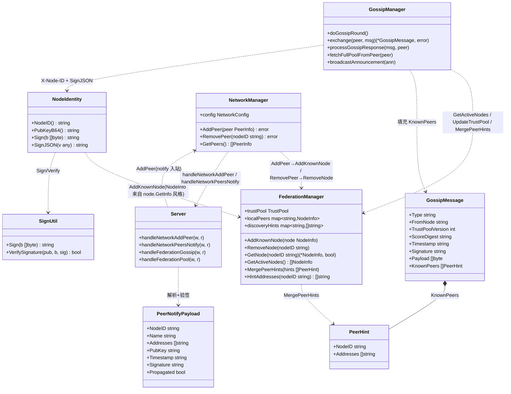
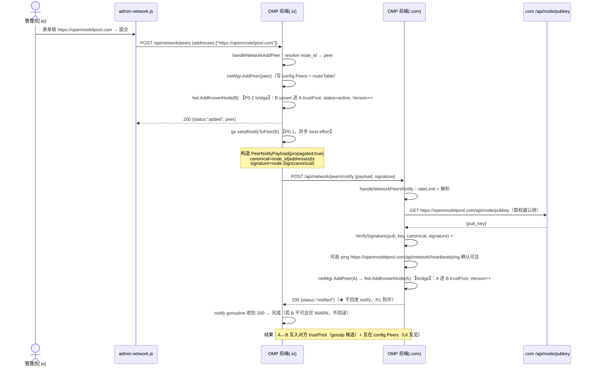
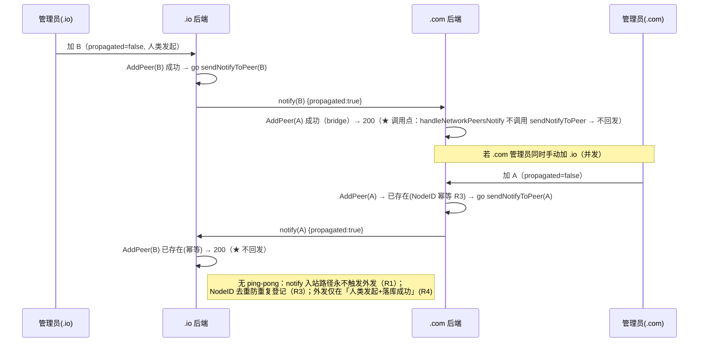
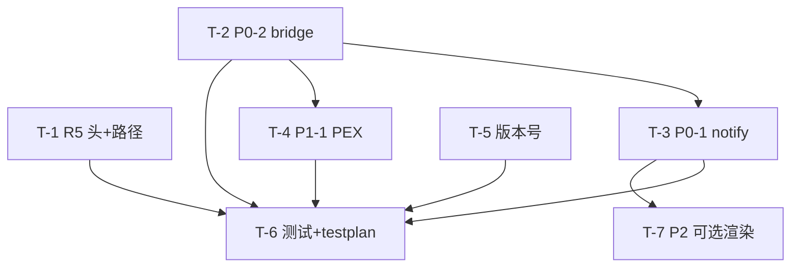

# 架构设计 + 任务分解：OpenModelPool 私有节点联邦「自动发现补齐」（v4.1.7 增量）

> 角色：架构师 高见远（Gao）｜目标版本：**v4.1.7**｜基线：**v4.1.6**｜日期：2026-07-26
> 输入：`PRD-discovery-v4.1.7.md`（许清楚）、`ARCH-federation-v4.1.6.md`（高见远）
> 代码事实基线（已用 Grep/Read 逐行核实，非假设）：
> - `network.go` `AddPeer` L844 / `handleNetworkAddPeer` L1415 / `resolvePublicEndpoint` L1364 / `resolvePeerNodeID` L1384
> - `federation.go` `withFederationAuth` L19 / `FederationManager` L92 / `GetActiveNodes` L168 / `GetNode` L189 / `UpdateTrustPool` L206 / `UpdateNodeInfo` L223 / `RemoveNode` L241
> - `gossip.go` `doGossipRound` L72 / `selectPeers` L105 / `exchange` L161 / `processGossipResponse` L277 / `fetchFullPoolFromPeer` L305
> - `server.go` 路由 L222-224（`/api/federation/{pool,gossip,announce}`）+ L263-265（`/api/network/peers*`）
> - `main.go` L9 `AppVersion="4.1.6"`；`scripts/omp-manager.ps1` L29 fallback `v4.1.6`
> - `types.go` `GossipMessage` L541 / `NodeInfo` L504 / `PeerInfo` L92
> 仓库绝对路径：`C:\Users\licha\WorkBuddy\2026-07-18-21-17-19\omp_clone\`

---

## 0. 设计结论速览（给主理人）

| 项 | 结论 |
|---|---|
| 技术栈 | **沿用现有 Go 单体 + 原生 JS**，不引入任何新依赖 / 新框架（约束达成） |
| 四块改动 | R5（gossip 鉴权+路径）/ P0-2（bridge 进信任池）/ P0-1（双向通知+防环）/ P1-1（gossip PEX） |
| 核心代码文件 | 后端 4 个：`network.go`、`federation.go`、`gossip.go`、`types.go`；路由 `server.go`；种子拉取 `discovery.go`；版本 `main.go`+`scripts/omp-manager.ps1` |
| **关键实测修正 ①** | **v4.1.6 的 P2P gossip 客户端 URL 实际是 `/federation/...`（缺 `/api`），而 server 只注册 `/api/federation/...` → 当前永远 404**。R5 须把 `exchange`/`fetchFullPoolFromPeer`/`broadcastAnnouncement`/`discovery.go.fetchFromSeedNodes` **全部**改为 `/api/federation/...`（主理人原以为仅 `fetchFullPoolFromPeer` 缺 `/api`，实测不止）。 |
| **关键实测修正 ②** | **`/api/network/peers/notify` 不能包 `withFederationAuth`**（主理人"建议包 withFederationAuth"在首次联系时必然 403：发送方尚不在对端 trustPool）→ 改为「**限流公开 + ed25519 签名验签**」（用对端 `/api/node/pubkey` 实时拉取权威公钥），既满足跨实例可达又满足"防伪造开放注册"。 |
| 依赖顺序硬约束 | R5 的功能生效**运行时**依赖 P0-1+P0-2（发送方须先进入对端 trustPool）；但 R5 代码改动可独立先落地。T-3（notify）依赖 T-2（bridge，因为 notify 接收方走 `AddPeer`→bridge）。 |
| 发布门禁 | `main.go` + `scripts/omp-manager.ps1` 版本号 `4.1.6→4.1.7` |

---

## 1. 实现方案 + 框架选型

### 1.1 总体策略

纯 Go 后端增量，沿用 `net/http` + 现有全局对象（`netMgr` / `fed` / `gossip` / `node` / `routeTable` / `cfg`），**零新依赖**。前端仅在 P2（可选）动 `admin-network.js`/`admin.html`，P0/P1 全为后端行为增强（UI 零改动或仅"不阻断"）。

### 1.2 四块实现策略（对应 PRD P0/P1 + R5）

| 块 | 策略 | 改动性质 | 鉴权方式 |
|---|---|---|---|
| **R5** gossip 传输鉴权+路径 | 出站请求加 `X-Node-ID: node.NodeID()` 头；URL 修正为 `/api/federation/...`。对端 `withFederationAuth` 的 path-1（`fed.GetNode(X-Node-ID)` 命中 trustPool/localPeers）即放行——前提是发送方已在对端 trustPool（由 P0-1 notify→P0-2 bridge 保证）。 | Bug 修复（路径）+ 安全增强（头） | `X-Node-ID` 命中信任池 |
| **P0-2** bridge 进信任池 | 新增 `fed.AddKnownNode(NodeInfo)`：upsert 进 `trustPool.Nodes`（`status=active`），`TrustPoolVersion++`，`saveLocked()`。`AddPeer` 写 `config.Peers` 成功后调用；`RemovePeer` 同步 `fed.RemoveNode`。 | 打通两套存储（功能使能） | 内部调用 |
| **P0-1** 双向通知+防环 | 新增独立端点 `POST /api/network/peers/notify`：**限流公开 + 签名验签**（非 `withFederationAuth`/`withAuth`）。A 在 `handleNetworkAddPeer` 本地 `AddPeer` 成功后异步发 notify（携带 ed25519 签名 + `propagated:true`）；B 收到后 `AddPeer(A)`（走同一 `AddPeer`→bridge），**绝不回发**（R1，靠调用点分离天然满足）。 | 后端行为增强 + 防环 | ed25519 签名验签 |
| **P1-1** gossip PEX | `GossipMessage` 增 `KnownPeers []PeerHint`；`doGossipRound`/`handleFederationGossip` 从「`fed.GetActiveNodes()` + `netMgr.GetPeers()` 去重合并」填充；`processGossipResponse` 把端点并入 `fed.discoveryHints`（内存提示表）作地址可达性回退。**主发现闭环仍由 P0-2 版本号驱动**（`processGossipResponse` 在 `msg.TrustPoolVersion>本地` 时 `fetchFullPoolFromPeer` 拉全量池）。 | 加固/传递发现 | 复用 R5 头 |

### 1.3 核心难点与对策

1. **gossip 路径 404（实测）**：所有 P2P 出站 URL 统一为 `/api/federation/...`，含 `discovery.go` 种子拉取。一次性修全部 4 处，与 server 注册对齐。
2. **notify 鸡生蛋（首次联系 403）**：改用签名验签而非 `X-Node-ID`，且公钥优先从对端 `https://<addr>/api/node/pubkey` 实时取（防 payload 公钥替换）。详见 §9 D1。
3. **防环 R1**：`AddPeer` 是纯数据操作（不主动外发）；外发 notify 只在「人类发起的 `handleNetworkAddPeer` 且本地新增成功」时发生。notify 接收方走 `handleNetworkPeersNotify`→`AddPeer`，**不调用**外发逻辑 → 天然不回发。R3 由 `AddPeer` 的 `NodeID` 幂等去重兜底。
4. **bridge 版本震荡（R7）**：`fetchFullPoolFromPeer` 已有 `UpdateTrustPool` 的 `incoming.Version>local` 守卫去重；观测即可，不额外处理。

---

## 2. 文件列表（相对路径，标注 新增/修改）

### 2.1 修改文件

| 文件 | 改动点（行号已核） | 对应块 |
|---|---|---|
| `network.go` | ① `AddPeer`（L844）写 `config.Peers` 成功后调用 `fed.AddKnownNode(...)`（bridge）；② `RemovePeer`（L873）成功移除后调用 `fed.RemoveNode(nodeID)`；③ 新增 `handleNetworkPeersNotify`（notify 接收+验签+`AddPeer`）；④ 新增 `sendNotifyToPeer(peer PeerInfo)`（异步外发，签名+best-effort）；⑤ `handleNetworkAddPeer`（L1415）本地新增成功且非 propagated 时触发 `sendNotifyToPeer` | P0-2 / P0-1 |
| `federation.go` | ① 新增 `AddKnownNode(node NodeInfo)`（upsert+版本自增+save）；② 新增 `discoveryHints map[string][]string` 字段 + `MergePeerHints(hints []PeerHint)` + `HintAddresses(nodeID) []string`（P1-1 提示表）；③ `GetActiveNodes`/`GetNode` 不变 | P0-2 / P1-1 |
| `gossip.go` | ① `exchange`（L161）改 URL `/api/federation/gossip` + 设 `X-Node-ID` 头；② `fetchFullPoolFromPeer`（L305）改 URL `/api/federation/pool` + 设 `X-Node-ID` 头；③ `broadcastAnnouncement`（L559）改 `/api/federation/announce` + 设 `X-Node-ID` 头；④ `doGossipRound`（L72）构造 `msg.KnownPeers`；⑤ `handleFederationGossip`（L441）响应填 `KnownPeers`；⑥ `processGossipResponse`（L277）合并 `msg.KnownPeers` 入 `fed.discoveryHints` | R5 / P1-1 |
| `discovery.go` | `fetchFromSeedNodes`（L90、L147）`/federation/pool` → `/api/federation/pool`（与 server 注册 + P1-1 种子窄放行路径对齐） | R5（连带） |
| `types.go` | `GossipMessage`（L541）增 `KnownPeers []PeerHint \`json:"known_peers,omitempty"\``；新增 `PeerHint` 结构 | P1-1 |
| `server.go` | 路由注册（L265 后）新增 `mux.HandleFunc("POST /api/network/peers/notify", rateLimitByIP(10,"network_notify")(handleNetworkPeersNotify))`（**不包** `withFederationAuth`/`withAuth`，见 §9 D1） | P0-1 |
| `main.go` | L9 `AppVersion = "4.1.7"`（门禁） | 版本 |
| `scripts/omp-manager.ps1` | L29 fallback `RELEASE_TAG = "v4.1.7"`（门禁） | 版本 |

### 2.2 新增文件

| 文件 | 用途 |
|---|---|
| `discovery_v417_test.go` | R5 头/路径、P0-2 bridge、P0-1 notify 验签+防环、P1-1 PEX 的单元/集成测试 |
| `docs/discovery-v4.1.7-testplan.md` | 3 节点 mesh 联调验证清单（手动+自动） |

### 2.3 修改文件（P2 可选）

| 文件 | 改动点 |
|---|---|
| `admin-network.js` | 网络页把 `fed.localPeers`/trustPool 中"通过发现"的节点渲染出来（来源标签：手动添加/通过发现） |
| `admin.html` | 节点列表项容器支持来源标签（如已有 `netPeersList`，仅前端加徽标） |
| `admin-common.js` | 可选小工具（来源标签渲染辅助） |

### 2.4 不改动（已正确 / 不属本增量）

`handlers.go`（邀请码 handler 完整）、`genesis.go`（共识逻辑不改）、`invite.go`（v4.1.6 已修）、`node.go`（仅复用 `Sign`/`SignJSON`/`NodeID`/`PubKeyB64`）、`network_loadbalancer.go`（心跳端点已存在）、`auth.go`、`middleware.go`。**明确不改**：邀请码 redeem / genesis 校验路径（Q1 仅约束邀请码）。

---

## 3. 数据结构和接口

### 3.1 关键函数/结构签名表

| 位置 | 现有 | 目标签名 / 行为 | 说明 |
|---|---|---|---|
| `federation.go`（新增） | — | `func (f *FederationManager) AddKnownNode(node NodeInfo)` | upsert 进 `trustPool.Nodes`（按 `NodeID` 命中则更新，否则 append）；置 `Status="active"`；`trustPool.Version++`；`saveLocked()`。调用前 `if fed==nil \|\| !fed.IsEnabled() {return}` 守卫（personal 模式跳过） |
| `federation.go`（新增） | — | `func (f *FederationManager) MergePeerHints(hints []PeerHint)` | 写入 `discoveryHints[nodeID] = addresses`（内存，去重合并） |
| `federation.go`（新增） | — | `func (f *FederationManager) HintAddresses(nodeID string) []string` | 返回 `discoveryHints` 中该节点提示地址（PEX 回退） |
| `network.go` `AddPeer` | 仅写 `config.Peers`+`routeTable` | 成功后若 `fed!=nil && fed.IsEnabled()` 调用 `fed.AddKnownNode(toNodeInfo(peer))` | bridge；PRD 命名 `AddManualNode`，本设计统一为 `AddKnownNode` |
| `network.go` `RemovePeer` | 仅删 `config.Peers` | 成功后若 `fed!=nil` 调用 `fed.RemoveNode(nodeID)` | 同步出信任池 |
| `network.go`（新增） | — | `func handleNetworkPeersNotify(w http.ResponseWriter, r *http.Request)` | 限流公开+验签；解析→校验时间戳(<5min)→**实时拉取对端 `/api/node/pubkey` 验签**（回退 payload.pub_key）→可选 ping→`netMgr.AddPeer(peer)`→200（**不回发 notify**） |
| `network.go`（新增 helper） | — | `func sendNotifyToPeer(peer PeerInfo)` | goroutine 异步；构建 `PeerNotifyPayload{propagated:true}` + `node.Sign(canonical)`；`POST {addr}/api/network/peers/notify`；失败仅 WARN，不回滚本地 |
| `network.go` `handleNetworkAddPeer` | 调 `netMgr.AddPeer` 后直接 200 | 调 `AddPeer` 前记录 `existed:=HasPeer(peer.NodeID)`；成功后若 `!existed && !peer.fromNotify` → `go sendNotifyToPeer(peer)` | 触发外发（R4：落库后外发） |
| `gossip.go` `exchange` | `client.Post(addr+"/federation/gossip",...)` 零头 | 改 `addr+"/api/federation/gossip"`；`req.Header.Set("X-Node-ID", node.NodeID())` | R5 |
| `gossip.go` `fetchFullPoolFromPeer` | `client.Get(addr+"/federation/pool")` 零头 | 改 `addr+"/api/federation/pool"`；`req.Header.Set("X-Node-ID", node.NodeID())` | R5 |
| `gossip.go` `broadcastAnnouncement` | `addr+"/federation/announce"` 零头 | 改 `addr+"/api/federation/announce"`；设 `X-Node-ID` 头 | R5（连带） |
| `gossip.go` `doGossipRound` | `msg` 无 `KnownPeers` | 构造后 `msg.KnownPeers = buildKnownPeers()` | P1-1 |
| `gossip.go` `processGossipResponse` | 仅版本触发拉取 | 新增 `if len(msg.KnownPeers)>0 { fed.MergePeerHints(msg.KnownPeers) }` | P1-1 |
| `types.go` `GossipMessage` | 6 字段 | 增 `KnownPeers []PeerHint \`json:"known_peers,omitempty"\`` | P1-1 |
| `types.go`（新增） | — | `type PeerHint struct { NodeID string \`json:"node_id"\`; Addresses []string \`json:"addresses"\` }` | P1-1 |
| `network.go`（新增） | — | `type PeerNotifyPayload struct { NodeID string \`json:"node_id"\`; Name string \`json:"name"\`; Addresses []string \`json:"addresses"\`; PubKey string \`json:"pub_key"\`; Timestamp string \`json:"timestamp"\`; Signature string \`json:"signature"\`; Propagated bool \`json:"propagated"\` }` | P0-1 |

### 3.2 `PeerNotifyPayload` 契约（`POST /api/network/peers/notify`）

```json
{
  "node_id": "mm-xxxx",                 // 发送方节点 ID（必填）
  "name": "openmodelpool.io",           // 显示名（可选）
  "addresses": ["https://openmodelpool.io"], // 发送方公网地址（必填，至少 1）
  "pub_key": "<ed25519 base64>",        // 发送方公钥（回退验签用；权威来源为对端 /api/node/pubkey）
  "timestamp": "2026-07-26T12:00:00Z",  // RFC3339，偏差 >5min 拒绝（防重放）
  "signature": "<ed25519 base64>",      // 覆盖 canonical = node_id + "|" + join(addresses,",") + "|" + timestamp
  "propagated": true                    // 经 notify 进入恒为 true；接收方据此 + 调用点分离保证 R1 不回发
}
```
> 验签 canonical 串：`fmt.Sprintf("%s|%s|%s", p.NodeID, strings.Join(p.Addresses, ","), p.Timestamp)`，用 `node.Sign([]byte(canonical))` 签、`VerifySignature(pubKey, []byte(canonical), p.Signature)` 验。

### 3.3 `X-Node-ID` 约定

| 方向 | 行为 |
|---|---|
| 出站（gossip 客户端） | `exchange` / `fetchFullPoolFromPeer` / `broadcastAnnouncement` 在请求上 `req.Header.Set("X-Node-ID", node.NodeID())` |
| 入站（接收端 `withFederationAuth` path-1，L33-40） | `nodeID := r.Header.Get("X-Node-ID")`；若 `fed.GetNode(nodeID)` 命中 trustPool/localPeers → 放行 |
| 前置条件 | 发送方须已在对端 trustPool 中（由 P0-1 notify → P0-2 bridge 保证）。**首次 notify 自身不走 X-Node-ID**（见 §9 D1）。 |

### 3.4 类图 / 接口关系（Mermaid classDiagram）



---

## 4. 程序调用流程（时序图，Mermaid）

### 4.1 A 加 B：双向通知 + bridge 时序



### 4.2 30s gossip 轮次：传递发现（A 加 B、B 已知 C → A 学到 C）

```mermaid
sequenceDiagram
    participant Loop as gossipLoop(30s)
    participant A as .io (gossip)
    participant B as .com (gossip)
    participant Auth as B.withFederationAuth

    Loop->>A: doGossipRound()
    A->>A: selectPeers(3) from fed.GetActiveNodes()（含 B，经 P0-2 bridge）
    A->>A: msg = {sync, FromNode:A, TrustPoolVersion:A.ver, KnownPeers:[B,C hints]}
    A->>A: msg.Signature = node.SignJSON(msg)
    A->>B: POST /api/federation/gossip  Header X-Node-ID:A
    B->>Auth: 检查 fed.GetNode("A")（A 在 B.trustPool? 是，P0-1 bridge）→ 放行
    Auth->>B: handleFederationGossip：验签 → 响应 {sync, TrustPoolVersion:B.ver(含C), KnownPeers:[A,C]}
    B-->>A: 200 resp
    A->>A: processGossipResponse(resp)：dedup；resp.TrustPoolVersion > A.ver?
    alt 是（B 池更新）
        A->>B: fetchFullPoolFromPeer(B) GET /api/federation/pool  Header X-Node-ID:A
        B->>Auth: GetNode("A") 命中 → 放行
        B-->>A: 200 全量 trustPool（含 A,B,C）
        A->>A: fed.UpdateTrustPool(fullPool) → A 现在含 C 【传递发现闭环】
    end
    A->>A: fed.MergePeerHints(resp.KnownPeers)（地址可达性提示，回退用）
    Note over A,B: 对称：B 也选到 A → B 拉 A 的全量池补齐；C 被 A/B 选为目标后同理学到 A/B
```

### 4.3 notify 防环时序（R1–R4）



---

## 5. 任务列表（有序、含依赖关系、按实现顺序）

> 任务 ID 沿用主理人指定顺序：T-1(R5) → T-2(P0-2) → T-3(P0-1) → T-4(P1-1) → T-5(版本) → T-6(测试+testplan) → T-7(P2 可选)。
> 说明：通用"≤5 任务"模板约束在此被**本增量显式 7 任务结构覆盖**（用户明确要求）。

| Task ID | 任务名 | 源文件（创建/修改） | 依赖 | 优先级 |
|---|---|---|---|---|
| **T-1** | R5 gossip 客户端鉴权 + 路径修正 | `gossip.go`(exchange/fetchFullPoolFromPeer/broadcastAnnouncement)、`discovery.go`(fetchFromSeedNodes) | 无（可并行 T-2） | P0（发现闭环硬前置） |
| **T-2** | P0-2 bridge：手动 Peer 进信任池 | `federation.go`(新增 `AddKnownNode`)、`network.go`(`AddPeer`/`RemovePeer` 调用) | 无 | P0 |
| **T-3** | P0-1 双向通知 + 防环（签名验签端点） | `server.go`(新路由)、`network.go`(handleNetworkPeersNotify/sendNotifyToPeer/handleNetworkAddPeer 触发) | T-2（notify 接收走 AddPeer→bridge） | P0 |
| **T-4** | P1-1 gossip PEX（传递发现） | `types.go`(GossipMessage+PeerHint)、`gossip.go`(doGossipRound/processGossipResponse/handleFederationGossip)、`federation.go`(discoveryHints) | T-2（共享 fed 结构） | P1 |
| **T-5** | 版本号升级（发布门禁） | `main.go`、`scripts/omp-manager.ps1` | 无 | P0（门禁） |
| **T-6** | 回归测试 + 联调验证清单 | `discovery_v417_test.go`(新)、`docs/discovery-v4.1.7-testplan.md`(新) | T-1, T-2, T-3, T-4, T-5 | P0/P1 |
| **T-7** | P2（可选）admin 渲染发现来源 | `admin-network.js`、`admin.html`、`admin-common.js` | T-2, T-3（节点已带来源） | P2（可选） |

### 5.1 任务明细

**T-1 — R5 gossip 客户端鉴权 + 路径修正**
1. `gossip.go` `exchange`：URL `addr+"/api/federation/gossip"`；用 `http.NewRequest` 构造请求，`req.Header.Set("X-Node-ID", node.NodeID())`，`client.Do(req)`。
2. `gossip.go` `fetchFullPoolFromPeer`：URL `addr+"/api/federation/pool"`；同上设 `X-Node-ID`。
3. `gossip.go` `broadcastAnnouncement`：URL `addr+"/api/federation/announce"`；设 `X-Node-ID`（announce 端点亦 `withFederationAuth` 保护）。
4. `discovery.go` `fetchFromSeedNodes`（L90、L147）：`/federation/pool` → `/api/federation/pool`（与 P1-1 种子窄放行路径对齐，修复种子发现同样 404 的隐患）。
- 依赖：无。

**T-2 — P0-2 bridge：手动 Peer 进信任池**
1. `federation.go` 新增 `AddKnownNode(node NodeInfo)`：`if fed==nil || !fed.IsEnabled() {return}`；加锁；按 `NodeID` 命中则更新否则 append；置 `Status="active"`；`trustPool.Version++`；`saveLocked()`。
2. `network.go` `AddPeer`（L844）：写 `config.Peers`+`routeTable` 成功后，若 `fed!=nil && fed.IsEnabled()` 调 `fed.AddKnownNode(toNodeInfo(peer))`（`toNodeInfo` 映射 `NodeInfo{NodeID,Name,Addresses:peer.Addresses,Endpoint:peer.Addresses[0],Status:"active",LastSeen,PubKey:peer 或回源拉取}`）。
3. `network.go` `RemovePeer`（L873）：移除成功后若 `fed!=nil` 调 `fed.RemoveNode(nodeID)`。
- 依赖：无（可与 T-1 并行）。

**T-3 — P0-1 双向通知 + 防环（签名验签端点）**
1. `server.go`（L265 后）新增路由：`mux.HandleFunc("POST /api/network/peers/notify", rateLimitByIP(10, "network_notify")(handleNetworkPeersNotify))`（**不包** `withFederationAuth`/`withAuth`，见 §9 D1）。
2. `network.go` 新增 `handleNetworkPeersNotify`：rateLimit；`readJSON` → `PeerNotifyPayload`；校验 `node_id`/地址非空 + `timestamp` 偏差 ≤5min；**实时取权威公钥** `GET {addresses[0]}/api/node/pubkey`（回退 `payload.PubKey`）；`VerifySignature` 验签；可选 ping 确认可达（best-effort）；构建 `PeerInfo` 调 `netMgr.AddPeer`；200（**不调用 sendNotifyToPeer** → R1）。
3. `network.go` 新增 `sendNotifyToPeer(peer PeerInfo)`：goroutine；构造 `PeerNotifyPayload{propagated:true}` + `node.Sign(canonical)`；`POST {addr}/api/network/peers/notify`；失败仅 WARN。
4. `network.go` `handleNetworkAddPeer`（L1415）：调 `AddPeer` 前记 `existed:=HasPeer(peer.NodeID)`；成功后若 `!existed` → `go sendNotifyToPeer(peer)`（R4：落库后外发；propagated 由 helper 置 true）。
- 依赖：T-2（notify 接收方 `AddPeer` 触发 bridge，需 `AddKnownNode` 存在）。

**T-4 — P1-1 gossip PEX（传递发现）**
1. `types.go` 新增 `PeerHint{NodeID, Addresses}`；`GossipMessage` 增 `KnownPeers []PeerHint \`json:"known_peers,omitempty"\``。
2. `federation.go` 新增 `discoveryHints map[string][]string` 字段 + `MergePeerHints` + `HintAddresses`。
3. `gossip.go` `doGossipRound`：构造 `msg` 后 `msg.KnownPeers = buildKnownPeers()`（合并 `fed.GetActiveNodes()` + `netMgr.GetPeers()` 去重，映射 `PeerHint{NodeID, Addresses}`）。
4. `gossip.go` `handleFederationGossip`：响应 `resp.KnownPeers = buildKnownPeers()`。
5. `gossip.go` `processGossipResponse`：新增 `if len(msg.KnownPeers) > 0 { fed.MergePeerHints(msg.KnownPeers) }`（地址可达性提示回退；主闭环仍由 `TrustPoolVersion` 驱动）。
- 依赖：T-2（共享 `fed` 结构）。

**T-5 — 版本号升级（发布门禁）**
1. `main.go` L9：`AppVersion = "4.1.7"`。
2. `scripts/omp-manager.ps1` L29：fallback `RELEASE_TAG = "v4.1.7"`。
- 依赖：无。

**T-6 — 回归测试 + 联调验证清单**
- `discovery_v417_test.go`：① `AddKnownNode` upsert+版本自增+save；② `AddPeer` 触发 bridge→`GetActiveNodes` 含该 peer；③ `handleNetworkAddPeer` 本地新增成功触发外发 notify（httptest 模拟对端 `/notify` 断言收到签名 payload 且 `propagated:true`）；④ `handleNetworkPeersNotify` 验签通过→`AddPeer` 成功、**不回发**（断言无二次出站）；错误签名/过期时间戳→拒绝；⑤ `exchange`/`fetchFullPoolFromPeer` 设 `X-Node-ID` 头且 URL 含 `/api/federation/`；⑥ PEX：`KnownPeers` 填充且接收方 `MergePeerHints` 生效。
- `docs/discovery-v4.1.7-testplan.md`：3 节点（.io/.com/.cc）mesh 联调（互加→互见→gossip 传递学到第三方→状态点随心跳）。
- 依赖：T-1, T-2, T-3, T-4, T-5。

**T-7 — P2（可选）admin 渲染发现来源**
- `admin-network.js`：网络页把 `fed.localPeers`/trustPool 节点渲染出来，标记来源（手动添加 / 通过发现）；`admin.html`/`admin-common.js` 配合来源徽标。
- 依赖：T-2, T-3。

### 5.2 任务依赖图（Mermaid）



---

## 6. 依赖包列表

**无新增依赖。** 全部使用现有标准库与仓库内已有能力：
- `net/http`（请求头、客户端）、`crypto/ed25519`（签名，已用）、`encoding/json`、`log/slog`、`sync`、`time`、`strings`。
- 复用：`node.Sign`/`node.SignJSON`/`node.NodeID`/`node.PubKeyB64`、`VerifySignature`、`GetSharedHTTPClient`、`rateLimitByIP`、`writeJSON`/`readJSON`、`resolvePublicEndpoint`、`fed.GetNode`/`GetActiveNodes`/`UpdateTrustPool`。

---

## 7. 共享知识（跨文件约定 §）

1. **`X-Node-ID` 头约定（R5）**：gossip 出站请求（`exchange`/`fetchFullPoolFromPeer`/`broadcastAnnouncement`）必须带 `req.Header.Set("X-Node-ID", node.NodeID())`；接收端 `withFederationAuth` path-1 以 `fed.GetNode(X-Node-ID)` 命中 trustPool/localPeers 放行。**发送方须已在对端 trustPool**（由 P0-1 notify→P0-2 bridge 保证）。
2. **`TrustPool.Version` 自增规则**：任何 upsert 进 `trustPool.Nodes`（`AddKnownNode` / `UpdateTrustPool` 应用新版本）都须 `Version++` 并 `saveLocked()`；`UpdateTrustPool` 仍只接受 `incoming.Version > local.Version`。gossip 以 `msg.TrustPoolVersion > local` 触发全量拉取。
3. **`propagated` 标记语义**：`propagated:true` 仅经 `/api/network/peers/notify` 进入的添加才置；UI/手动 `POST /api/network/peers` 为 `false`（前端不传，默认 false）。接收端据调用点分离保证 R1（notify 路径永不回发）。
4. **peer endpoint 字段名约定**：统一用 `addresses []string`（与 `PeerInfo.Addresses`/`NodeInfo.Addresses`/`PeerHint.Addresses` 一致），不新增单值 `endpoint` 字段；`peerEndpoints()` 优先 `Addresses` 后 `Endpoint`。
5. **notify 签名约定（P0-1）**：canonical = `node_id + "|" + strings.Join(addresses, ",") + "|" + timestamp`；ed25519（`node.Sign` / `VerifySignature`）；公钥优先从对端 `https://<addr>/api/node/pubkey` 实时拉取验签，`payload.pub_key` 为回退；`timestamp` 偏差 >5min 拒绝（防重放）。
6. **notify 端点鉴权约定（偏差声明）**：`POST /api/network/peers/notify` 为「**限流公开 + 签名验签**」，**不包 `withFederationAuth` / 不包 `withAuth`**。理由见 §9 D1（首次联系 X-Node-ID 必然 403 + 跨实例 admin token 不可达）。
7. **URL 路径约定（实测修正）**：所有 P2P/gossip 出站 URL 必须为 `/api/federation/{gossip|pool|announce}`；`discovery.go` 种子拉取同样为 `/api/federation/pool`。v4.1.6 客户端误用 `/federation/...` 缺 `/api` → 404，本次一并修正。
8. **genesis 约束范围（Q1）**：本次仅动**手动互连 + gossip** 路径；`NetworkID(genesis)` 仅约束邀请码 redeem，**不约束** `AddPeer` / notify / bridge。明确标注，避免误加 genesis 校验。
9. **bridge 守卫**：`AddKnownNode` / `AddPeer` 内的 bridge 调用须 `if fed != nil && fed.IsEnabled()`，避免 personal 模式（未启用联邦）下误写 trustPool。

---

## 8. 待明确事项 / 风险（Open Questions / Risks）

| # | 项 | 影响 | 建议 / 已决 |
|---|---|---|---|
| **D1（关键）** | **notify 端点鉴权方案偏差**：主理人"建议包 `withFederationAuth`"在首次联系时必然 403（发送方 A 尚未进入接收方 B 的 trustPool，`GetNode(A)` 不命中）。 | 若照"包 withFederationAuth"实现，notify 首联必 403 → 双向通知整体失效 | **已决**：改为「限流公开 + ed25519 签名验签」（公钥优先对端 `/api/node/pubkey` 实时取）。既满足跨实例可达，又满足"防伪造开放注册"。主理人"R5 修复比 PRD 简单"的论断针对 gossip（X-Node-ID 已支持），**不**适用于 notify 首联。请主理人/产品经理确认此偏差。 |
| **D2** | **pubkey 缺失（R6）**：手动加节点时 `resolvePeerNodeID` 仅取 `node_id`，`PeerInfo.PubKey` 可能为空 → bridge 的 `NodeInfo.PubKey` 空 → 后续 gossip 验签该节点失败 | 影响 PEX/full-pool 拉取后对该节点的后续 gossip 验签 | 建议 `toNodeInfo` 时若 `peer.PubKey==""` 尝试 `GET {addr}/api/node/pubkey` 回源补充；失败则留空（仅影响对该节点的出站 gossip 验签，不阻塞发现）。T-2 实现细节。 |
| **D3** | notify 是否额外校验对端 `shared`+`network_enabled` | 防止未启用联邦节点被登记 | `AddPeer` 自身已校验 `Mode==NetworkModeShared` 否则报错，notify 自然受限；无需额外校验。已决。 |
| **D4** | PEX `discoveryHints` 是否持久化 | 重启后提示表丢失 | 建议仅内存（重启后随下一轮 gossip 重建），不持久化。已决。 |
| **D5** | `broadcastAnnouncement` 是否一并修（/api + X-Node-ID） | announce 端点也 `withFederationAuth` 保护，当前同样 0 头 + 错路径 | 建议一并修（低成本，与 R5 同类）。已纳入 T-1。 |
| **D6** | 版本号是否顺带更新 README/CHANGELOG 措辞 | 文档一致性 | T-5 仅改 `main.go`+`ps1` fallback；README 版本提及可顺带，非门禁。 |
| **R7** | 版本震荡 | 多节点频繁 bridge → 版本频繁 +1 → gossip 频繁全量拉取 | `UpdateTrustPool` 的 `version>` 守卫去重；观测即可，不额外处理。 |
| **R（安全）** | notify 开放端点被滥用探测 | 限流公开端点可被扫描 | `rateLimitByIP(10/min)` + 签名验签 + 时间戳窗口 + 可选 ping 确认可达；不写盘未知节点（仅验签通过才 `AddPeer`）。风险可控。 |

---

## 9. 边界说明（改什么 / 不改什么 / 回归范围）

| 维度 | 范围 |
|---|---|
| **改后端** | `network.go`、`federation.go`、`gossip.go`、`types.go`、`discovery.go`、`server.go`、`main.go` |
| **改运维/版本** | `scripts/omp-manager.ps1` |
| **改前端（仅 P2）** | `admin-network.js`、`admin.html`、`admin-common.js` |
| **新增测试/文档** | `discovery_v417_test.go`、`docs/discovery-v4.1.7-testplan.md` |
| **不改（已正确）** | `handlers.go`(邀请码)、`genesis.go`、`invite.go`、`node.go`(仅复用)、`auth.go`、`middleware.go`、邀请码 redeem / genesis 校验路径 |
| **回归测试重点** | ① `AddKnownNode` upsert+版本自增；② `AddPeer` 触发 bridge→`GetActiveNodes` 含 peer；③ gossip 出站带 `X-Node-ID` 且 URL=`/api/federation/`；④ notify 验签通过+防环（不回发）+错误签名拒绝；⑤ PEX 字段填充+合并；⑥ 版本号=`v4.1.7` |
| **联调重点** | 3 节点（.io/.com/.cc）互加→互见→下一轮 gossip 传递学到第三方→状态点随心跳变化；断网/不可达时本地添加仍成功（best-effort） |
| **明确不改** | 邀请码 redeem / `NetworkID(genesis)` 校验（Q1 仅约束邀请码，不约束本增量手动互连路径） |
