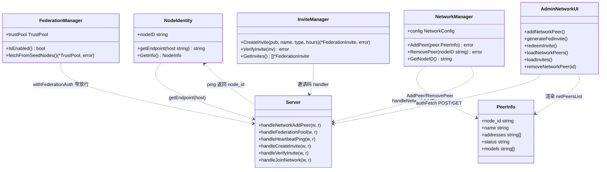
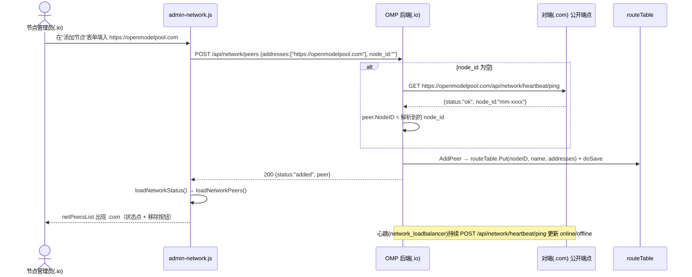
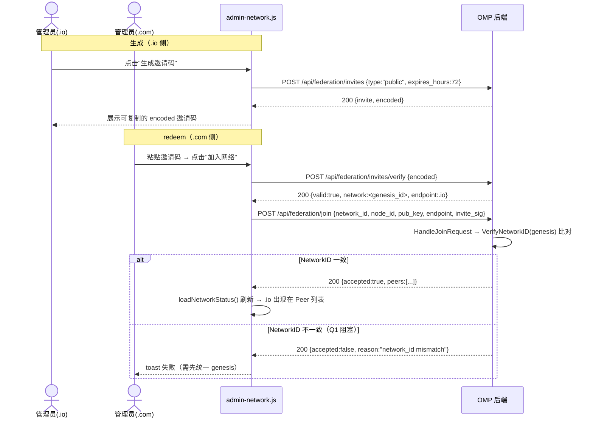
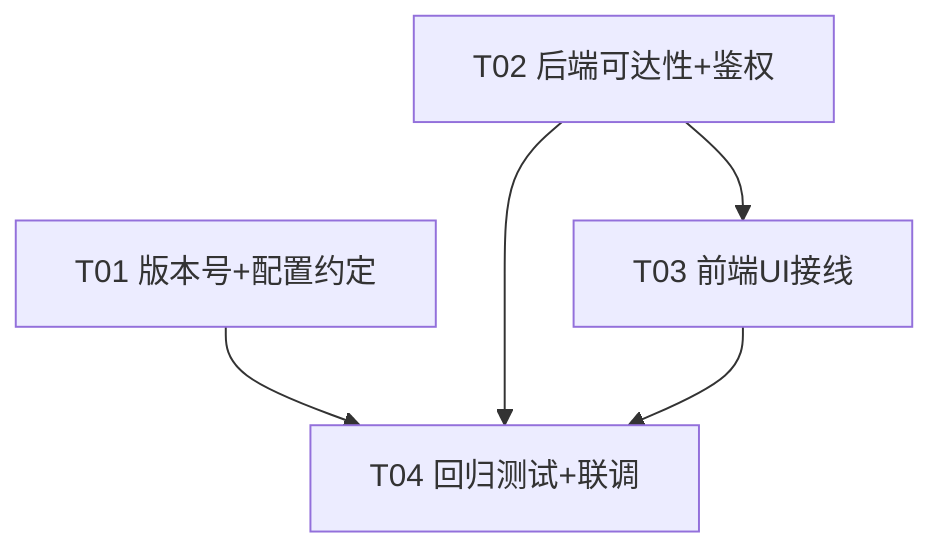

# 架构设计 + 任务分解：OpenModelPool 私有节点联邦组网修复（v4.1.6）

> 角色：架构师 高见远（Gao）｜目标版本：**v4.1.6**｜日期：2026-07-18
> 输入：PRD-federation-v4.1.6.md（产品经理 许清楚）
> 代码事实基线：`git -C <repo> log` 最新提交 `6acc76d（v4.1.5）`，工作树仅含本 PRD 文档（干净基线）。
> 仓库绝对路径：`C:\Users\licha\WorkBuddy\2026-07-18-21-17-19\omp_clone\`

---

## 0. 设计结论速览（给主理人）

| 项 | 结论 |
|---|---|
| 技术栈 | **沿用现有 Go + 原生 JS**，不引入任何新框架 / 新依赖 |
| 根因修复量 | 后端 4 个文件（node.go / invite.go / network.go / federation.go）+ 版本号 2 处 |
| 前端接线量 | 3 个文件（admin.html / admin-network.js / admin-common.js），均为"补 UI + 修孤儿函数" |
| 阻塞点 | **P1-2 邀请码 redeem 受 Q1（两端 NetworkID/genesis 是否一致）阻塞**；P0-2 手动加 Peer 不受 genesis 约束 |
| 已存在可复用资产 | `loadNetworkPeers`（状态点+移除已就绪）、`createInvite`（字段正确）、`loadInvites`、`removeNetworkPeer` |
| 需修复的孤儿函数 Bug | `generateFedInvite()` 读 `d.code`（后端返回 `encoded`）且发 `invite_type`（后端要 `type`） |
| 版本号 | `main.go` AppVersion `4.1.5→4.1.6`；`scripts/omp-manager.ps1` fallback `v4.1.5→v4.1.6` |

---

## 1. 实现方案 + 框架选型

### 1.1 总体策略

OMP 联邦初衷是"全球公开共享池"，本任务目标是让**两个自托管私有节点**通过**显式 UI** 互连、互发现、共享 provider。设计定位：**不做零配置自动发现**（那是 P2 探索项），只修复阻断互连的根因 bug + 补齐显式互连 UI。

- **后端**：完全沿用 Go 标准库 `net/http`、现有 `cfg`、`auth`、`routeTable`、`netMgr`、`fed`、`invMgr` 等全局对象，**不新增第三方依赖**。
- **前端**：沿用原生 JS 管理面板（`admin.html` + `admin-network.js` + `admin-common.js`），复用已有的 `authFetch` / `toast` / `escapeHtml` / `loadNetworkPeers` 等工具与渲染函数，**不引入打包器 / 框架**。

### 1.2 各需求实现策略

| 需求 | 策略 | 后端 / 前端 | 改动性质 |
|---|---|---|---|
| **P0-1** 修复 `getEndpoint()` 内网回落 | 新增统一解析函数 `resolvePublicEndpoint(host)`：优先级 `federation_endpoint` → 新增 `public_domain` 配置 → 请求 `Host` 头（`https://host`）→ 兜底 `http://<hostname>:<port>`（保留但打 WARN，仅 LAN 兜底）。两处 `getEndpoint` 调用统一走该 helper。 | 后端（node.go / invite.go / network.go） | Bug 修复 |
| **P0-2** 手动添加 Peer UI | 前端新增 `addNetworkPeer()` → `POST /api/network/peers`，body `{addresses:[url], node_id?, name?}`。**后端 `handleNetworkAddPeer` 改为允许 `node_id` 为空**：为空时向 `{addr}/api/network/heartbeat/ping`（公开端点，返回 `node_id`）发起出站解析。 | 前后端 | Bug 修复 + UI 接线 |
| **P0-3** 节点列表 online/offline + 移除 | `loadNetworkPeers()` 已渲染状态点（online=绿/degraded=黄/offline=红）与"移除"按钮（`removeNetworkPeer`）。任务重点：确保面板加载时调用 `loadNetworkPeers()`，并确认心跳持续刷新 `status`（心跳机制已存在于 `network_loadbalancer.go`）。 | 前端（接线） | UI 接线（逻辑已存在） |
| **P1-1** 放宽种子只读 GET 鉴权 | `withFederationAuth` 增加**窄放行**：仅当 `GET` + 路径以 `/federation/pool` 结尾 + 请求 `Host` 命中 `netMgr.config.BootstrapNodes` 时跳过鉴权。其余路径严格不变（SA-12 不破坏）。 | 后端（federation.go） | 安全修复 |
| **P1-2** 邀请码 UI | 前端补"生成/粘贴 redeem"区，复用 `createInvite`/`loadInvites`，并**修复** `generateFedInvite()` 字段/响应 Bug，新增 `redeemInvite()`。后端（handlers.go / invite.go / server.go）**已完整，零改动**。 | 前端 | UI 接线 + Bug 修复 |
| **P2** LAN mDNS | 探索性，本次**不做**（手动加 Peer 已覆盖私有 mesh 场景）。 | — | 暂缓 |

### 1.3 核心难点与对策

1. **Endpoint 内网回落（P0-1）**：解析源优先级化 + 新增 `public_domain` 运维配置，确定性最强、不依赖请求上下文脆弱性。
2. **node_id 可选（P0-2）**：用已存在的**公开** ping 端点做服务端出站解析（浏览器直连对端会有 CORS，必须由 OMP 后端代解析）。
3. **种子 403（P1-1）**：窄放行 + 仅可信种子 Host 匹配，避免"secret 为空即放行"这类破坏 SA-12 的做法。
4. **孤儿函数字段错配（P1-2）**：前端 `generateFedInvite` 与后端 `handleCreateInvite` 契约不一致，必须在接线时对齐。

---

## 2. 文件列表（相对路径）

### 2.1 修改文件

| 文件 | 改动点 |
|---|---|
| `node.go` | `GetInfo()`（~L625）内联 endpoint 逻辑改为调用 `resolvePublicEndpoint("")` |
| `invite.go` | `getEndpoint()`（L311）签名改为 `getEndpoint(host string)`；L91 调用处传入 `r.Host` |
| `network.go` | ① 新增包级 `resolvePublicEndpoint(host string)` helper；② `handleNetworkAddPeer`（L1357）支持空 `node_id` + 新增 `resolvePeerNodeID(addr)` helper |
| `federation.go` | `withFederationAuth`（L19）增加可信种子 `GET /federation/pool` 窄放行 + 新增 `isTrustedSeed(r)` 辅助 |
| `main.go` | `AppVersion` 常量 `"4.1.5"` → `"4.1.6"`（L9） |
| `scripts/omp-manager.ps1` | fallback `RELEASE_TAG` `"v4.1.5"` → `"v4.1.6"`（L29） |
| `admin.html` | 网络页新增"添加节点"表单（peerAddr / peerNodeId / addPeerBtn）+ "邀请码"区（genInviteBtn / fedInviteCode / redeemCode / redeemBtn / inviteList）；确认 `netPeersList` 容器存在（L809 已存在） |
| `admin-network.js` | 新增 `addNetworkPeer()`；修复 `generateFedInvite()`（字段/响应）；新增 `redeemInvite()`；在 `loadNetworkStatus`/`renderNetworkUI` 中接线 `loadNetworkPeers()` + `loadInvites()` |
| `admin-common.js` | 新增前端小工具（如 `validatePeerAddress()`、增强 `copyToClipboard()`），被 `addNetworkPeer`/`redeemInvite` 复用 |

### 2.2 新增文件

| 文件 | 用途 |
|---|---|
| `federation_auth_test.go` | P1-1 回归：可信种子 GET `/federation/pool` 放行 / 非种子 403 / 非 GET 路径仍 403 |
| `network_peer_test.go` | P0-2 回归：`handleNetworkAddPeer` 空 node_id 经 ping 解析 / 地址缺失报错 / Mode!=shared 报错 |
| `docs/federation-v4.1.6-testplan.md` | 两节点联调验证清单（手动 + 自动化） |

### 2.3 不改动（已正确/无需动）

`server.go`（路由注册完整）、`handlers.go`（邀请码 handler 完整）、`discovery.go`（种子消费者无需改）、`genesis.go`（共识逻辑不改）、`network_loadbalancer.go`（心跳公开端点已存在，仅复用）、`version_test.go`（已存在，仅确认断言通过）。

---

## 3. 数据结构和接口

### 3.1 关键函数签名改动表

| 位置 | 现有签名 | 目标签名 / 行为 | 说明 |
|---|---|---|---|
| `network.go`（新增 helper） | — | `func resolvePublicEndpoint(host string) string` | 解析优先级：`federation_endpoint` → `public_domain` → `https://host` → `http://<hostname>:<port>`(WARN) |
| `node.go` `GetInfo()` | `endpoint := cfg.Get("federation_endpoint","")` … 兜底 `http://host:port` | `endpoint := resolvePublicEndpoint("")` | 注册/gossip 上下文无 Host，走配置优先 |
| `invite.go` `getEndpoint()` | `func (n *NodeIdentity) getEndpoint() string` | `func (n *NodeIdentity) getEndpoint(host string) string` | L91 调用传 `r.Host` |
| `network.go` `handleNetworkAddPeer` | 要求 `peer.NodeID != ""` 否则 400 | `node_id` 可空；空时调用 `resolvePeerNodeID(peer.Addresses[0])` 解析 | 契约见下 |
| `network.go`（新增） | — | `func resolvePeerNodeID(addr string) (string, error)` | `GET {addr}/api/network/heartbeat/ping`（公开）解析 `node_id`；校验 scheme；带超时 |
| `federation.go` `withFederationAuth` | 三路径全失败 → 403 | 前置窄放行：`GET` + 路径以 `/federation/pool` 结尾 + `isTrustedSeed(r)` → 直接 handler | 不破坏 SA-12 |
| `federation.go`（新增） | — | `func isTrustedSeed(r *http.Request) bool` | 比对 `r.Host` 与 `netMgr.config.BootstrapNodes`（容差 http/https 前缀） |
| `admin-network.js` | — | `async function addNetworkPeer()` | 读 peerAddr/peerNodeId → `POST /api/network/peers` → 成功 `loadNetworkStatus()` |
| `admin-network.js` `generateFedInvite` | 发 `{invitee_name, invite_type, expires_in_hours}`，读 `d.code` | 发 `{invitee_name, type:"public", expires_hours:72}`，读 `d.encoded` | **修复字段错配 Bug** |
| `admin-network.js`（新增） | — | `async function redeemInvite()` | `POST /api/federation/invites/verify {encoded}` → `POST /api/federation/join {...}` |

### 3.2 `POST /api/network/peers` 请求契约（P0-2 明确）

```json
{
  "addresses": ["https://openmodelpool.com"],  // 必填（管理员的对方地址）；节点 ID 为空时由后端 ping 解析
  "node_id": "",                                // 可选；为空则后端经 /api/network/heartbeat/ping 解析
  "name": "openmodelpool.com"                   // 可选显示名
}
```
> 注：PRD 草案中的 `{address}` 为示意；`PeerInfo` 真实字段为 `addresses []string`（`network.go:100`），前端须发 `addresses`。后端 `handleNetworkAddPeer` 不另做 `address→addresses` 映射，前端直接传数组。

### 3.3 邀请码接口契约（P1-2，对齐后端 handlers.go）

| 端点 | 请求 | 响应 | 前端注意 |
|---|---|---|---|
| `POST /api/federation/invites`（withAuth） | `{invitee_pub?:"*", invitee_name?, type?:"public", expires_hours?:168}` | `{invite, encoded}` | **必须用 `encoded`**，不是 `code` |
| `GET /api/federation/invites`（withAuth） | — | `{invites:[...]}` | `loadInvites()` 已正确 |
| `POST /api/federation/invites/verify`（限流公开） | `{encoded}` | `{valid, inviter, endpoint, network, type, expires}` | redeem 第一步 |
| `POST /api/federation/join`（限流公开） | `{network_id, node_id, pub_key, endpoint, invite_sig?}` | `{accepted, network_id, reason?, peers?}` | redeem 第二步；`network_id` 须与本地 `NetworkID(genesis)` 一致，否则 `accepted:false` |

### 3.4 类图 / 接口关系（Mermaid classDiagram）



---

## 4. 程序调用流程（时序图，Mermaid）

### 4.1 手动添加 Peer（P0-2）



### 4.2 邀请码生成 + redeem（P1-2）



### 4.3 种子发现放宽后（P1-1）

```mermaid
sequenceDiagram
    participant Loop as refreshLoop / fetchFromSeedNodes
    participant Seed as 对端(seed) /federation/pool
    participant Auth as withFederationAuth
    participant H as handleFederationPool

    Loop->>Seed: GET <seed>/federation/pool（无认证头）
    Seed->>Auth: 进入中间件
    Auth->>Auth: GET 且路径=/federation/pool 且 isTrustedSeed(r.Host)?
    alt 命中 BootstrapNodes
        Auth->>H: 直接放行
        H-->>Seed: 200 TrustPool
        Seed-->>Loop: 解析成功（不再 403）
    else 非可信种子
        Auth-->>Seed: 403（走原有三路径校验）
    end
```

---

## 5. 任务列表（有序、含依赖）

> 分组原则：按层/模块聚合，避免单文件拆任务；≤5 个任务；前端任务含 3 个相关文件。

| Task ID | 任务名 | 源文件（创建/修改） | 依赖 | 优先级 |
|---|---|---|---|---|
| **T01** | 版本号升级 + 运维配置约定 | `main.go`、`scripts/omp-manager.ps1`、`README.md`（新增 `federation_endpoint`/`public_domain` 说明） | 无 | P0（发布门禁） |
| **T02** | 后端可达性 + 鉴权修复（P0-1 / P0-2 后端 / P1-1） | `node.go`、`invite.go`、`network.go`（含 `resolvePublicEndpoint`/`resolvePeerNodeID`）、`federation.go`（含 `isTrustedSeed`） | 无 | P0 / P1 |
| **T03** | 前端 UI 接线（P0-2 / P0-3 / P1-2） | `admin.html`、`admin-network.js`、`admin-common.js` | T02（依赖后端契约） | P0 / P1 |
| **T04** | 回归测试与两节点联调验证 | `federation_auth_test.go`、`network_peer_test.go`、`docs/federation-v4.1.6-testplan.md` | T02、T03 | P0 / P1 |

### 5.1 任务明细

**T01 — 版本号升级 + 运维配置约定**
- `main.go` L9：`AppVersion = "4.1.6"`
- `scripts/omp-manager.ps1` L29：fallback `RELEASE_TAG = "v4.1.6"`
- `README.md`：新增"联邦组网配置"小节，说明 `federation_endpoint`、`public_domain`（新增，建议设为公网域名如 `https://openmodelpool.io`）、`bootstrap_nodes` 的用途与优先级。
- 依赖：无。可最先执行，也是发布门禁。

**T02 — 后端可达性 + 鉴权修复**
1. `network.go` 新增 `resolvePublicEndpoint(host string) string`（优先级见 §6）。
2. `node.go` `GetInfo()`：内联 endpoint 逻辑替换为 `resolvePublicEndpoint("")`。
3. `invite.go` `getEndpoint(host string)`：签名加 `host`；L91 调用传 `r.Host`；内部用 `resolvePublicEndpoint(host)`。
4. `network.go` `handleNetworkAddPeer`：允许空 `node_id`；空时调用新增 `resolvePeerNodeID(addr)`（向 `{addr}/api/network/heartbeat/ping` 出站解析 `node_id`，校验 scheme、带超时）；地址缺失且 node_id 空则 400。
5. `federation.go` `withFederationAuth`：前置窄放行（GET + 路径以 `/federation/pool` 结尾 + `isTrustedSeed(r)`）；新增 `isTrustedSeed(r)` 比对 `r.Host` 与 `netMgr.config.BootstrapNodes`。
- 依赖：无（与 T01 可并行）。

**T03 — 前端 UI 接线**
1. `admin.html`：网络页新增"添加节点"表单（id `peerAddr`/`peerNodeId`/`addPeerBtn`，`onclick="addNetworkPeer()"`）与"邀请码"区（id `genInviteBtn`/`fedInviteCode`/`redeemCode`/`redeemBtn`/`inviteList`）；确认 `netPeersList` 容器存在（L809）。
2. `admin-network.js`：
   - 新增 `addNetworkPeer()`：读输入 → `POST /api/network/peers {addresses:[addr], node_id, name}` → 成功 `loadNetworkStatus()`。
   - 修复 `generateFedInvite()`：请求 `{invitee_name, type:"public", expires_hours:72}`，响应读 `d.encoded`（**修复原 `d.code` Bug**）。
   - 新增 `redeemInvite()`：先 `POST /api/federation/invites/verify {encoded}`，再 `POST /api/federation/join {...}`。
   - 在 `loadNetworkStatus()`/`renderNetworkUI()` 中接线 `loadNetworkPeers()`（P0-3 状态点/移除已存在）+ `loadInvites()`（P1-2 已生成记录）。
3. `admin-common.js`：新增 `validatePeerAddress(url)`（校验 http/https）、增强 `copyToClipboard()`，供 `addNetworkPeer`/`redeemInvite` 复用。
- 依赖：T02（须先确定 `addresses`/`encoded` 等契约）。

**T04 — 回归测试与两节点联调验证**
- `federation_auth_test.go`：可信种子 GET `/federation/pool` 放行；非种子 403；非 GET 路径仍 403。
- `network_peer_test.go`：`handleNetworkAddPeer` 空 node_id 经 ping 解析成功；地址缺失报错；`Mode!=shared` 报错。
- `docs/federation-v4.1.6-testplan.md`：两节点（.io / .com）手动联调清单（配置 `public_domain`、互加 Peer、状态点、邀请码生成/redeem、种子发现）。
- 依赖：T02、T03 完成后执行。

### 5.2 任务依赖图（Mermaid）



---

## 6. 共享知识（跨文件约定）

1. **`federation_endpoint` 来源优先级（全仓库统一）**
   `federation_endpoint`（显式） > `public_domain`（新增，建议配公网域名） > 请求 `Host` 头（`https://host`，仅请求上下文） > `http://<hostname>:<port>`（兜底，仅 LAN，打 WARN）。
2. **AddPeer 前置条件**：`NetworkManager.config.Mode == NetworkModeShared`，否则报错（沿用现有校验）。
3. **邀请码 redeem 前置**：`verify`（限流公开）→ `join`（限流公开）；`join` 的 `network_id` 必须与本地 `NetworkID(genesis)` 一致，否则 `accepted:false`（见 Q1）。
4. **心跳**：`network_loadbalancer.go` 对 `routeTable` 每个 peer 地址定时 `POST {addr}/api/network/heartbeat/ping`（端点公开，`server.go:315`），更新 online/offline；本版本不调整周期，沿用现有实现。
5. **API 鉴权约定**：管理类写/读接口走 `withAuth`（admin JWT）；仅 `GET /api/network/heartbeat/ping`、`POST /api/federation/invites/verify`、`POST /api/federation/join` 为公开（限流）；P1-1 后 `GET /federation/pool` 对可信种子额外放行。
6. **邀请码接口契约**：create 响应字段为 `encoded`（非 `code`），请求 `type`（非 `invite_type`）——前端必须对齐。
7. **配置键新增**：`public_domain`（字符串，公网可达基址，如 `https://openmodelpool.io`）。

---

## 7. 待明确事项（Open Questions / 风险）

| # | 问题 | 影响 | 建议 |
|---|---|---|---|
| Q1 | 两端 `NetworkID(genesis)` 是否一致？ | **阻塞 P1-2**（JoinNetwork 拒签）；P0-2 手动加 Peer 不受限 | 联调前确认 `.io`/`.com` 使用相同 `GenesisConfig`（同 `NetworkName` 等）；否则需统一 genesis 或放弃 P1-2 |
| Q2 | `openmodelpool.com` 是否公网可达（正确端口/路径/HTTPS）？ | 阻塞 P0-2 实测连通 | 联调时 `curl https://openmodelpool.com/api/network/heartbeat/ping` 验证 |
| Q3 | `federation_endpoint` 配置方式 / 是否需要 `public_domain` 文档 | 影响 P0-1 落地 | T01 在 README 补充配置说明 |
| Q4 | `JoinNetwork` 是否要求对端也 `network_enabled=true,mode=shared`？ | 影响 P1-2 测试步骤 | 手动 Peer 路径已要求 shared；邀请码路径建议同样两端 shared |
| Q5 | P1-1 放宽是否引入信息泄露（暴露 trust pool） | 安全评估 | 已收窄为"仅 GET /federation/pool + 仅可信种子 Host"；trust pool 仅含节点公开信息，风险可控 |
| Q6 | 孤儿函数 Bug：`generateFedInvite` 读 `d.code`/发 `invite_type` | 不修复则邀请码无法显示 | T03 必须修复（已纳入） |
| Q7 | 心跳具体周期值 | 影响 online 状态刷新频率观感 | 沿用现有 ticker，本版本不调整（如需可在 T04 文档标注观测值） |

---

## 8. 边界说明（改什么 / 不改什么 / 回归范围）

| 维度 | 范围 |
|---|---|
| **改后端** | `node.go`、`invite.go`、`network.go`、`federation.go`、`main.go` |
| **改前端** | `admin.html`、`admin-network.js`、`admin-common.js` |
| **改配置/文档** | `scripts/omp-manager.ps1`、`README.md`、`docs/federation-v4.1.6-testplan.md` |
| **新增测试** | `federation_auth_test.go`、`network_peer_test.go` |
| **不改（已正确）** | `server.go` 路由注册、`handlers.go` 邀请码 handler、`discovery.go` 消费者、`genesis.go` 共识逻辑、`network_loadbalancer.go` 心跳端点 |
| **回归测试重点** | ① `getEndpoint` 不再回落内网；② 空 node_id 加 Peer 经 ping 解析；③ 种子 GET 放行但非种子仍 403；④ 邀请码 `encoded` 正确显示；⑤ 版本号 = v4.1.6 |
| **联调重点** | 两节点互加 Peer 后 `netPeersList` 出现对端且状态点随心跳变化；邀请码跨节点 redeem 成功（须 Q1 满足） |
