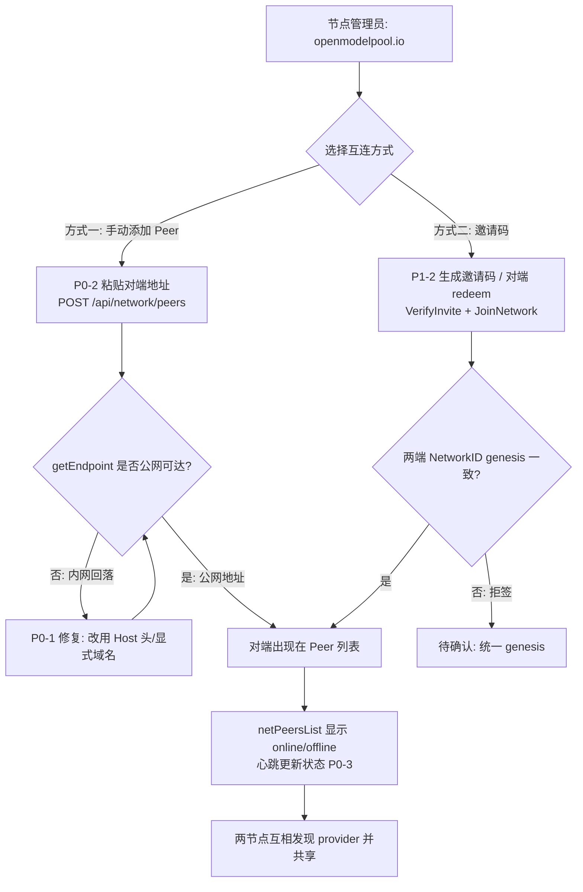

# PRD：OpenModelPool 私有节点联邦组网修复（v4.1.6）

> 角色：产品经理 许清楚（Xu）｜目标版本：**v4.1.6**｜类型：简单 PRD（默认格式）
> 适用对象：架构师（系统设计）、工程师（实现）、QA（测试）

---

## 1. 项目信息

| 字段 | 内容 |
|---|---|
| 语言 | 简体中文 |
| Programming Language | 后端 Go；前端 原生 JS（管理面板 `admin.html` + `admin-network.js`） |
| Project Name | `omp_federation_private_mesh_fix` |
| 原始需求复述 | 两个自托管 OMP 实例 `https://openmodelpool.io` 与 `https://openmodelpool.com` 均已 `network_enabled=true, mode=shared`（加入共享网络），但**互相看不到对方**，无法发现/共享 provider。需修复阻断互连的根因 bug，并在管理面板补齐「手动添加 Peer」与「邀请码」UI，让两个私有节点能通过显式 UI 互连、互相发现并共享 provider。 |

### 现状根因（已通过代码调研确认，作为本 PRD 的问题集合）

| # | 问题 | 位置 | 根因 | 现状 |
|---|---|---|---|---|
| 1 | Endpoint 回落内网地址 | `network.go` `getEndpoint()` | 未配置 `federation_endpoint` 时回落 `http://<内网主机名>:<port>`（codespace 内网名） | 生成的邀请码/peer 注册信息携带**不可达地址**，对端永远连不上 |
| 2 | 种子节点自动发现失效 | `discovery.go` `fetchFromSeedNodes` ↔ `federation.go` `withFederationAuth` | 对 `<seed>/federation/pool` 发**无认证 GET**，而鉴权中间件严格（SA-12），无「密钥为空即放行」分支，返回 **403** | 互设 `bootstrap_nodes` 这条路现版走不通 |
| 3 | 缺「手动添加 Peer」UI | `network.go` `handleNetworkAddPeer`（POST `/api/network/peers`）已完整实现并持久化到 `config.Peers` + 路由表，心跳可更新 online 状态 | `admin.html` 无调用入口（grep 零命中；仅 `netPeers`/`netPeersList` 展示元素存在） | **最可靠的私有互连路径，只需补 UI** |
| 4 | 缺「邀请码」UI | `invite.go` + `handlers.go` + `server.go` 后端完整（CreateInvite/VerifyInvite/ListInvites/JoinNetwork 均注册） | `admin.html` 无调用入口 | 注：经核对 `admin-network.js` 已存在 `createInvite()` / `generateFedInvite()` / `loadInvites()` 等**孤立函数**（已定义但未被任何 HTML 元素/事件触发），属可复用资产，非从零实现 |

> 设计定位：OMP 联邦初衷是「全球公开共享池」，并非为「个人多个私有节点组私有 mesh」设计；因此**「零配置自动发现」不是目标**，需通过显式 UI（手动加 Peer / 邀请码）让用户把两个私有节点连起来。

---

## 2. 产品定义

### 2.1 产品目标（Product Goals，3 个正交目标）

| ID | 目标 | 说明 |
|---|---|---|
| G1 | **连接可达性（Connectivity）** | 修复 `getEndpoint()` 使生成的 peer/邀请码元数据携带**公网可达地址**，两个私有节点能真正建立连接。 |
| G2 | **显式互连（Explicit Linking via UI）** | 在管理面板补齐「手动添加 Peer」与「邀请码」UI 入口，让节点管理员无需依赖零配置自动发现即可把两个私有节点显式连起来。 |
| G3 | **可见与可管理（Discoverability & Manageability）** | 互连后节点出现在彼此的节点列表，带 online/offline 状态、可移除，并能互相发现与共享 provider。 |

### 2.2 用户故事（User Stories，节点管理员视角）

| ID | 角色 | 诉求 | 收益 |
|---|---|---|---|
| US1 | openmodelpool.io 的节点管理员 | 我想在网络页粘贴 `https://openmodelpool.com` 地址并提交 | 它出现在我的 Peer 列表，我们共享 provider，无需交换密钥 |
| US2 | 任一私有节点管理员 | 我想生成邀请码，让对端粘贴 redeem | 两个私有节点互连，且不暴露原始地址/节点ID |
| US3 | 节点管理员 | 我想在节点列表看到每个 Peer 的 online/offline 状态，并能移除 | 我能管理自己的私有 mesh，踢掉失效/不信任节点 |
| US4 | （可选 P2）LAN 内节点管理员 | 我希望同网段 OMP 节点被自动发现 | 零配置发现（探索性，非必须） |

---

## 3. 技术规范

### 3.1 需求池（Requirements Pool）

> 优先级：P0=必须（Must）/ P1=应该（Should）/ P2=可选（Nice-to-have）

#### P0（必须）

| ID | 需求 | 验收标准 |
|---|---|---|
| P0-1 | **修复 `getEndpoint()` 内网回落 bug** | 当未显式配置 `federation_endpoint` 时，优先使用 HTTP 请求 `Host` 头（或显式配置的 `public domain`），不再回落 `http://<内网主机名>:<port>`；修复后由 `getEndpoint()` 生成的所有邀请码 / peer 注册信息中 `endpoint` 字段**必须是公网可达地址**（如 `https://openmodelpool.io`）。 |
| P0-2 | **新增「手动添加 Peer」UI** | 在管理面板「网络」页新增表单：输入对方地址（如 `https://openmodelpool.com`），节点 ID 可留空（由对端返回）；提交调用已有 `POST /api/network/peers`（`handleNetworkAddPeer`，后端已完整）。提交成功后对端出现在本节点 `netPeersList`。 |
| P0-3 | **节点列表显示 online/offline 状态并可移除** | 添加后节点列表项展示名称/节点ID、状态点（online=绿/degraded=黄/offline=红）、移除按钮（`removeNetworkPeer` 已存在）。心跳机制须将持续更新 online/offline（不可出现「已添加但永远 offline」且无原因）。 |

#### P1（应该）

| ID | 需求 | 验收标准 |
|---|---|---|
| P1-1 | **修复 `bootstrap_nodes` 种子发现 403** | 放宽 `federation.go` `withFederationAuth`：对**可信种子节点**的只读 `GET /federation/pool` 放行（或提供只读 token），使互设 `bootstrap_nodes` 时 `fetchFromSeedNodes` 不再收到 403，可拉到对端节点信息。 |
| P1-2 | **新增「邀请码」UI** | 管理面板新增邀请码区：①「生成邀请码」按钮（串联已有 `CreateInvite`，复用 `admin-network.js` 中已存在的 `createInvite()`/`generateFedInvite()`/`loadInvites()` 孤立函数，补 HTML 表单并接线）；②「粘贴并加入」输入框（串联 `VerifyInvite` + `JoinNetwork`）。生成成功后展示可复制的邀请码，redeem 后对端出现在 Peer 列表。 |

#### P2（可选 / 探索性）

| ID | 需求 | 说明 |
|---|---|---|
| P2-1 | **LAN mDNS 自动发现** | 同网段私有节点零配置发现（探索性，明确标注为可选；若手动添加 Peer 已覆盖私有 mesh 场景，可不做）。 |

### 3.2 UI 设计稿（网络页新增部分，文字 + HTML 结构）

#### A. 「添加节点」表单（P0-2）

```
┌─ 网络 / Network ──────────────────────────────┐
│  已连接节点 (1/1 在线)                          │
│  ┌──────────────────────────────────────────┐ │
│  │ openmodelpool.com        [🟢] [移除]       │ │
│  │ mmx-xxxx…   (provider: gpt-4o, …)          │ │
│  └──────────────────────────────────────────┘ │
│                                                │
│  ➕ 添加节点（手动互连）                         │
│  对方地址: [ https://openmodelpool.com    ]     │
│  节点 ID:  [ 可留空，由对端返回        ]        │
│            [ 添加 ]                            │
└────────────────────────────────────────────────┘
```

HTML 结构草案：
```html
<div class="peer-add">
  <h4>➕ 添加节点（手动互连）</h4>
  <input id="peerAddr" placeholder="https://openmodelpool.com" />
  <input id="peerNodeId" placeholder="节点 ID（可留空，由对端返回）" />
  <button id="addPeerBtn" onclick="addNetworkPeer()">添加</button>
</div>
<ul id="netPeersList"><!-- 已有 renderNetworkUI / loadNetworkPeers 渲染 --></ul>
```

> 实现提示：新增 `addNetworkPeer()` 调用 `POST /api/network/peers`（body：`{address, node_id?}`），成功后 `loadNetworkStatus()` 刷新列表。

#### B. 邀请码区（P1-2）

```
┌─ 邀请码（互连对端）───────────────────────────┐
│  [ 生成邀请码 ]                                │
│  邀请码: [ omp-fed-xxxx-xxxx（可复制）   ]     │
│  ── 或 ──                                      │
│  粘贴对方邀请码: [ omp-fed-yyyy-yyyy      ]    │
│                 [ 加入网络 ]                    │
│  已生成记录: (列表，复用 loadInvites 渲染)      │
└────────────────────────────────────────────────┘
```

HTML 结构草案：
```html
<div class="invite-zone">
  <button id="genInviteBtn" onclick="generateFedInvite()">生成邀请码</button>
  <input id="fedInviteCode" readonly placeholder="生成的邀请码将显示在此" />
  <input id="redeemCode" placeholder="粘贴对方邀请码" />
  <button id="redeemBtn" onclick="redeemInvite()">加入网络</button>
  <div id="inviteList"><!-- loadInvites() 渲染 --></div>
</div>
```

#### C. 节点列表项（P0-3，复用现有 render）

每个 `netPeersList` 项包含：名称 + 节点ID（monospace）+ 共享模型（如有）+ 状态圆点（online/degraded/offline）+ 移除按钮（`removeNetworkPeer` 已存在）。

### 3.3 互连流程（Mermaid）



> 注：`bootstrap_nodes` 种子发现（P1-1）为第三条可选自动路径，依赖 `withFederationAuth` 对只读 GET 放行，非互连主路径。

---

## 4. 待确认问题（Open Questions）

| # | 问题 | 影响 |
|---|---|---|
| Q1 | 两节点的 **NetworkID (genesis)** 是否一致？不一致则邀请码 redeem 会**拒签** | 阻塞 P1-2；需确认 `.io` 与 `.com` 使用同一网络标识 |
| Q2 | `openmodelpool.com` 是否也**公网可达 :8000**（或正确端口/路径）？ | 阻塞 P0-2；若其不可达，手动添加后仍连不上 |
| Q3 | `federation_endpoint` 应如何配置（双方公网域名）？修复 `getEndpoint` 同时是否需要补充配置项/文档？ | 影响 P0-1 落地方式与运维文档 |
| Q4 | 邀请码 redeem（`JoinNetwork`）是否要求对端也 `network_enabled=true, mode=shared`？两端状态需一致 | 影响 P1-2 测试步骤 |
| Q5 | P1-1 放宽种子只读 GET 鉴权后，是否引入**信息泄露风险**（暴露 provider 列表）？需安全评估 | 影响 P1-1 取舍与实现方案 |
| Q6 | P2 mDNS 是否真有必要？还是手动添加已覆盖私有 mesh 场景 | 决定是否投入 P2 |

---

## 5. 交付范围小结（给主理人转发用）

- **目标版本**：v4.1.6｜**类型**：简单 PRD（默认格式）
- **核心目标**：让两个自托管私有节点（openmodelpool.io / .com）通过 UI 互连、互相发现并共享 provider。
- **关键根因（已代码确认）**：① `getEndpoint()` 内网回落；② 种子 GET 403；③ 缺手动加 Peer UI；④ 缺邀请码 UI（后端 + 部分 JS 已就绪）。
- **P0（必须）**：修复 `getEndpoint()` 用公网域名｜新增「手动添加 Peer」UI（POST `/api/network/peers`）｜节点列表显示 online/offline + 移除。
- **P1（应该）**：放宽种子只读 GET 鉴权修复 403｜新增「邀请码」UI（生成 + redeem，复用已有 `admin-network.js` 函数）。
- **P2（可选）**：LAN mDNS 自动发现（探索性）。
- **验证发现**：`admin-network.js` 中 `createInvite`/`generateFedInvite`/`loadInvites` 已存在但未在 `admin.html` 接线，属可复用资产。
- **待确认**：NetworkID 一致性、`.com` 公网可达性、邀请码 redeem 前置条件、鉴权放宽的安全风险。
