# OpenModelPool Agent P2P — 去中心化 AI 能力共享网络技术架构方案

> **版本**: v1.0 · **日期**: 2026-07-07 · **状态**: 架构设计  
> **当前基线**: OpenModelPool Agent v3.3.0 (Go, 单二进制, 联邦架构)

---

## 目录

1. [产品定位升级](#1-产品定位升级)
2. [网络架构设计](#2-网络架构设计)
3. [信任与声誉体系](#3-信任与声誉体系)
4. [贡献者保护机制](#4-贡献者保护机制)
5. [跨区域中继方案](#5-跨区域中继方案)
6. [贡献激励](#6-贡献激励)
7. [渐进式部署策略](#7-渐进式部署策略)
8. [技术选型](#8-技术选型)
9. [与现有代码的集成路径](#9-与现有代码的集成路径)
10. [风险与合规](#10-风险与合规)
11. [协议设计细节](#11-协议设计细节)
12. [数据模型设计](#12-数据模型设计)
13. [分阶段实施路线图](#13-分阶段实施路线图)
14. [能力交换经济模型（10.1–10.15）](#十能力交换经济模型)
15. [Phase 1 & Phase 2 实现状态](#十一phase-1--phase-2-实现状态)

---

## 1. 产品定位升级

### 1.1 从"代理网关"到"AI 能力共享网络"

OpenModelPool Agent 的演进经历了三个认知阶段，每一阶段的定位决定了架构边界的扩张：

| 阶段 | 定位 | 核心能力 | 网络模型 |
|------|------|---------|---------|
| v1–v2 | API 代理网关 | 请求转发、负载均衡 | 星型（Client → Gateway → Provider） |
| v3 | 联邦 API 管理系统 | 多节点联邦、邀请码、智能路由 | 联邦（Federation，中心式目录 + 对等节点） |
| **v4 (本次)** | **去中心化 AI 能力共享网络** | 多跳中继、匿名路由、贡献激励、自组织网络 | **P2P Overlay（无中心依赖，DHT 自发现）** |

这一升级的本质变化：**节点不再是"被管理的代理"，而是"自主贡献的网络公民"**。每个节点既是服务的消费者，也是能力的提供者，网络的价值由参与者的总贡献决定——这与 BitTorrent 的 Swarm 模型在精神上一致。

### 1.2 与经典去中心化网络的精神对比

| 维度 | BitTorrent | Tor | IPFS | **OpenModelPool Agent P2P** |
|------|-----------|-----|------|-------------------|
| 共享资源 | 文件分片 | 带宽/中继 | 存储/内容 | **AI 模型调用能力** |
| 核心隐喻 | Swarm 下载 | 洋葱电路 | Merkle DAG | **能力隧道（Capability Tunnel）** |
| 激励机制 | Tit-for-Tat | 无偿志愿 | Pinning 服务费 | **贡献积分 + TFT 变体** |
| 匿名性 | 无 | 强（3 跳） | 无 | **中等（2–3 跳，可配置）** |
| 发现机制 | Tracker/DHT | 目录权威 | Kademlia DHT | **Kademlia DHT + Peer Seed** |
| 退出策略 | 断开即退出 | 出口节点到公网 | 网关到 HTTP | **出口节点到 AI API** |

### 1.3 差异化价值主张

OpenModelPool Agent P2P 的独特定位不在"匿名通信"（这是 Tor 的领域），也不在"内容存储"（这是 IPFS 的领域），而在于 **"AI 能力的跨区域流动"**——解决的核心矛盾是：**海外 AI 模型因地域/合规限制对大量用户不可用，而海外有能力的用户愿意将其访问能力贡献给网络**。

三条差异化价值线：

1. **能力共享而非数据共享**：与 BitTorrent 共享文件不同，OpenModelPool Agent 共享的是"API 调用能力"——一种实时、有状态、有配额的资源，这使得激励模型和风控机制完全不同。
2. **请求级匿名而非连接级匿名**：与 Tor 追求通用匿名不同，OpenModelPool Agent 的匿名是为了保护贡献者身份（出口节点不被追溯），而非为请求者提供绝对匿名，这使得协议可以更轻量。
3. **社区信任而非密码学信任**：与区块链依赖经济惩罚不同，OpenModelPool Agent 依赖邀请链 + 声誉积累的社交信任图，这在早期小圈子阶段更易冷启动。

---

## 2. 网络架构设计

### 2.1 节点模型：统一的 Peer

所有节点都是对等的 peer，没有预设的类型区分。每个节点可以同时承担多种角色，角色由节点的能力声明和实际配置动态决定：

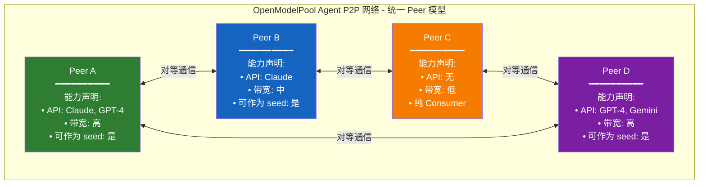

**核心原则**：

| 原则 | 说明 |
|------|------|
| **所有节点都是 seed** | 任何节点都可以为新加入的 peer 提供节点发现服务，无需硬编码的 Bootstrap 节点 |
| **角色由能力决定** | 节点声明自己拥有哪些 API、带宽能力，网络据此决定它可以承担的角色 |
| **动态角色** | 同一个节点在不同请求中可以扮演不同角色（发起请求时是 Consumer，帮别人中继时是 Relay） |
| **对等通信** | 所有节点之间的通信都是对等的，没有层级区分 |

**节点能力声明**：

每个节点加入网络时声明自己的能力：

```yaml
node_capabilities:
  # 提供的 API 能力（如果有）
  providers:
    - model: claude-3-opus
      region: us-west
      quota: 1000  # 每日可用 token 数
    - model: gpt-4
      region: us-east
      quota: 500
  
  # 网络能力
  network:
    bandwidth: high  # high/medium/low
    can_relay: true  # 是否愿意中继他人流量
    can_seed: true   # 是否作为 seed 帮助新节点发现
    
  # 声誉和信任
  reputation_score: 0.85
  uptime_hours: 720
```

**实际角色映射**：

根据能力声明，节点在实际请求中动态扮演不同角色：

| 实际角色 | 触发条件 | 说明 |
|---------|---------|------|
| **Consumer** | 任何节点发起请求时 | 所有节点都可以发起请求 |
| **Provider/Exit** | 节点拥有对应 API 且被选中时 | 拥有 API 能力的节点可以作为出口 |
| **Relay** | 节点声明 can_relay=true 且被选中时 | 带宽充足的节点可以中继流量 |
| **Seed** | 节点声明 can_seed=true 且在线时 | 所有节点默认都可以作为 seed |


### 2.2 节点发现

节点发现采用 **Peer Seed + Kademlia DHT + Gossip** 三层机制，所有节点都可以作为 seed 帮助新节点加入网络：

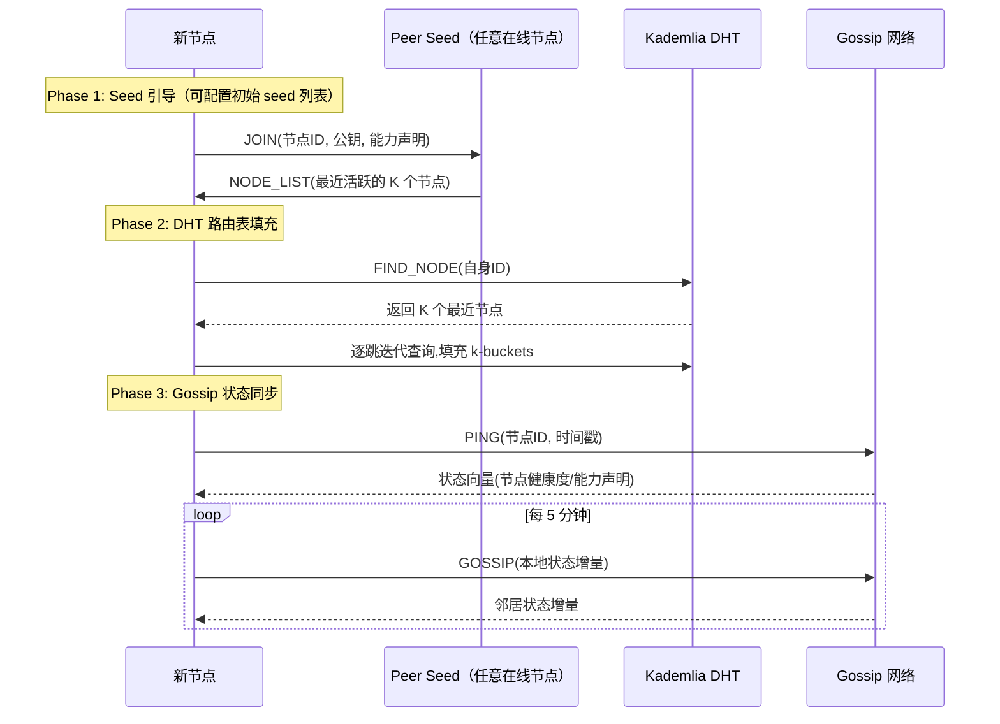

**发现机制细节**：

| 机制 | 用途 | 阶段 | 协议 |
|------|------|------|------|
| Peer Seed | 初始引导，任意在线节点都可以响应 | Phase 1–3 | HTTPS + 动态 seed 列表 |
| Kademlia DHT | 全局节点路由、能力注册 | Phase 2–3 | 自研基于 libp2p Kademlia |
| Gossip 协议 | 实时状态传播（节点在线/离线、能力变化） | Phase 2–3 | Plumtree / Scuttlebutt 变体 |
| mDNS | 本地网络发现 | Phase 1 | 标准 mDNS |

**初始 Seed 列表**：

新节点首次加入时，需要配置一个初始 seed 列表（可以是硬编码的官方节点，也可以是用户已知的任何节点地址）：

```yaml
initial_seeds:
  - https://seed1.openmodelpool.com
  - https://peer.example.com:8000
  # 或者任何已知的在线节点地址
```

一旦加入网络，新节点就可以通过 DHT 发现更多节点，不再依赖初始 seed。

### 2.3 多跳中继——适配 LLM API 的洋葱路由

Tor 的 3 跳电路是为低延迟 TCP 流设计的，但 LLM API 请求有其特殊性：**请求-响应模式（非持久流）、Token 级流式响应、单次请求体积大（prompt 可能达数十 KB）**。OpenModelPool Agent 对洋葱路由做了如下适配：

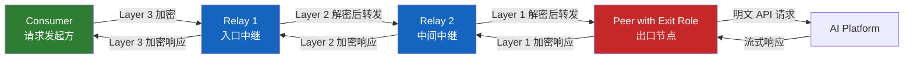

**与 Tor 洋葱路由的关键差异**：

| 维度 | Tor 洋葱路由 | OpenModelPool Agent 洋葱路由 |
|------|-------------|-------------------|
| 电路粒度 | TCP 流级别（持久电路） | **请求级别（短生命周期电路）** |
| 跳数 | 固定 3 跳 | **2–3 跳可配置**（国内→海外可 2 跳） |
| 加密层数 | 3 层 AES-CTR/AES-GCM | **2–3 层 AES-256-GCM** |
| 电路复用 | 长时间复用同一电路 | **每批请求新建电路**（降低关联分析风险） |
| 响应路径 | 原路返回 | **原路返回**（与 Tor 一致） |
| 流式支持 | 不适用 | **SSE 流式响应透传**（逐 chunk 加密回传） |
| 信元大小 | 固定 512 字节 Cell | **变长 Message**（适配 LLM 大 payload） |

**电路构建流程**（2 跳为例）：

```
Consumer                                    Relay                          Exit
   │                                         │                              │
   │──── CREATE(session_id, DH_gx₁) ────────>│                              │
   │<─── CREATED(session_id, DH_gy₁, H(K₁)) ─│                              │
   │                                         │                              │
   │──── RELAY_EXTEND(DH_gx₂, Exit_ID) ─────>│                              │
   │     [用 K₁ 加密]                        │──── CREATE(session_id, DH_gx₂) ─>│
   │                                         │<─── CREATED(session_id, DH_gy₂, H(K₂)) ─│
   │<─── RELAY_EXTENDED(DH_gy₂, H(K₂)) ─────│     [用 K₁ 加密]              │
   │                                         │                              │
   │──── DATA(encrypted_request) ────────────>│──── DATA(decrypt_layer) ─────>│
   │     [K₂(K₁(payload))]                   │     [K₁(payload)]            │
   │                                         │                              │────> AI API
   │                                         │                              │
   │<─── DATA(encrypted_response) ───────────│<─── DATA(response_chunk) ────│
   │     [K₂(K₁(response))]                  │     [K₁(response)]           │
```

### 2.4 端到端加密方案

加密体系采用分层设计，确保每跳只能解密自己负责的层：

| 加密层 | 算法 | 密钥来源 | 保护对象 |
|--------|------|---------|---------|
| **传输层** | TLS 1.3 | 节点间 ECDHE | 节点间所有通信（防窃听） |
| **电路层** | AES-256-GCM | 每跳 DH 密钥协商 | 信元载荷（洋葱加密/解密） |
| **端到端层** | AES-256-GCM + HMAC | Consumer 与 Exit 的 DH 协商 | 请求明文 + 响应明文（防恶意中继窥探） |
| **内容层** | 不额外加密 | — | AI 模型响应本身 |

**密钥派生链**：

```
每跳 DH 密钥协商 → HKDF-SHA256(salt=握手随机数, ikm=DH_shared_secret)
  → 派生 encryption_key (32 bytes) + authentication_key (16 bytes) + nonce_base (12 bytes)
  → 每个信元 nonce = nonce_base XOR counter
```

**前向安全**：电路生命周期短（默认 10 分钟轮换），且每次 DH 使用临时密钥对，即使长期身份密钥泄露，历史通信也无法解密。这与 Tor 的前向安全设计一致 [(Tor Design Paper)](https://svn.torproject.org/svn/projects/design-paper/tor-design.html)。

### 2.5 协议设计——节点间通信

节点间通信采用 **QUIC + 自定义帧协议** 作为主传输，WebSocket 作为穿透备选：

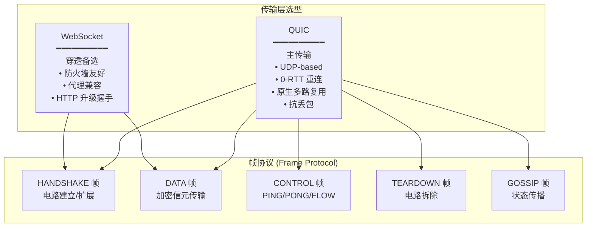

**帧格式**：

```
┌──────────┬──────────┬────────────┬──────────────────────────┐
│ Frame    │ Circuit  │  Payload   │  Payload                 │
│ Type     │ ID       │  Length    │  (加密后的数据)            │
│ (1 byte) │ (4 bytes)│ (4 bytes)  │  (变长)                   │
└──────────┴──────────┴────────────┴──────────────────────────┘

Frame Type:
  0x01  HANDSHAKE_CREATE
  0x02  HANDSHAKE_CREATED
  0x03  HANDSHAKE_EXTEND
  0x04  HANDSHAKE_EXTENDED
  0x10  DATA
  0x20  CONTROL_PING
  0x21  CONTROL_PONG
  0x22  CONTROL_FLOW
  0x30  TEARDOWN
  0x40  GOSSIP
  0xFF  ERROR
```

**选型依据**：QUIC 基于 UDP，在弱网环境下优于 TCP（WebSocket 底层），原生支持多路复用（多个电路共享一个连接），且 0-RTT 特性使重连极快。WebSocket 作为备选是因为部分网络环境阻断 UDP 但放行 HTTP 升级。gRPC 虽然高性能但需要 HTTP/2，在 P2P 穿透场景下不如 QUIC 灵活 [(WebSocket vs gRPC)](https://websocket.org/comparisons/grpc/)。

---

## 3. 信任与声誉体系

### 3.1 节点信誉评分算法

信誉评分采用多维度加权模型，实时计算，定期衰减：

```
Reputation(peer) = Σᵢ wᵢ × fᵢ(metricᵢ)

维度:
  f₁ = 请求成功率 (2xx / total)         w₁ = 0.25
  f₂ = 平均响应延迟百分位 (P50)           w₂ = 0.15
  f₃ = 累计服务时长 (小时)               w₃ = 0.20
  f₄ = 邀请链深度贡献                     w₄ = 0.15
  f₅ = 异常行为扣分 (负值)               w₅ = 0.25

衰减: 每天衰减 5%（半衰期约 14 天），防止历史声誉永久生效
```

**评分等级与权限**：

| 评分区间 | 等级 | 出口权限 | 中继权限 | 信任权重 |
|---------|------|---------|---------|---------|
| 0.8–1.0 | Diamond | ✅ 全部模型 | ✅ 优先路由 | 1.0 |
| 0.6–0.8 | Gold | ✅ 非敏感模型 | ✅ 正常路由 | 0.8 |
| 0.4–0.6 | Silver | ⚠️ 受限模型 | ✅ 正常路由 | 0.5 |
| 0.2–0.4 | Bronze | ❌ 不可出口 | ⚠️ 低优先 | 0.2 |
| 0–0.2 | Untrusted | ❌ | ❌ | 0.0 |

### 3.2 Sybil 攻击防御

Sybil 攻击是 P2P 网络的"终极 Boss"——一个攻击者可以零成本创建大量虚假身份 [(Sybil Attacks Explained)](https://www.litep2p.com/blog/sybil-attacks-protection)。OpenModelPool Agent 采用 **纵深防御（Defense in Depth）** 策略：

| 防御层 | 机制 | 原理 | 阶段 |
|--------|------|------|------|
| **经济成本** | 邀请码绑定（Phase 1） / 身份质押（Phase 3） | 增加身份创建成本 | 1–3 |
| **社交信任图** | Web of Trust（邀请链信任传递） | 类 PGP 签名，信任沿邀请链衰减传播 | 1–2 |
| **行为分析** | 请求模式指纹、时序分析 | 正常用户和 Sybil 集群行为分布显著不同 | 2–3 |
| **IP 限制** | 同一 /24 子网最多 3 个节点 | 防止单机批量注册 | 1–3 |
| **声誉门槛** | 低声誉节点流量受限 | 新身份无法立即获得高权限 | 2–3 |

**邀请链信任传递（类 PGP Web of Trust）**：

```
信任衰减公式:
  Trust(A→C via B) = Trust(A→B) × Trust(B→C) × decay^depth

  其中 decay = 0.7, depth = 邀请链跳数

  示例:
    A 信任 B (0.9) → B 邀请 C (0.8) → C 邀请 D (0.7)
    A 对 D 的信任 = 0.9 × 0.8 × 0.7 × 0.7^2 = 0.9 × 0.8 × 0.7 × 0.49 ≈ 0.248
    
    → D 的信任分低于 0.4，仅获 Bronze 等级
```

此设计与 SybilGuard/SybilLimit 的原理一致：诚实节点的社交图具有良好的扩展性（expansion），而 Sybil 区域与诚实区域之间只有少量"攻击边"（attack edges），信任在跨越攻击边时会快速衰减 [(SybilGuard)](https://www.litep2p.com/blog/sybil-attacks-protection)。

### 3.3 邀请链信任传递

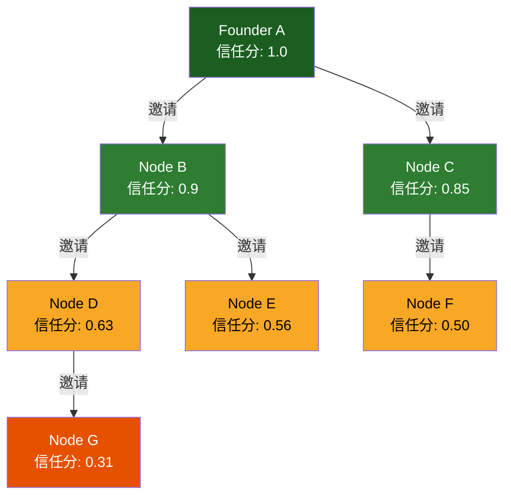

**邀请码设计**：

```
邀请码 = Base64(PK_inviter || HMAC(invite_secret, PK_invitee) || expiry || nonce)

验证逻辑:
1. 检查 expiry 未过期
2. 从 DHT 查询 PK_inviter 的声誉
3. 验证 HMAC 完整性
4. 计算被邀请者的初始信任分 = inviter_trust × 0.8 × decay^depth
5. 在 DHT 写入 /invite/{invite_code} → (inviter, invitee, timestamp)
```

### 3.4 恶意节点检测与联合封禁

**检测信号**：

| 信号 | 检测方式 | 严重度 | 处理 |
|------|---------|--------|------|
| 返回伪造响应 | 响应签名校验失败 | 🔴 高 | 即时降级 + 广播 |
| 流量分析攻击 | 异常电路建立频率 | 🟠 中 | 速率限制 + 观察 |
| 请求注入/篡改 | 端到端 HMAC 不匹配 | 🔴 高 | 即时封禁 + 广播 |
| 长期离线 | 心跳超时 > 30 分钟 | 🟡 低 | 自动降级 |
| 请求内容违规 | 出口节点内容审核 | 🟠 中 | 扣分 + 警告 |

**联合封禁流程**：

```
检测节点 → 本地标记 → Gossip 广播证据 → 收到 ≥3 个独立节点确认 
→ 网络级封禁(DHT 删除记录 + 路由表剔除) → 封禁记录上链/分布式存储
```

---

## 4. 贡献者保护机制

贡献者是网络中最关键的资产——他们承担着 API 账号被封的风险。保护贡献者即是保护网络的生命线。

### 4.1 速率自适应

出口节点根据上游平台的风控阈值动态调节请求速率：

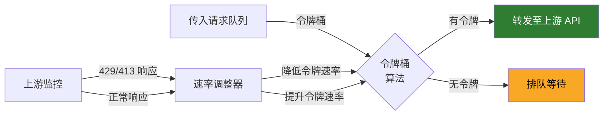

**令牌桶参数**：

| 参数 | 默认值 | 调整策略 |
|------|--------|---------|
| 每分钟最大请求数 (RPM) | 20 | 收到 429 → RPM × 0.7；连续 5 分钟正常 → RPM × 1.1 |
| 每日最大 Token 数 | 500K | 硬上限，不可超过 |
| 并发请求数 | 5 | 按上游平台文档设定 |
| 请求间隔抖动 | ±30% | 随机化，避免均匀间隔特征 |

### 4.2 行为模拟

使出口节点的请求模式尽可能接近正常用户：

| 模拟维度 | 策略 | 目的 |
|---------|------|------|
| **时间分布** | 正态分布随机间隔（μ=3s, σ=1.5s） | 避免均匀间隔的机器特征 |
| **请求多样性** | 随机切换模型、参数组合 | 避免单一模型高频调用的异常模式 |
| **会话模拟** | 构造伪对话上下文（system prompt 变换） | 模拟真实多轮对话 |
| **User-Agent 轮换** | 模拟不同客户端（浏览器/SDK/CLI） | 避免单一 UA 特征 |
| **IP 轮换** | 出口节点支持多 IP 绑定 | 分散请求来源 |

### 4.3 匿名隔离

**请求者不知出口节点身份，出口节点不知请求者身份**——这是通过洋葱路由天然实现的：

```
Consumer 发起请求:
  → 只知道 Relay 1 的地址（不知道 Relay 2 和 Exit）
  
Relay 1:
  → 只知道 Consumer 和 Relay 2 的地址（不知道 Exit 和请求内容）
  
Relay 2:
  → 只知道 Relay 1 和 Exit 的地址（不知道 Consumer 和请求内容）
  
Exit:
  → 只知道 Relay 2 的地址和请求明文（不知道 Consumer 身份）
  → 上游 AI 平台只能看到 Exit 的 IP
```

**额外保护**：Exit 在转发前对请求做"清洗"——移除 `X-Forwarded-For`、`X-Real-IP` 等 header，替换为 Exit 自身的标识，确保上游无法通过 HTTP header 追溯。

### 4.4 止损机制

| 止损规则 | 阈值 | 动作 |
|---------|------|------|
| 单日调用量上限 | 可配置（默认 1000 次/天） | 超限后自动拒绝新请求，次日重置 |
| 单日 Token 消耗上限 | 可配置（默认 500K tokens/天） | 超限后自动降级或拒绝 |
| 连续错误率 | 5 分钟内 >30% 错误 | 暂停 15 分钟 + 自检 |
| 上游风控信号 | 收到 429/403 | 立即暂停 + 指数退避 |
| 账号异常检测 | API Key 验证失败 | 停止服务 + 通知节点所有者 |

---

## 5. 跨区域中继方案

### 5.1 地理感知路由

出口节点在 DHT 中注册时附带地理元数据，Consumer 的路由算法优先选择地理最优路径：

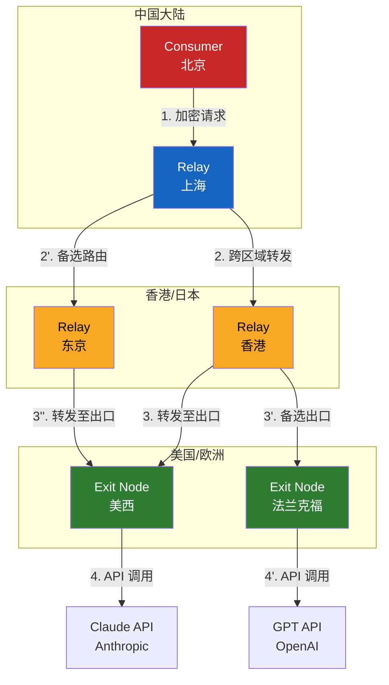

**路由选择算法**：

```
score(exit) = α × latency(consumer, exit)
           + β × (1 - reputation(exit))
           + γ × model_availability(exit, requested_model)
           + δ × congestion(exit)
           + ε × geo_risk(exit.region)

权重: α=0.3, β=0.25, γ=0.2, δ=0.15, ε=0.1
选择: score 最低的前 3 个出口作为主/备
```

### 5.2 出口节点伪装策略

| 策略 | 说明 | 实现方式 |
|------|------|---------|
| **住宅 IP 优先** | 住宅 IP 比数据中心 IP 更不易被标记为代理 | 鼓励家宽用户贡献出口能力 |
| **TLS 指纹统一** | 所有出口节点使用相同的 TLS 指纹（JA3/JA4） | Go crypto/tls 配置统一化 |
| **DNS 解析本地化** | 出口节点使用本地 DNS 递归解析 | 避免统一 DNS 服务器的指纹 |
| **流量整形** | 填充请求至固定大小块 + 随机延迟 | 抗流量分析 |

### 5.3 反检测技术

1. **流量填充**：将请求/响应填充至固定大小桶（1KB / 4KB / 16KB / 64KB），消除基于包大小的流量分析。
2. **请求伪装**：出口节点将 API 请求包装为正常的 HTTPS 请求（如访问 `api.anthropic.com` 的正常客户端行为），包括正确的 TLS SNI、HTTP/2 帧格式。
3. **连接复用**：出口节点与上游平台保持长连接池，新请求复用已有连接，减少连接建立频率的异常特征。
4. **时序随机化**：在请求间注入随机延迟（指数分布，μ=200ms），打破时间关联。

### 5.4 法律风险评估与缓解措施

**⚠️ 重大法律风险提示**：本项目架构设计仅供技术讨论，不构成法律建议。任何部署前必须咨询专业法律意见。

| 风险领域 | 风险描述 | 严重度 | 缓解措施 |
|---------|---------|--------|---------|
| **平台 TOS 违规** | 几乎所有 AI 平台禁止 API Key 转售/共享 [(OpenAI TOS)](https://community.openai.com/t/is-it-legal-to-host-a-proxy-of-openai-api-that-allows-third-parties-to-use-openai-api-without-providing-their-own-api-key/299854/10) | 🔴 高 | 仅限非商业场景；用户自持 Key；项目不从中获利 |
| **中国数据出境** | 用户对话经出境中继至海外服务器，触发《数据安全法》《个人信息保护法》合规要求 [(中国法律分析)](http://m.toutiao.com/group/7655255012952392192/) | 🔴 高 | 明确告知用户数据出境；敏感数据本地处理选项；隐私政策披露 |
| **EU GDPR** | 欧盟用户数据经中继可能非法传输至美国 [(GDPR 分析)](https://dredyson.com/the-hidden-legal-compliance-risks-when-ai-tools-break-under-byok-a-developers-complete-guide-to-data-privacy-gdpr-and-software-licensing-issues-with-broken-vision-routing-in-cursor-ide/) | 🟠 中 | 支持欧盟区域内出口节点优先路由；数据本地化选项 |
| **计算机犯罪法** | 绕过地域限制可能构成"非法获取计算机信息系统数据" [(中国判例)](http://m.toutiao.com/group/7655255012952392192/) | 🔴 高 | 项目定位于"个人自用工具"而非"公开服务"；不商业化运营 |
| **出口管制** | AI 模型可能受美国 EAR 出口管制 | 🟠 中 | 限制受控模型的共享范围；合规审查 |

**核心缓解原则**：

1. **非商业化**：项目不收取任何费用，无盈利模式，降低非法经营罪风险。
2. **用户自持 Key**：出口节点使用自己的 API Key，网络仅做路由中继，不做 Key 共享/转售。
3. **明确免责声明**：用户协议明确告知风险、数据路径、合规责任由用户自担。
4. **内容审核**：出口节点内置内容过滤（详见 §10.4），防止生成违规内容。
5. **区域限制**：可根据司法管辖区调整功能可用性。

---

## 6. 贡献激励

### 6.1 设计原则

贡献激励鼓励节点共享资源，维持网络健康发展。在统一 Peer 模型下，所有节点对等，贡献激励基于**实际贡献的资源量**，而非节点类型。

### 6.2 贡献积分系统

积分系统不是加密货币，而是网络内的 **贡献度记账单位**，用于优先级排序和公平调度：

| 贡献行为 | 积分奖励 | 计算方式 |
|---------|---------|---------|
| 共享 Provider 被调用 | +10 × model_weight | model_weight: GPT-4=1.5, Claude-3=1.3, 其他=1.0 |
| 节点在线时长 | +1 / 小时 | 累计在线即奖励 |
| 邀请新节点 | +20 | 被邀请者活跃 72h 后发放 |
| 滥用/违规 | -50 ~ -∞ | 视严重度扣分 |

**说明**：
- 统一 Peer 模型下，所有节点都可以贡献 Provider 算力
- 积分基于实际贡献，不区分节点类型
- 鼓励长期稳定在线，而非一次性刷分

### 6.3 公平调度算法

基于贡献积分的公平调度，确保高贡献节点获得优先服务：

```
调度优先级 = α × 贡献积分 / 总积分  (长期贡献, α=0.5)
           + β × 近期贡献率 / 网络均值   (近期活跃度, β=0.5)

请求分配:
  Provider 节点收到请求 → 按优先级排序 → 高优先级先服务
  低优先级请求 → 排队等待（最长 30s 超时）

关键设计:
  1. 累计积分而非即时速率 → 避免间歇性贡献的"搭便车"
  2. 近期贡献率衰减 → 鼓励持续贡献而非一次性刷分
  3. 简单透明 → 易于理解和调试
```

### 6.4 贡献排行榜

- **全球排行**：按贡献积分排名，每日更新
- **区域排行**：按地理区域排名（亚太/欧美/其他）
- **模型排行**：按贡献的模型类型排名
- **隐私保护**：排行榜仅显示节点哈希 ID，不暴露 IP 或身份

---

## 7. 渐进式部署策略

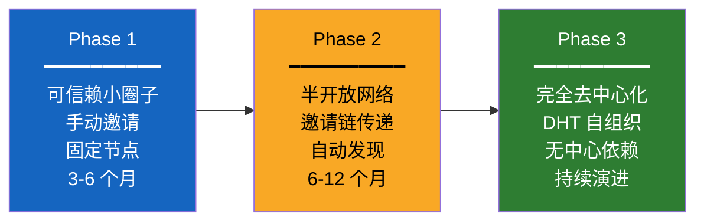

### Phase 1：可信赖小圈子（3–6 个月）

| 维度 | 配置 |
|------|------|
| 节点规模 | 10–50 个节点 |
| 加入方式 | 创始人手动发放邀请码 |
| 节点发现 | Peer Seed 列表（初始配置） |
| 路由 | 固定 2 跳（Consumer → Relay → Exit） |
| 加密 | TLS 1.3 + AES-GCM（无洋葱层） |
| 声誉 | 人工信任，无自动评分 |
| 激励 | 无积分系统，社区驱动 |
| 中继 | Cloudflare Tunnel（复用现有） |

**Phase 1 目标**：验证核心协议、加密、路由在真实环境下的可用性。

### Phase 2：半开放网络（6–12 个月）

| 维度 | 配置 |
|------|------|
| 节点规模 | 50–500 个节点 |
| 加入方式 | 邀请链信任传递（1 级邀请自动，2+ 级需审核） |
| 节点发现 | Peer Seed + Kademlia DHT |
| 路由 | 动态 2–3 跳洋葱路由 |
| 加密 | TLS 1.3 + 洋葱加密（2–3 层 AES-GCM） |
| 声誉 | 自动评分 + 邀请链信任 |
| 激励 | 积分系统上线，TFT 调度 |
| 中继 | 直连 + QUIC + WebSocket 穿透 |

**Phase 2 目标**：验证信任体系、激励机制、自动路由的可扩展性。

### Phase 3：完全去中心化（持续演进）

| 维度 | 配置 |
|------|------|
| 节点规模 | 500+ 个节点 |
| 加入方式 | 任何人可加入（声誉冷启动） |
| 节点发现 | 纯 Kademlia DHT + Gossip |
| 路由 | 自适应多跳（1–3 跳，按需选路） |
| 加密 | 完整洋葱加密 + 端到端加密 |
| 声誉 | 全自动，分布式存储 |
| 激励 | 完整 TFT + 积分经济 |
| 中继 | 全协议支持（QUIC/WebSocket/WebRTC） |

**Phase 3 目标**：网络可自组织运行，无单点依赖。

---

## 8. 技术选型

### 8.1 节点发现协议

| 方案 | 优势 | 劣势 | 推荐度 |
|------|------|------|--------|
| **libp2p Kademlia DHT** | 成熟、多语言实现、已被以太坊/IPFS 验证 | 依赖 libp2p 生态、Go 实现较重 | ⭐⭐⭐⭐ |
| 自研 Kademlia | 完全可控、轻量 | 工作量大、需自行验证安全 | ⭐⭐ |
| 纯 Gossip | 实现简单 | 扩展性差、不适合大规模 | ⭐ |

**决策：采用 go-libp2p Kademlia DHT**。理由：go-libp2p 是 Go 生态最成熟的 P2P 库 [(go-libp2p 文档)](https://docs.libp2p.io/guides/getting-started-go/)，已被以太坊、IPFS、Filecoin 等大规模网络验证，支持 DHT、Gossipsub、Circuit Relay v2 等我们需要的全部能力。Phase 1 仅用 Peer Seed 列表，Phase 2 逐步引入 DHT。

### 8.2 中继协议

| 方案 | 优势 | 劣势 | 推荐度 |
|------|------|------|--------|
| **类 Tor 洋葱路由（适配版）** | 成熟理论、请求级电路适合 API 场景 | 实现复杂 | ⭐⭐⭐⭐⭐ |
| 类 I2P 大蒜路由 | 更强的匿名性（单向隧道） | 过于复杂、延迟高 | ⭐⭐ |
| 简单 VPN 隧道 | 实现简单 | 无匿名性 | ⭐ |

**决策：类 Tor 洋葱路由（适配 LLM 场景）**。理由：I2P 的大蒜路由更适合持续性 P2P 通信（如 BitTorrent），而 OpenModelPool Agent 是请求-响应模式，Tor 的电路模型更匹配。关键适配点：请求级电路（非 TCP 流级）、变长信元（非固定 512B Cell）、SSE 流式响应支持 [(I2P vs Tor)](https://www.whonix.org/wiki/I2P)。

### 8.3 加密方案

| 层 | 选型 | 理由 |
|----|------|------|
| 传输层 | **TLS 1.3** | 行业标准、前向安全、Go 原生支持 |
| 电路层 | **AES-256-GCM** | Tor 0.4.x 正在迁移至 AEAD 模式 [(Tor AES-GCM)](https://routeharden.com/blog/tor-onion-routing-and-circuit-anonymity) |
| 密钥交换 | **X25519 ECDH** | 比 RSA 更快更安全、Noise 协议框架推荐 |
| 握手 | **Noise XX pattern** | 不需要预共享密钥、三消息双向认证 [(Noise Framework)](https://noiseprotocol.org/noise.html) |
| 哈希 | **BLAKE2b-256** | 比 SHA-256 更快、Go 原生支持 |

### 8.4 存储方案

| 数据类型 | 存储方式 | 理由 |
|---------|---------|------|
| 节点元数据 | **DHT 分布式存储** | 去中心化、自动冗余 |
| 声誉数据 | **本地 BoltDB + Gossip 同步** | 低延迟查询、最终一致性 |
| 邀请链记录 | **DHT + 本地 SQLite** | 持久化 + 可审计 |
| 配置/密钥 | **本地文件（加密）** | 安全性要求高、不需要分布式 |
| 审计日志 | **本地 SQLite** | 可选功能、隐私敏感 |

---

## 9. 与现有代码的集成路径

### 9.1 现有架构分析

```
OpenModelPool Agent v3.3.0 架构:
┌─────────────────────────────────────────────────────┐
│  Admin Panel (Web UI)                               │
├─────────────────────────────────────────────────────┤
│  API Gateway Layer                                   │
│  ├── OpenAI-compatible endpoints                    │
│  ├── Auth (JWT) + Rate Limiting                     │
│  └── Smart Router (4-dim: keyword/history/benchmark/feedback) │
├─────────────────────────────────────────────────────┤
│  Provider Layer                                      │
│  ├── 34+ AI Platform Adapters                       │
│  ├── AES-GCM Encryption                             │
│  └── Cloudflare Tunnel Integration                  │
├─────────────────────────────────────────────────────┤
│  Federation Layer                                    │
│  ├── Node Discovery (static config)                 │
│  ├── Invitation Code System                         │
│  └── Cross-node Request Forwarding                  │
└─────────────────────────────────────────────────────┘
```

### 9.2 需要新增的模块

| 模块 | 包路径 | 功能 | 阶段 |
|------|--------|------|------|
| `pkg/p2p` | P2P 网络栈 | libp2p 集成、DHT、Gossip | Phase 1 |
| `pkg/onion` | 洋葱路由 | 电路管理、多层加解密 | Phase 2 |
| `pkg/reputation` | 声誉引擎 | 评分计算、衰减、查询 | Phase 2 |
| `pkg/incentive` | 激励系统 | 积分记账、TFT 调度 | Phase 2 |
| `pkg/exit` | 出口节点 | 速率自适应、行为模拟、内容审核 | Phase 1 |
| `pkg/geo` | 地理路由 | 地理感知选路、延迟测量 | Phase 2 |
| `pkg/relay` | 中继服务 | 信元转发、流量统计 | Phase 2 |

### 9.3 需要改造的模块

| 现有模块 | 改造内容 | 兼容性 |
|---------|---------|--------|
| Federation Layer | 替换静态发现为 DHT | 向后兼容（保留静态配置作为 fallback） |
| Smart Router | 增加 P2P 路由维度（出口选择/中继路径） | 向后兼容（新维度为可选） |
| Auth (JWT) | 增加节点身份认证（Ed25519 签名） | 向后兼容（JWT 和节点签名共存） |
| Invitation Code | 增加邀请链信任传递 | 向后兼容（现有邀请码可作为 Phase 1 入口） |
| Admin Panel | 增加 P2P 网络状态、声誉、积分看板 | 向后兼容（新增 Tab 页） |
| Provider Adapters | 增加"通过 P2P 网络调用"模式 | 向后兼容（现有直连模式保留） |

### 9.4 兼容性保证

**渐进式演化原则**：每一阶段的改造都不破坏现有功能，用户可以选择是否启用 P2P 模式。

```
v3.3.0 用户升级路径:
  1. 升级到 v4.0 → 现有功能完全不变，新增 --p2p-mode=off 配置项（默认 off）
  2. 启用 --p2p-mode=phase1 → 引入 Peer Seed、固定 2 跳中继
  3. 升级到 v4.1 → --p2p-mode=phase2 → DHT 发现、洋葱路由、声誉系统
  4. 升级到 v5.0 → --p2p-mode=phase3 → 完全去中心化
```

---

## 10. 风险与合规

### 10.1 平台 TOS 风险分析

| 平台 | 相关条款 | 风险 | 缓解 |
|------|---------|------|------|
| OpenAI | "You may not ... sub-license, sell, resell, or transfer API keys" | 🔴 高 | 用户自持 Key，不转售 |
| Anthropic | "You must not share your API credentials with any third party" | 🔴 高 | 出口节点使用自己的 Key |
| Google Gemini | "You may not ... provide access to the Services to third parties" | 🔴 高 | 同上 |
| 国内模型 | "未经书面许可，不得拆分Token、搭建中转对外售卖" | 🟠 中 | 国内模型走直连，不经 P2P |

**关键区别**：OpenModelPool Agent P2P 不是"Key 共享/转售"平台——每个出口节点使用自己的 API Key，网络仅负责路由中继。这与"租借 Key"有本质区别，但在平台方看来可能仍属于违规。

### 10.2 各司法管辖区法律风险

| 司法管辖区 | 主要法律风险 | 风险等级 | 说明 |
|-----------|-------------|---------|------|
| 中国大陆 | 非法经营罪、数据出境、内容审核 | 🔴 高 | 已有 API 中转站站长被刑拘案例 |
| 美国 | CFAA（计算机欺诈法）、出口管制 | 🟠 中 | 绕过地域限制可能违反 CFAA |
| 欧盟 | GDPR 数据跨区域传输 | 🟠 中 | 用户对话可能含个人数据 |
| 日本 | 无专门限制 | 🟢 低 | VPN 合法，API 使用无地域限制 |
| 其他 | 各异 | 🟡 中低 | 需逐一评估 |

### 10.3 滥用防护

**多层内容审核体系**：

```
请求流入 → Consumer 本地审核（轻量规则）
         → 出口节点审核（调用 moderation API）
         → 上游平台审核（平台自带安全过滤）
         → 响应审核（出口节点扫描响应内容）
```

| 审核层 | 实现方式 | 检测内容 |
|--------|---------|---------|
| Consumer 本地 | 正则匹配 + 关键词过滤 | 明显违规关键词 |
| 出口节点 | 调用 OpenAI Moderation API / 本地分类器 | 违规内容类别 |
| 响应扫描 | 输出分类器 | 生成内容合规性 |
| 事后审计 | 日志分析（去标识化） | 异常使用模式 |

### 10.4 举报与封禁机制

```
举报流程:
  用户/节点 → 提交举报(被举报节点ID, 证据, 类型)
           → 举报进入 Gossip 网络传播
           → ≥3 个独立节点确认
           → 执行封禁(DHT 删除 + 路由剔除)
           → 封禁记录持久化（不可篡改日志）
```

---

## 11. 协议设计细节

### 11.1 消息格式（Protobuf 定义）

```protobuf
syntax = "proto3";
package openmodelpool.p2p;

// ===== 节点身份 =====
message NodeIdentity {
  bytes peer_id = 1;           // Ed25519 公钥的 SHA-256 哈希
  bytes public_key = 2;        // Ed25519 公钥
  string version = 3;          // 协议版本 (e.g., "4.0.0")
  NodeCapabilities caps = 4;   // 节点能力声明
}

message NodeCapabilities {
  bool can_relay = 1;          // 可作为中继
  bool can_exit = 2;           // 可作为出口
  repeated string models = 3;  // 可提供的模型列表
  string region = 4;           // 地理区域 (e.g., "us-west")
  int32 bandwidth_mbps = 5;    // 可用带宽
}

// ===== 电路管理 =====
message CircuitCreate {
  uint32 circuit_id = 1;
  bytes dh_public = 2;         // X25519 临时公钥
  bytes encrypted_payload = 3; // 可选：用于 EXTEND 的嵌套数据
}

message CircuitCreated {
  uint32 circuit_id = 1;
  bytes dh_public = 2;         // 响应方的 X25519 公钥
  bytes key_hash = 3;          // HMAC(协商密钥, "confirm") 用于验证
}

message CircuitExtend {
  uint32 circuit_id = 1;
  bytes next_node_id = 2;      // 下一跳节点 ID
  bytes encrypted_handshake = 3; // 给下一跳的加密握手数据
}

message CircuitExtended {
  uint32 circuit_id = 1;
  bytes dh_public = 2;         // 下一跳的 DH 公钥
  bytes key_hash = 3;
}

message CircuitTeardown {
  uint32 circuit_id = 1;
  enum Reason {
    NORMAL = 0;
    TIMEOUT = 1;
    ERROR = 2;
    POLICY = 3;   // 策略关闭（如风控触发）
  }
  Reason reason = 2;
}

// ===== 数据传输 =====
message DataCell {
  uint32 circuit_id = 1;
  bytes encrypted_payload = 2;  // AES-256-GCM 加密的载荷
  uint64 sequence_number = 3;   // 序列号（用于 nonce 派生）
  bool is_streaming = 4;        // 是否为流式响应片段
  bool is_final = 5;            // 是否为最后一个片段
}

// ===== API 请求（端到端加密层） =====
message AIRequest {
  string model = 1;
  repeated Message messages = 2;
  float temperature = 3;
  int32 max_tokens = 4;
  bool stream = 5;
  map<string, string> extra_params = 6;
  bytes request_hmac = 7;       // 端到端 HMAC，防篡改
}

message AIResponse {
  bool success = 1;
  string content = 2;           // 非流式：完整响应
  string stream_chunk = 3;      // 流式：单个 chunk
  string model_used = 4;
  int32 prompt_tokens = 5;
  int32 completion_tokens = 6;
  bytes response_hmac = 7;
}

message Message {
  string role = 1;              // system / user / assistant
  string content = 2;
}

// ===== 声誉与激励 =====
message ReputationUpdate {
  bytes peer_id = 1;
  float score_delta = 2;       // 分数变化量
  enum Reason {
    REQUEST_SUCCESS = 0;
    REQUEST_FAILURE = 1;
    MALICIOUS_BEHAVIOR = 2;
    CONTENT_VIOLATION = 3;
    UPTIME_BONUS = 4;
    INVITE_BONUS = 5;
  }
  Reason reason = 3;
  bytes reporter_id = 4;       // 报告者 ID
  bytes signature = 5;         // 报告者签名
}

message IncentiveRecord {
  bytes peer_id = 1;
  int64 points = 2;
  int64 timestamp = 3;
  enum Action {
    EXIT_REQUEST = 0;
    RELAY_FORWARD = 1;
    UPTIME = 2;
    INVITE = 3;
    REPORT = 4;
    PENALTY = 5;
  }
  Action action = 4;
  float amount = 5;
}

// ===== Gossip 状态 =====
message GossipMessage {
  enum Type {
    NODE_ONLINE = 0;
    NODE_OFFLINE = 1;
    REPUTATION_UPDATE = 2;
    CAPABILITY_CHANGE = 3;
    BAN_NOTIFICATION = 4;
    EXIT_AVAILABILITY = 5;
  }
  Type type = 1;
  bytes payload = 2;
  uint64 timestamp = 3;
  bytes origin_id = 4;
  bytes signature = 5;
  uint32 ttl = 6;              // 跳数限制
}
```

### 11.2 握手流程（Noise XX Pattern）

节点间建立加密连接使用 Noise XX 握手模式——双方无需预知对方公钥，三消息完成双向认证 [(Noise Framework)](https://noiseprotocol.org/noise.html)：

```
Noise_XX_25519_ChaChaPoly_BLAKE2b:

  Initiator (I)                          Responder (R)
  ─────────                              ─────────
  
  → e                                    // I 发送临时公钥
                                         // 双方状态: h = HASH(h || e_I)
  
  ← e, ee, s, es                        // R 发送临时公钥 + 执行 DH + 发送静态公钥(加密)
                                         // ee: DH(e_I, e_R) → 新 ck, k
                                         // s: R 的静态公钥 (用 k 加密)
                                         // es: DH(e_I, s_R) → 新 ck, k
                                         // 双方状态更新
  
  → s, se                               // I 发送静态公钥(加密) + 执行 DH
                                         // s: I 的静态公钥 (用 k 加密)
                                         // se: DH(s_I, e_R) → 新 ck, k
                                         // 握手完成，派生传输密钥

  → [传输密钥加密的应用数据]              // 双向加密通信开始
  ← [传输密钥加密的应用数据]
```

**选择 XX 而非 IK 的理由**：在 P2P 场景中，节点之间通常不预先知道对方的静态公钥。IK 要求 Initiator 预知 Responder 的静态公钥，适合客户端-服务器模型（如 WireGuard），但不适合对等网络。XX 虽然多一轮消息，但提供了更好的身份隐藏属性 [(Noise XX vs IK)](https://routeharden.com/blog/noise-protocol-framework)。

### 11.3 电路建立完整时序

```
Consumer (C)              Relay (R)              Exit (E)
    │                         │                       │
    │ 1. Noise XX 握手        │                       │
    │────────────────────────>│                       │
    │<────────────────────────│                       │
    │────────────────────────>│                       │
    │                         │                       │
    │ 2. CREATE circuit_1     │                       │
    │    (DH_gx₁, 随机数)     │                       │
    │────────────────────────>│                       │
    │                         │                       │
    │ 3. CREATED circuit_1    │                       │
    │    (DH_gy₁, H(K₁))     │                       │
    │<────────────────────────│                       │
    │                         │                       │
    │ 4. EXTEND circuit_1     │                       │
    │    (用 K₁ 加密:         │                       │
    │     E 的 ID, DH_gx₂)   │                       │
    │────────────────────────>│                       │
    │                         │ 5. Noise XX 握手       │
    │                         │──────────────────────>│
    │                         │<──────────────────────│
    │                         │──────────────────────>│
    │                         │                       │
    │                         │ 6. CREATE circuit_2   │
    │                         │    (DH_gx₂, 随机数)   │
    │                         │──────────────────────>│
    │                         │                       │
    │                         │ 7. CREATED circuit_2  │
    │                         │    (DH_gy₂, H(K₂))   │
    │                         │<──────────────────────│
    │                         │                       │
    │ 8. EXTENDED circuit_1   │                       │
    │    (DH_gy₂, H(K₂))     │                       │
    │<────────────────────────│                       │
    │                         │                       │
    │ 9. DATA (API 请求)      │                       │
    │    加密: K₂(K₁(payload))│                       │
    │────────────────────────>│ 解密 K₁ 层 ──────────>│ 解密 K₂ 层
    │                         │                       │ → 调用 AI API
    │                         │                       │
    │ 10. DATA (API 响应)     │ 加密 K₁ 层 <──────────│ 加密 K₂ 层
    │    K₂(K₁(response))    │                       │
    │<────────────────────────│                       │
```

---

## 12. 数据模型设计

### 12.1 节点数据模型

```go
// Node 表示网络中的一个节点
type Node struct {
    // 身份
    PeerID      []byte    // Ed25519 公钥哈希 (32 bytes)
    PublicKey   []byte    // Ed25519 公钥 (32 bytes)
    
    // 能力
    Role        NodeRole  // ORDINARY | RELAY | EXIT | BOOTSTRAP
    Models      []string  // 可提供的模型列表 (仅 EXIT)
    Region      string    // 地理区域代码
    Bandwidth   int       // 可用带宽 (Mbps)
    
    // 网络
    Addresses   []string  // 多地址列表 (multiaddr 格式)
    LastSeen    time.Time // 最后在线时间
    
    // 信任
    InviterID   []byte    // 邀请者 PeerID
    TrustScore  float64   // 信任分 [0.0, 1.0]
    InviteDepth int       // 邀请链深度
    
    // 统计
    TotalUptime   time.Duration // 累计在线时长
    RequestCount  int64         // 处理的请求数
    SuccessCount  int64         // 成功请求数
    Points        int64         // 贡献积分
}
```

### 12.2 电路数据模型

```go
// Circuit 表示一个洋葱路由电路
type Circuit struct {
    ID          uint32        // 电路 ID
    CreatedAt   time.Time     // 创建时间
    ExpiresAt   time.Time     // 过期时间 (默认 10 分钟)
    State       CircuitState  // BUILDING | ACTIVE | TEARDOWN | EXPIRED
    
    // 路径
    Path        []Hop         // 有序的跳列表
    
    // 密钥 (每跳一对)
    Keys        []CircuitKey  // 每跳的加密密钥
    
    // 统计
    BytesSent   int64
    BytesRecv   int64
    RequestCount int
}

type Hop struct {
    PeerID    []byte   // 节点 ID
    Address   string   // 网络地址
    IsExit    bool     // 是否为出口
}

type CircuitKey struct {
    EncryptKey  []byte  // AES-256 加密密钥 (32 bytes)
    AuthKey     []byte  // HMAC 密钥 (16 bytes)
    NonceBase   []byte  // Nonce 基数 (12 bytes)
    Counter     uint64  // 包计数器
}
```

### 12.3 声誉数据模型

```go
// ReputationRecord 表示一个节点的声誉记录
type ReputationRecord struct {
    PeerID      []byte       // 节点 ID
    Score       float64      // 当前总分 [0.0, 1.0]
    Level       TrustLevel   // DIAMOND | GOLD | SILVER | BRONZE | UNTRUSTED
    
    // 维度分项
    SuccessRate  float64     // 请求成功率
    LatencyP50   float64     // 中位延迟 (ms)
    UptimeHours  float64     // 累计在线时长
    InviteDepth  int         // 邀请链深度
    PenaltyScore float64     // 累计扣分
    
    // 时间窗口
    DailyRequests  int64     // 今日请求数
    DailyErrors    int64     // 今日错误数
    LastUpdated    time.Time // 最后更新
    
    // 历史快照 (用于趋势分析)
    ScoreHistory   []ScoreSnapshot
}

type ScoreSnapshot struct {
    Timestamp time.Time
    Score     float64
}
```

### 12.4 DHT 存储模型

| DHT Key | Value | TTL | 说明 |
|---------|-------|-----|------|
| `/node/{peer_id}` | Node (protobuf) | 48h | 节点元数据 |
| `/capability/{model}/{region}` | `[]peer_id` | 22h (重发布) | 出口能力注册 |
| `/reputation/{peer_id}` | ReputationRecord | 24h | 声誉记录 |
| `/invite/{code}` | `(inviter_id, invitee_id, ts)` | 30d | 邀请码记录 |
| `/ban/{peer_id}` | `(reason, evidence, ban_ts)` | 永久 | 封禁记录 |

---

## 13. 分阶段实施路线图

### Phase 1：可信赖小圈子（已完成 ✅）

| 任务 | 状态 | 说明 |
|------|------|------|
| 双模式隔离（personal / shared） | ✅ | mode=personal 时所有网络代码零开销 |
| NodeID 寻址（Ed25519） | ✅ | `mmx-` + hex(sha256(pubkey)[:16]) |
| 去中心化 relay（最多 3 跳） | ✅ | httputil.ReverseProxy，hop 防循环 |
| 同意流程 + 免责声明 | ✅ | 风险红色加粗，必须勾选确认 |
| 管理面板网络选项卡 | ✅ | 状态面板、relay URL 复制、节点管理 |
| OpenAI SDK 兼容 URL | ✅ | `https://{relay}/network/{node_id}/v1` |

### Phase 2：半开放网络（当前进行中 🔧）

| 任务 | 状态 | 子任务 |
|------|------|--------|
| **签名密钥系统** | ✅ | mk_ 格式密钥 + Ed25519 签名 + 跨节点公钥获取 |
| **贡献积分追踪** | ✅ | 贡献量记录 + 额度冻结 + 消费扣减 |
| **节点心跳与发现** | ✅ | 60s 心跳，gossip 协议传播节点状态 |
| **relay 密钥验证** | ✅ | relay 转发时验证 mk_ 密钥签名和额度 |
| **管理面板增强** | ✅ | 密钥管理 + 贡献统计 + 心跳状态 |
| **双 base URL 展示** | ✅ | 界面显示个人 + 共享网络 URL |
| **公共试用池** | ⏳ | mk_trial_{node_id} 试用密钥 + 2x 积分激励 + 试用额度划拨 |
| **动态阈值解锁** | ⏳ | 冷启动路由限制 + 动态阈值公式 + 积分解锁全网路由 |
| **开放 key 双模式** | ⏳ | 未绑定试用（mk_open_xxxxx，1000 tokens）+ 绑定 NodeID 正式使用 |
| **信誉乘数** | ⏳ | 在线率/延迟/投诉/时间加权 |
| **削峰填谷** | ⏳ | 未用额度转积分 + 透支机制 |
| **密钥分享** | ⏳ | 直赠/限额赠/时效赠 |
| **Kademlia DHT** | ⏳ | libp2p 替换简化 RouteTable |

### Phase 3：经济模型完善（下一步 ⏭️）

| 任务 | 优先级 | 子任务 |
|------|--------|--------|
| **开放 key 额度动态算法** | P0 | openKeyRatio 参数 + 信誉/贡献加权分配 + 5 分钟重算 + 最小额度保障 |
| **去中心化算法存储** | P0 | AlgorithmBlock 链式结构 + Genesis Block + 哈希链 + Ed25519 签名 |
| **算法调整共识** | P0 | 2/3 投票机制 + 提案系统 + 24h 投票期 + 紧急回滚（90%） |
| **洋葱路由** | P0 | 2–3 跳洋葱加密 + 电路逐跳扩展 + 端到端加密层 |
| **初期激励实现** | P1 | 分阶段激励参数 + 自动阶段切换 + 2/3 共识确认 |
| **全球统一 base URL** | P1 | network.openmodelpool.network + 智能路由引擎 + DNS 解析 |
| **声誉系统** | P0 | 评分引擎 + 邀请链信任传递 + 恶意节点检测 |
| **地理路由** | P1 | 出口节点地理注册 + 延迟感知选路 + 区域优先路由 |
| **大规模测试** | P0 | 50 节点压力测试 + 攻击模拟 + 性能优化 |

### Phase 4：终局——全球 AI 能力互联网（愿景 🌐）

| 任务 | 优先级 | 说明 |
|------|--------|------|
| **全球算力池** | P0 | 所有 token 汇入统一池，全球统一公共 key `mk_open_global_xxxxx` |
| **动态负载均衡** | P0 | 请求自动路由到全球最优节点，实时负载感知 |
| **跨区域流量优化** | P1 | 亚太/美洲/欧洲多区域智能调度 |
| **动态平衡** | P0 | 年均消费 ≈ 年均贡献，网络自我调节 |
| **真正的"AI 能力互联网"** | — | 一个 URL + 一个 Key = 访问全球所有 AI 能力 |

---

## 附录

### A. 术语表

| 术语 | 定义 |
|------|------|
| **Circuit** | 电路，Consumer 到 Exit 的一条加密通道 |
| **Cell / Message** | 信元，在电路上传输的加密数据单元 |
| **Peer with Exit Role** | 拥有 AI API 访问能力的节点，在请求中充当出口角色 |
| **Peer with Relay Role** | 声明 can_relay=true 的节点，在请求中充当中继角色 |
| **Peer Seed** | 任意在线节点，帮助新节点发现网络 |
| **DHT** | 分布式哈希表，去中心化的键值存储和路由 |
| **Gossip** | 流言协议，节点间状态增量传播 |
| **TFT** | Tit-for-Tat，以牙还牙激励策略 |
| **Sybil Attack** | 女巫攻击，通过创建大量虚假身份获取不当影响力 |
| **Web of Trust** | 信任网络，通过签名链传递信任 |
| **Trial Key** | 试用密钥（`mk_trial_{node_id}`），新节点加入时必须创建的公共试用密钥 |
| **Open Key** | 开放密钥（`mk_open_xxxxx`），网络公共入口，支持未绑定（试用）和绑定（正式）两种模式 |
| **Private Key** | 私有密钥（`mk_{consumer_id}.xxx`），节点签发给特定消费者，仅访问签发节点 |
| **Public Key** | 公共密钥（开放 key），可访问全网资源，受积分 + 信誉约束 |
| **Dynamic Threshold** | 动态阈值，新节点积分解锁全网路由的门槛，随网络状态动态调整 |
| **openKeyRatio** | 开放密钥资源比例，网络总资源中分配给开放 key 的比例（默认 30%） |
| **AlgorithmBlock** | 算法参数链的区块，包含版本号、参数、哈希链和 Ed25519 签名 |

### B. 协议版本兼容矩阵

| 版本 | P2P 模式 | 传输 | 加密 | 发现 | 经济模型 | 兼容 |
|------|---------|------|------|------|---------|------|
| v3.3 | 无 | HTTPS | TLS + AES-GCM | 静态配置 | — | — |
| v4.0 (Phase 1) | 固定 2 跳 | QUIC/WS | TLS + 单层 AES-GCM | Peer Seed | 基础积分 | v3.3 |
| v4.1 (Phase 2) | 洋葱 2–3 跳 | QUIC/WS | TLS + 多层 AES-GCM + E2E | DHT + Peer Seed | 签名密钥 + 试用池 + 动态阈值 + 开放 key | v4.0 |
| v5.0 (Phase 3) | 自适应 | QUIC/WS/WebRTC | 完整洋葱 + E2E | 纯 DHT | 额度动态算法 + 去中心化算法存储 + 共识 + 激励 | v4.1 |
| v6.0 (Phase 4) | 全球统一 | QUIC/WS/WebRTC | 完整洋葱 + E2E | 纯 DHT + 全球路由 | 全球算力池 + 动态平衡 | v5.0 |

### C. 参考资料

- Tor Design Paper: https://svn.torproject.org/svn/projects/design-paper/tor-design.html
- Kademlia DHT: Maymounkov & Mazières, "Kademlia: A Peer-to-Peer Information System Based on the XOR Metric"
- Noise Protocol Framework: https://noiseprotocol.org/noise.html
- go-libp2p: https://docs.libp2p.io/guides/getting-started-go/
- BitTorrent TFT: Cohen, "Incentives Build Robustness in BitTorrent"
- BitTyrant: Piatek et al., "Do Incentives Build Robustness in BitTorrent?"
- I2P Network: https://geti2p.net/en/docs/how/network
- IPFS DHT: https://docs.ipfs.tech/concepts/dht/
- WireGuard & Noise IK: https://www.wireguard.com/papers/wireguard.pdf

---

## 十、能力交换经济模型

### 10.1 核心理念：不是买卖，是交换

OpenModelPool Agent 共享网络的底层经济逻辑是**模型能力互换**，而非法币交易：

- 你有 Gemini Token 余量用不完，但想用 GLM
- 地球另一端的人有 GLM 额度富余，却想用 Gemini
- 你们互相交换，各取所需

**没有中间商，没有定价，没有法币。纯粹的能力互换，让每个 Token 都不浪费。**

### 10.2 贡献积分 = 交换货币

```
节点贡献 10,000 token → 获得 10,000 贡献积分
                      → 可签发总额度 ≤ 10,000 的访问密钥
                      → 密钥权重 = 签发额度 × 节点信誉分
```

**关键约束**：
- 节点只能签发**不超过其贡献量**的密钥额度（防通胀）
- 签发时**冻结**对应额度（防止超额签发）
- 密钥持有者消费时扣减冻结额度

### 10.3 签名密钥（Signed Key）结构

全球统一 Base URL + API Key 路由方案。消费者无需关心目标节点的实际地址：

```
Key 格式：mk_{consumer_id}.{payload}.{signature}

payload (JSON, Base64 编码)：
{
  "sub": "consumer_123",           // 消费者 ID
  "iss": "mmx-d7f4627ae9b6a20a",   // 签发节点 NodeID
  "quota": 15000,                   // 分配额度（token 数）
  "used": 3200,                     // 已消耗额度
  "models": ["gpt-4", "claude-3"],  // 可用模型列表（["*"] 表示全部）
  "weight": 14250,                  // 实际权重 = quota × 信誉分
  "iat": 1720000000,               // 签发时间
  "exp": 1735689600                 // 过期时间
}

signature：签发节点用 Ed25519 私钥签名 payload
```

**验证流程**：
1. 收到请求 → 解析 Key 中的签发节点 NodeID（`iss` 字段）
2. 从 DHT 路由表获取签发节点公钥
3. 用公钥验证签名 → 合法则提取 payload
4. 检查额度（quota - used > 0）、模型权限、过期时间
5. 通过 → 路由请求；拒绝 → 返回 401/403

**消费者使用方式（兼容 OpenAI SDK）**：
```python
import openai
client = openai.OpenAI(
    base_url="https://任意relay节点/network/目标NodeID/v1",
    api_key="mk_consumer123.eyJ...（签名密钥）"
)
response = client.chat.completions.create(
    model="gpt-4",
    messages=[{"role": "user", "content": "Hello"}]
)
```

### 10.4 节点信誉乘数

单纯贡献量不够——一个经常掉线的节点不应享有高权重。引入信誉乘数：

```
密钥实际权重 = 签发额度 × 签发节点信誉分

信誉分计算（0.0 ~ 1.0）：
  - 在线率权重 40%：90%+ 在线 = 1.0，< 50% = 0.3
  - 响应速度 25%：EWMA 延迟排名，前 20% = 1.0
  - 持续贡献时间 20%：3 个月+ = 1.0，< 1 周 = 0.3
  - 被投诉次数 15%：0 次 = 1.0，每投诉 -0.2
```

**信誉分定期更新**（每 24 小时重新计算），已签发密钥的权重随之调整。

### 10.5 时间维度：削峰填谷

用户每月用量波动大。网络帮助平滑：

```
月份    消耗      额度      差额      网络动作
1月     3,000     10,000   +7,000    → 贡献给网络，存入积分
2月     15,000    10,000   -5,000    ← 从积分池支取，或借用他人
3月     8,000     10,000   +2,000    → 贡献给网络
4月     20,000    10,000   -10,000   ← 大量借用
...
年均    11,500    10,000             网络抹平了波动
```

**机制**：
- 每月未用完的额度自动转为贡献积分（永不过期）
- 额度不足时可透支（透支量从未来贡献中扣减）
- 网络整体利用率趋近 100%（所有人的波动叠加后趋于稳定）

### 10.6 密钥分享（社交维度）

贡献者可以将自己签发的密钥分享给他人：

- **直赠**：把密钥直接给朋友，朋友用你的额度消费
- **限额赠**：设置子额度（如从 15,000 中分出 3,000 给朋友）
- **时效赠**：设置临时密钥（如 24 小时有效）

被分享者无需自己贡献，即可使用网络——前提是分享者有足够的贡献额度。

### 10.7 经济模型全景

```
┌─────────────────────────────────────────────────────────────┐
│                    OpenModelPool Agent 能力交换网络                      │
│                                                             │
│   ┌─────────┐   贡献    ┌──────────────┐   贡献    ┌──────┐ │
│   │ 节点 A  │ ───────→ │  贡献积分池   │ ←─────── │ 节点B│ │
│   │ Gemini  │          │  (全局账本)   │          │ GLM  │ │
│   │ 余量丰富 │          │              │          │余量丰富│ │
│   └─────────┘          └──────────────┘          └──────┘ │
│        ↑                      ↑↓                    ↑      │
│     调用 GLM              信誉 × 额度             调用 Gemini│
│        │                 = 密钥权重               │      │
│        └────────────────────┴────────────────────┘      │
│                                                             │
│   空间交换：Gemini ↔ GLM ↔ Claude ↔ 任意模型                │
│   时间交换：闲月存 → 忙月取 → 年均平滑                       │
│   社交交换：贡献者 → 密钥分享 → 非贡献者也能用               │
│   冷启动：试用池 + 动态阈值 → 新节点零门槛加入               │
│   公平性：开放 key 额度动态分配 → 资源紧张时自适应收缩        │
└─────────────────────────────────────────────────────────────┘
```

### 10.8 公共试用池机制

新节点加入网络时，必须创建公共试用密钥，为网络提供初始可试用资源。这是网络的"入场税"——**你必须先给予，才能获取**。

**核心规则**：

| 规则 | 说明 |
|------|------|
| 必须创建 | 新节点加入时自动创建 `mk_trial_{node_id}` 试用密钥 |
| 额度划拨 | 试用额度从节点自身配额中划拨（建议初期 50,000 tokens） |
| 2x 积分激励 | 试用池被消耗算 **2 倍贡献积分**（初期激励，鼓励节点开放更多额度） |
| 额度用尽 | 试用额度耗尽后试用 key 自动失效，不影响节点其他功能 |
| 补充机制 | 节点可手动补充试用池额度，获得额外信誉加成 |

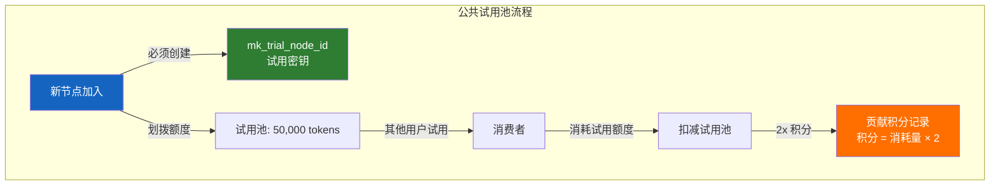

**试用密钥格式**：

```
Key 格式：mk_trial_{node_id}

payload (JSON, Base64 编码)：
{
  "type": "trial",
  "iss": "mmx-d7f4627ae9b6a20a",   // 签发节点 NodeID
  "quota": 50000,                    // 试用额度
  "used": 0,                         // 已消耗
  "models": ["*"],                   // 试用 key 可访问所有模型
  "iat": 1720000000,
  "exp": 1735689600,
  "multiplier": 2                    // 贡献积分乘数
}
```

### 10.9 动态阈值解锁（冷启动机制）

新节点刚加入时面临"冷启动问题"：没有任何贡献积分，也无法消费其他节点的服务。动态阈值解锁机制借鉴 BitTorrent 的分享率逻辑——**必须先上传（提供服务），才能获得下载（消费服务）的权利**。

**机制说明**：

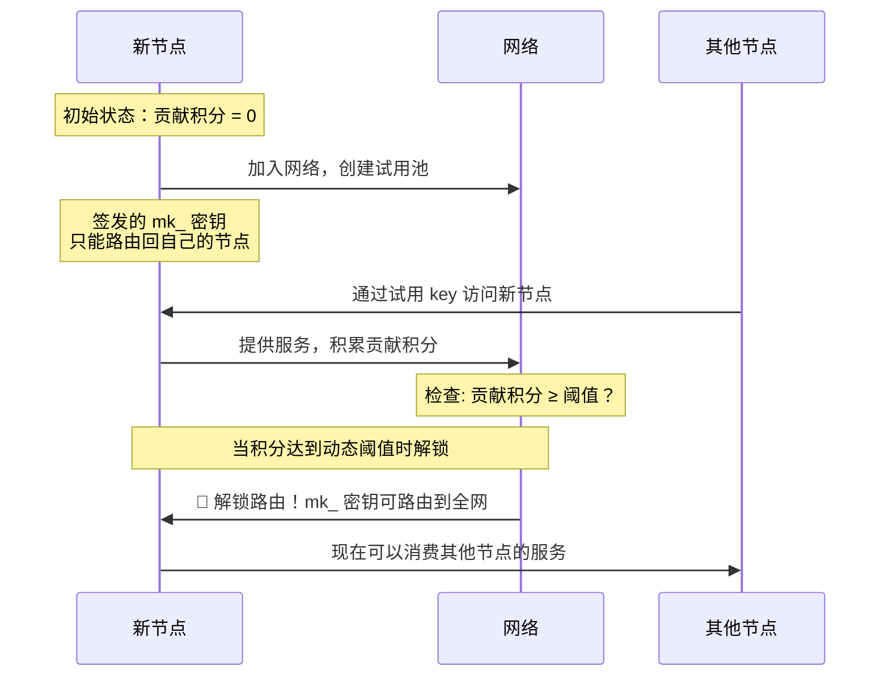

**动态阈值公式**：

```
解锁阈值 = 网络平均贡献 × 权重系数 × 网络规模因子

其中:
  网络平均贡献 = 全网总贡献积分 / 活跃节点数
  权重系数 = 0.3（可调整，控制解锁难度）
  网络规模因子 = log₁₀(活跃节点数 + 1) / log₁₀(101)
    → 100 节点时 ≈ 1.0
    → 1000 节点时 ≈ 1.5
    → 10000 节点时 ≈ 2.0

示例（100 节点，平均贡献 5000 积分）:
  阈值 = 5000 × 0.3 × 1.0 = 1500 积分
  → 新节点需积累 1500 贡献积分才能解锁全网路由
```

**阈值动态调整**：

| 网络状态 | 阈值变化 | 目的 |
|---------|---------|------|
| 网络资源充裕 | 阈值降低 | 鼓励更多节点消费，提高利用率 |
| 网络资源紧张 | 阈值升高 | 保护贡献者，优先服务高贡献节点 |
| 网络快速扩张 | 阈值暂时降低 | 加速新节点融入，避免冷启动壁垒过高 |

### 10.10 开放 Key 的双模式

开放密钥（`mk_open_xxxxx`）是网络的"公共入口"，支持两种使用模式：

#### 未绑定节点（纯试用模式）

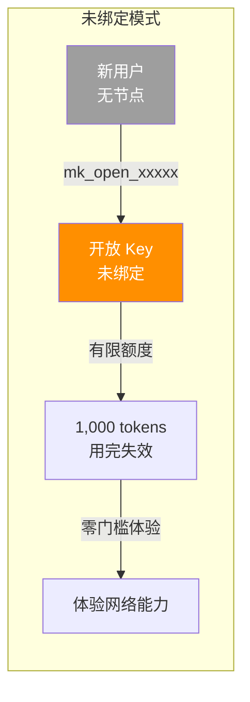

| 属性 | 说明 |
|------|------|
| Key 格式 | `mk_open_{random}` |
| 绑定信息 | 无（不绑定任何节点） |
| 额度 | 有限（如 1,000 tokens），用完即失效 |
| 访问范围 | 仅可访问试用池资源 |
| 目的 | 零门槛体验，让潜在用户感受网络价值 |

#### 绑定节点（正式使用模式）

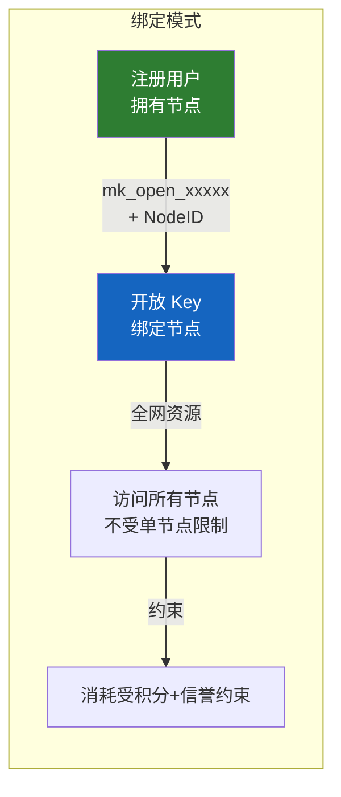

| 属性 | 说明 |
|------|------|
| Key 格式 | `mk_open_{random}`（关联 NodeID） |
| 绑定信息 | 使用者的节点 NodeID |
| 额度 | 由贡献积分 + 信誉动态决定（见 10.12） |
| 访问范围 | 全网资源（不受单节点限制） |
| 约束 | 消耗受积分 + 信誉约束——"我用我的信誉为消费担保" |

**模式对比**：

| 维度 | 未绑定（试用） | 绑定（正式） |
|------|-------------|-------------|
| 身份要求 | 无 | 需要注册节点 |
| 额度 | 固定 1,000 tokens | 动态计算（可很高） |
| 访问范围 | 试用池资源 | 全网资源 |
| 信誉要求 | 无 | 需良好信誉 |
| 消费约束 | 额度即上限 | 积分 + 信誉双重约束 |
| 目的 | 体验 | 日常使用 |

### 10.11 私有 Key vs 公共 Key

网络中存在两类密钥，适用场景和约束完全不同：

```mermaid
graph TB
    subgraph "密钥分类"
        PK[mk_{consumer_id}.xxx<br/>━━━━━━━━━━━━━━━<br/>私有 Key]
        CK[mk_open_xxxxx<br/>━━━━━━━━━━━━━━━<br/>公共 Key / 开放 Key]
    end
    
    PK -->|访问范围| SELF[仅签发节点<br/>单节点资源]
    PK -->|消耗来源| OWN[签发节点配额<br/>自己的资源]
    PK -->|约束条件| NONE[不受积分/信誉限制<br/>自给自足]
    
    CK -->|访问范围| ALL[全网资源<br/>所有节点]
    CK -->|消耗来源| NET[网络总资源<br/>动态分配]
    CK -->|约束条件| REPUTE[贡献积分 + 信誉<br/>双重约束]
    
    style PK fill:#C62828,color:#fff
    style CK fill:#1565C0,color:#fff
    style SELF fill:#FFCDD2,color:#000
    style ALL fill:#BBDEFB,color:#000
```

**对比表**：

| 维度 | 私有 Key（`mk_{consumer_id}.xxx`） | 公共 Key（`mk_open_xxxxx`） |
|------|-----------------------------------|---------------------------|
| 签发方式 | 节点签发给特定消费者 | 网络自动生成/节点开放 |
| 访问范围 | **仅签发节点** | **全网资源** |
| 消耗来源 | 签发节点的配额 | 网络总资源（动态决定） |
| 额度上限 | 签发节点设定（不超过其贡献量） | 动态计算（见 10.12） |
| 积分/信誉限制 | **无**（用的是自己的资源） | **有**（用的是公共资源，需信用担保） |
| 风险 | 仅影响签发节点 | 影响网络整体 |
| 适用场景 | 给朋友/团队使用 | 新用户试用 / 跨节点消费 |

### 10.12 开放 Key 额度动态决定算法

开放 Key 的额度不是固定的，而是根据网络总资源和用户贡献动态计算，每 5 分钟重新评估一次：

**核心公式**：

```
开放 Key 全局额度 = 网络总资源 × openKeyRatio

单个用户额度 = 开放 Key 全局额度 × (0.4 × 用户信誉/总信誉 + 0.6 × 用户贡献/总贡献)
```

**参数说明**：

| 参数 | 默认值 | 说明 |
|------|--------|------|
| `openKeyRatio` | 30% | 网络总资源中分配给开放 key 的比例（剩余 70% 给私有 key） |
| 信誉权重 | 0.4 | 信誉在额度分配中的权重 |
| 贡献权重 | 0.6 | 贡献在额度分配中的权重（略高于信誉，鼓励积极贡献） |
| 重算周期 | 5 分钟 | 每隔 5 分钟重新计算一次额度 |
| 最小额度 | 1,000 tokens | 保证每位用户有基本可用额度 |

**算法示例**：

```
假设网络状态:
  网络总资源 = 10,000,000 tokens
  openKeyRatio = 30%
  总信誉 = 500 (全网所有用户信誉之和)
  总贡献 = 1,000,000 (全网所有用户贡献积分之和)

全局开放额度 = 10,000,000 × 30% = 3,000,000 tokens

用户 A（信誉 10, 贡献 50,000）:
  额度 = 3,000,000 × (0.4 × 10/500 + 0.6 × 50000/1000000)
       = 3,000,000 × (0.008 + 0.03)
       = 3,000,000 × 0.038
       = 114,000 tokens

用户 B（信誉 5, 贡献 5,000）:
  额度 = 3,000,000 × (0.4 × 5/500 + 0.6 × 5000/1000000)
       = 3,000,000 × (0.004 + 0.003)
       = 3,000,000 × 0.007
       = 21,000 tokens
```

**自适应性**：

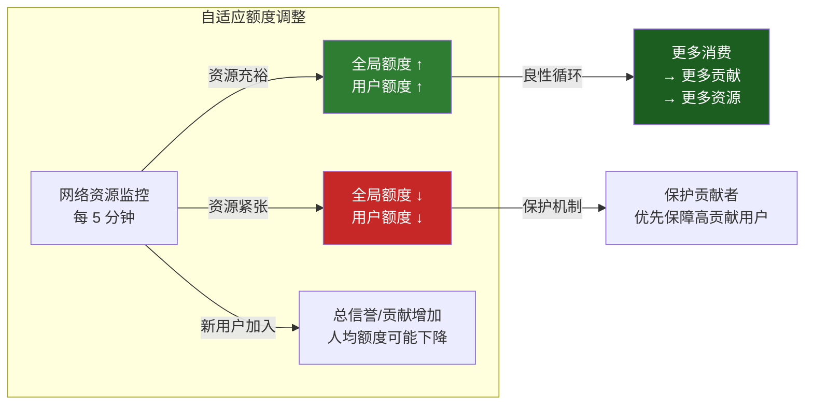

| 网络状态 | 全局额度 | 用户体验 |
|---------|---------|---------|
| 资源充裕（利用率 < 50%） | 大（openKeyRatio 可自动上调至 35%） | 额度充足，体验好 |
| 资源适中（利用率 50–80%） | 正常（openKeyRatio = 30%） | 额度够用 |
| 资源紧张（利用率 > 80%） | 收缩（openKeyRatio 下调至 20%） | 额度受限，但保障基本可用 |

### 10.13 去中心化算法存储

所有经济模型算法参数（`openKeyRatio`、权重系数、阈值因子等）采用链式结构分布式存储，确保透明、不可篡改、可审计。

**链式结构设计**：

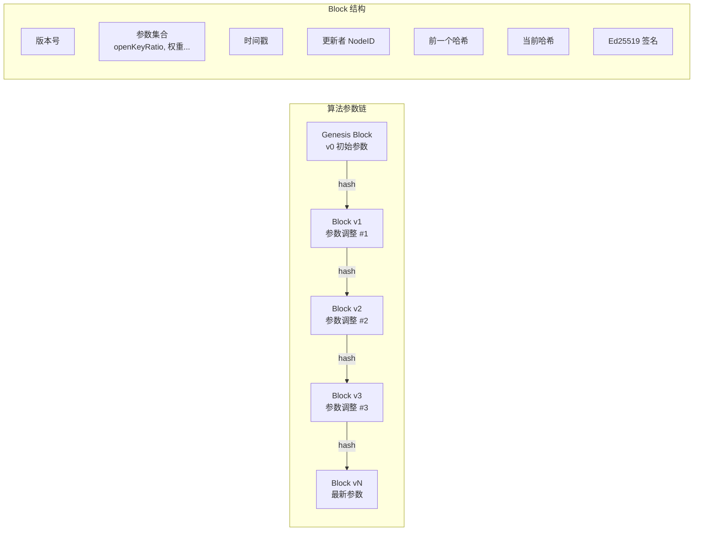

**单个 Block 结构**：

```
AlgorithmBlock {
    version:        uint64          // 版本号（递增）
    parameters: {                   // 算法参数集合
        openKeyRatio:       float64 // 开放 key 资源比例
        reputationWeight:   float64 // 信誉权重
        contributionWeight: float64 // 贡献权重
        thresholdFactor:    float64 // 阈值权重系数
        networkScaleFactor: float64 // 网络规模因子
        minQuota:           int64   // 最小额度
        // ... 其他可调参数
    }
    timestamp:      int64           // Unix 时间戳
    updater_node:   []byte          // 发起更新的节点 ID
    prev_hash:      [32]byte        // 前一个 Block 的 SHA-256 哈希
    current_hash:   [32]byte        // 当前 Block 的哈希
    signature:      []byte          // 更新者 Ed25519 签名
}
```

**共识机制**：

| 规则 | 说明 |
|------|------|
| 共识要求 | 算法调整需 **2/3 以上活跃节点同意**（类 PBFT） |
| 提案权 | 任何 Diamond/Gold 级别节点可提出参数调整提案 |
| 投票期 | 提案后 24 小时内投票，超时未投票视为弃权 |
| 执行条件 | 投票节点数 ≥ 活跃节点 50% 且同意率 ≥ 2/3 |
| 验证 | 每个节点可独立验证整条链的哈希连续性和签名合法性 |
| 回滚 | 如发现恶意参数，可发起紧急回滚提案（需 90% 同意） |

**安全属性**：

| 安全属性 | 实现方式 |
|---------|---------|
| **不可篡改** | 链式哈希 + Ed25519 签名，任何修改导致后续所有 Block 哈希不匹配 |
| **可审计** | 所有参数变更历史公开可查，每笔调整都有时间戳和投票记录 |
| **去中心化** | 链存储在所有节点，无单点控制 |
| **可验证** | 任何节点可从 Genesis Block 开始逐块验证，确保状态正确 |
| **抗审查** | 2/3 共识门槛确保少数节点无法单方面修改参数 |

### 10.14 初期激励机制

为加速网络冷启动，在不同阶段设置差异化的激励参数，早期加入者获得更多奖励：

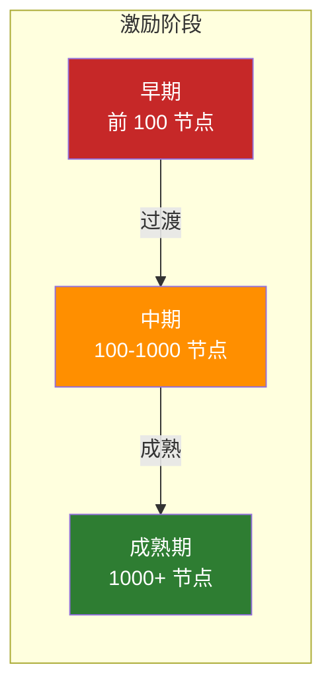

| 参数 | 早期（前 100 节点） | 中期（100–1000 节点） | 成熟期（1000+ 节点） |
|------|-------------------|---------------------|---------------------|
| 建议试用池 | 50,000 tokens | 20,000 tokens | 10,000 tokens |
| 贡献积分乘数 | **2x** | 1.5x | 1x（正常） |
| 信誉加成上限 | 最高 **+20%** | 最高 +10% | 最高 +5% |
| 试用池额度加成 | **+50%**（即 75,000） | +20%（即 24,000） | 无（10,000） |
| 动态阈值权重 | 0.2（更易解锁） | 0.25 | 0.3（标准） |
| 未绑定试用额度 | 2,000 tokens | 1,500 tokens | 1,000 tokens |

**早期激励原理**：

1. **2x 积分乘数**：早期节点贡献 1 token 获得 2 积分，快速积累积分以解锁全网路由
2. **+50% 试用池加成**：实际只需划拨 50,000 tokens 的配额，但试用池显示 75,000 tokens，降低早期节点的实际负担
3. **+20% 信誉加成**：早期节点的信誉评分额外加成 20%，加速信誉等级提升
4. **更低阈值权重**：动态阈值计算中权重系数降低，新节点更容易解锁全网路由

**激励递减逻辑**：

- 所有激励参数存储在去中心化算法链中（见 10.13）
- 阶段切换由网络自动判定（当活跃节点数达到阈值时触发）
- 切换后的新参数只影响新加入节点，已享有的激励不受追溯影响
- 阶段切换需 2/3 节点共识确认

### 10.15 终局愿景：全球统一 AI 能力网络

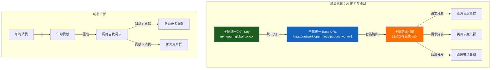

**愿景目标**：

| 目标 | 说明 |
|------|------|
| 全球统一 Base URL | `https://network.openmodelpool.network/v1`——一个地址，所有资源 |
| 全球统一公共 Key | `mk_open_global_xxxxx`——一个 key，访问所有模型 |
| 零配置体验 | 任何人拿到 key 即可使用，无需关心底层路由 |
| 智能路由 | 请求自动路由到全球最优节点（延迟最低、可用性最高） |
| 动态平衡 | 年均消费 ≈ 年均贡献，网络自我调节 |

**用户视角**：

```python
import openai

# 终局体验：一个 URL，一个 Key，访问全球 AI 能力
client = openai.OpenAI(
    base_url="https://network.openmodelpool.network/v1",
    api_key="mk_open_global_a1b2c3d4e5"
)

# 请求自动路由到全球最优节点
# 消耗的是用户的贡献积分（来自他分享的闲置算力）
response = client.chat.completions.create(
    model="gpt-4",
    messages=[{"role": "user", "content": "Hello"}]
)
```

**动态平衡机制**：

```
核心公式：年均消费 ≈ 年均贡献

实现路径:
  1. 消费 > 贡献时 → 积分余额下降 → 额度自动收缩 → 用户被激励贡献更多
  2. 贡献 > 消费时 → 积分余额上升 → 额度自动扩大 → 用户体验更好
  3. 网络层面 → 总消费 ≈ 总贡献 → 资源利用率最优化
  
  类比:
    BitTorrent → 上传/下载比趋近 1:1
    OpenModelPool → 年贡献/年消费比趋近 1:1
```

**与经典互联网的对比**：

| 维度 | 互联网 | OpenModelPool 终局 |
|------|--------|-------------|
| 统一入口 | 任何浏览器 → 任何网站 | 任何 SDK → 任何 AI 模型 |
| 寻址方式 | DNS → IP | DHT → NodeID → 最优节点 |
| 协议 | HTTP/HTTPS | OpenAI API 兼容 |
| 支付 | 法币/订阅 | 贡献积分（算力换算力） |
| 覆盖 | 全球 | 全球（跨区域 AI 能力） |

---

## 十一、Phase 1 & Phase 2 实现状态

### Phase 1（已完成 ✅）

| 功能 | 状态 | 说明 |
|------|------|------|
| 双模式隔离（personal / shared） | ✅ | mode=personal 时所有网络代码零开销 |
| NodeID 生成（Ed25519 派生） | ✅ | `mmx-` + hex(sha256(pubkey)[:16])，确定性，重启不变 |
| 强制同意流程 + 免责声明 | ✅ | 风险部分红色加粗，必须勾选确认 |
| 去中心化 relay 转发 | ✅ | httputil.ReverseProxy，hop 防循环（max 3） |
| RouteTable（简化 DHT） | ✅ | 内存路由表，TTL 10 分钟，5 分钟自动刷新 |
| NodeID 地址解析 API | ✅ | `GET /api/network/resolve/{node_id}` |
| 管理面板共享网络选项卡 | ✅ | 免责声明弹窗、状态面板、relay URL 复制、节点管理 |
| OpenAI SDK 兼容 URL 格式 | ✅ | `https://{relay}/network/{node_id}/v1` |

### Phase 2（进行中 🔧）

| 功能 | 状态 | 说明 |
|------|------|------|
| 签名密钥系统（mk_ 格式，Ed25519 签名） | ✅ | mk_{consumer_id}.{payload}.{signature}，跨节点公钥获取 |
| 贡献积分追踪 | ✅ | 贡献量记录 + 额度冻结 + 消费扣减 |
| 节点心跳与发现 | ✅ | 60s 心跳，gossip 协议传播节点状态 |
| relay 中 mk_ 密钥验证集成 | ✅ | relay 转发时验证 mk_ 密钥签名和额度 |
| 管理面板密钥管理 + 贡献统计 + 心跳状态 | ✅ | 密钥签发/吊销、积分看板、节点在线状态 |
| 界面显示双 base URL（个人 + 共享网络） | ✅ | 个人 URL 和共享网络 URL 并列展示 |
| 公共试用池机制 | ⏳ | mk_trial_{node_id} 试用密钥 + 2x 积分激励 |
| 动态阈值解锁 | ⏳ | 冷启动路由限制 + 动态阈值公式 + 积分解锁 |
| 开放 key 双模式（绑定/未绑定） | ⏳ | mk_open_xxxxx 未绑定试用 + 绑定 NodeID 正式使用 |

### 新增文件

| 文件 | 行数 | 职责 |
|------|------|------|
| `network.go` | ~480 行 | 双模式隔离、NodeID 派生、RouteTable、同意流程、API handlers |
| `network_relay.go` | ~280 行 | 去中心化 relay 转发、hop 防循环、bootstrap 查询 |

### 待后续实现

| 功能 | 计划阶段 | 说明 |
|------|----------|------|
| 开放 key 额度动态决定算法 | Phase 3 | openKeyRatio + 信誉/贡献加权分配 + 5 分钟重算 |
| 去中心化算法存储（链式结构） | Phase 3 | AlgorithmBlock 链 + 共识机制 |
| 算法调整共识机制 | Phase 3 | 2/3 投票 + 提案 + 24h 投票期 |
| 初期激励机制实现 | Phase 3 | 分阶段激励参数 + 自动阶段切换 |
| 全球统一 base URL（智能路由） | Phase 4 | network.openmodelpool.network + 智能路由引擎 |
| 信誉乘数计算 | Phase 2 | 在线率/延迟/投诉/时间加权 |
| 削峰填谷（月度额度平滑） | Phase 2 | 未用额度转积分 + 透支机制 |
| 密钥分享（社交维度） | Phase 2 | 直赠/限额赠/时效赠 |
| 完整 Kademlia DHT | Phase 2 | libp2p 替换简化 RouteTable |
| 洋葱路由（多层加密） | Phase 3 | 2-3 跳请求级电路 |
| 端到端加密 | Phase 3 | 中间节点不可见请求内容 |

### 技术选型（开源优先原则）

| 需求 | 选型 | 理由 |
|------|------|------|
| Ed25519 密钥 | `crypto/ed25519`（Go 标准库） | 成熟、无外部依赖 |
| 反向代理 | `net/http/httputil.ReverseProxy` | 标准库，支持 SSE 流式 |
| 序列化 | `encoding/json` | 简单够用，后续可切 protobuf |
| 路由 | Go 1.22+ `ServeMux` | 不引入第三方路由库 |
| 加密 | 复用已有 AES-256-GCM | 一致性，不重复造轮子 |

---

> **文档维护说明**：本文档随项目迭代持续更新。每个 Phase 完成后，需更新兼容矩阵和实际工时数据。所有架构决策需在 ADR (Architecture Decision Record) 中记录理由。
>
> **最近更新**：2026-07-07 新增经济模型机制（10.8 公共试用池、10.9 动态阈值解锁、10.10 开放 key 双模式、10.11 私有 vs 公共 key、10.12 开放 key 额度动态算法、10.13 去中心化算法存储、10.14 初期激励机制、10.15 终局愿景）；更新第十三章迭代路线图（Phase 1–4）；更新第十一章 Phase 2 进度。

## 公共 Key（mk_public_v1）设计澄清

> 2026-07-09 用户确认

### 正确理解

公共 Key（mk_public_v1）的核心设计：

1. **不绑定任何节点** — 它不是某个节点签发的，不属于任何节点
2. **不访问本节点的 Provider 资源** — 它的路由目标不是本地 Provider
3. **始终访问共享网络公共池** — 访问的是全网中由不同节点共享出来的那部分公共模型算力资源
4. **功能永远一致** — 无论当前节点是否加入共享网络，公共 Key 的行为定义不变

### 行为说明

**公共 Key 永远可以访问全网资源**。

| 场景 | 行为 |
|------|------|
| 所有场景 | 公共 Key 始终路由到全网共享池，访问所有节点共享的公共算力 |

**设计原则**：
- 节点只要有公网访问能力，就自动加入 P2P 网络
- 公共 Key 是网络层概念，不绑定任何特定节点
- 公共 Key 始终可以访问全网共享资源
- 唯一的限制是动态额度（池中可用资源总量 / 当前活跃用户数）

### 额度分配：动态分配机制

公共 Key 的访问资源额度**不是固定值**，而是基于实时供需动态分配：

**供给侧**：整个算力池中允许公共 Key 访问的资源总量
- 各节点贡献到共享池的资源之和
- 节点可随时调整贡献量，池子总量实时变化

**需求侧**：当前使用公共 Key 的活跃用户数
- 按终端（IP/设备指纹）识别独立用户

**动态公式**：
```
每个公共 Key 用户的可用额度 ≈ 池中可用资源总量 / 当前活跃用户数
```

**特点**：
- 资源多、用户少 → 每人额度充裕
- 资源少、用户多 → 每人额度收紧，但不会完全不可用
- 节点加入/退出 → 池子总量变化，额度自动调整
- 无需预设固定配额，系统自适应

**与固定配额的区别**：
| 维度 | 固定配额 | 动态分配（本设计） |
|------|---------|------------------|
| 每个用户的额度 | 预设固定值（如10万token/天） | 实时计算，随供需变化 |
| 节点退出影响 | 不影响其他用户 | 池子缩小，所有人额度相应减少 |
| 用户激增影响 | 后来者无法使用 | 所有人额度均摊减少 |
| 管理复杂度 | 需要手动设定和调整 | 全自动，无需人工干预 |

### 常见误解

- ❌ 公共 Key 不是"本地试用 Key"
- ❌ 公共 Key 不应该 fallback 到本地 Provider
- ❌ `AllowPublic` 不应默认为 `true`
- ❌ 公共 Key 额度不是固定值
- ✅ 公共 Key 是去中心化网络思想的体现，属于网络层概念，不属于节点层
- ✅ 额度是动态的，由供需实时决定

---

## 16. 节点模型澄清：加入网络 vs 共享资源

### 16.1 核心原则

**节点加入网络是默认行为**，只要节点能访问公网，就自动成为网络的一部分。

| 概念 | 含义 | 是否默认 |
|------|------|---------|
| **加入网络** | 节点成为 P2P 网络的一部分，可以路由到全网 | ✅ 默认开启 |
| **共享资源** | 节点将自己的 Provider 算力贡献给网络，供其他用户使用 | ❌ 需要主动开启 |

### 16.2 加入网络的目的

加入网络的唯一目的是：**让所有用户可以通过任何可达的节点 URL 路由到全网**。

这意味着：
- 用户拿到任何一个节点的 base URL（无论是局域网还是隧道地址）
- 使用合法的 Key（公共 Key、Guest Key 或 Proxy API Key）
- 就可以访问整个网络的资源（受 Key 类型和额度限制）

### 16.3 共享资源的控制

是否共享自己的资源是一个**独立的开关**，控制节点是否进入共享资源池：

```yaml
node_config:
  # 网络参与（默认开启）
  network_enabled: true  # 加入网络，可以路由到全网
  
  # 资源共享（独立控制）
  share_to_pool: false  # 是否将自己的 Provider 贡献给共享池
```

**对 Proxy API Key 的影响**：

| 共享资源开关 | Proxy API Key 的访问范围 | 说明 |
|-------------|-------------------------|------|
| `share_to_pool: false` | 仅访问自己的 Provider | 节点的 API Key 只能使用自己配置的 Provider |
| `share_to_pool: true` | 访问全网共享算力 | 节点的 API Key 可以使用所有节点贡献的共享资源 |

### 16.4 设计理念

这种设计的优势：

1. **降低门槛**：任何人都可以部署节点并立即使用，通过任何可达 URL 访问全网
2. **自主控制**：是否共享自己的资源完全由节点所有者决定，不影响基本的网络参与
3. **网络价值**：加入的节点越多，路由路径越丰富，网络可用性和冗余度越高
4. **渐进式共享**：节点可以先体验网络的价值，再决定是否贡献自己的资源

### 16.5 与 Key 体系的关系

| Key 类型 | 访问范围 | 与共享池的关系 |
|---------|---------|--------------|
| **公共 Key** | 全网共享池 | 只能访问共享池中的资源，动态额度 |
| **Guest Key** | 签发节点的网络范围 | 如果签发节点加入共享池，Guest Key 可以访问全网共享资源 |
| **Proxy API Key** | 取决于节点的共享配置 | 节点共享=全网，节点不共享=仅自己 |


---

## 17. P2P 网络基础模型

### 17.1 核心理念

**所有部署的节点自动组成一个 P2P 网络**。

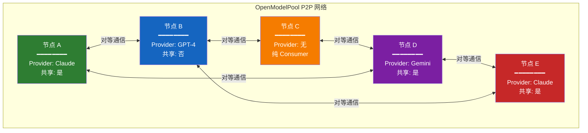

### 17.2 网络的组成

- **每个节点都是网络的一部分**：只要部署并运行，节点就自动成为 P2P 网络的成员
- **节点之间是对等的**：没有中心服务器，没有主从关系，所有节点地位平等
- **网络由所有节点共同维护**：节点发现、路由、状态同步都通过节点之间的通信完成

### 17.3 网络的价值

| 节点数量 | 网络价值 |
|---------|---------|
| 1 个节点 | 只能访问自己的资源（退化为单点网关） |
| 2-5 个节点 | 可以提供基础的路由冗余和简单的资源共享 |
| 10+ 个节点 | 形成有意义的网络，提供多路径选择和资源池化 |
| 100+ 个节点 | 真正的 P2P 网络，高可用性、高冗余度、全球化覆盖 |

### 17.4 网络拓扑

节点可以分布在不同地理位置，通过 P2P 协议互联：

```
中国大陆节点群 ←→ 香港/日本节点群 ←→ 美西节点群 ←→ 欧洲节点群
     ↓                    ↓                  ↓              ↓
   本地路由            跨区域中继          API 出口        API 出口
```

所有节点共同组成一个覆盖全球的去中心化网络。

---

## 18. 域名与节点通信的关系

### 18.1 核心原则

**P2P网络建立后，节点间通信不再依赖域名**。

### 18.2 域名的定位

域名从"必需"降级为"可选的便利功能"：

| 场景 | 是否依赖域名 | 说明 |
|------|-------------|------|
| **节点间通信** | ❌ 不依赖 | 节点通过 NodeID 互相发现和通信 |
| **初始引导** | 可选 | 新节点加入网络时需要 seed 地址，可以是域名、IP+端口或隧道URL |
| **用户访问入口** | 可选 | 用户访问任意节点的 URL（域名/IP/隧道均可），然后路由到全网 |
| **域名绑定功能** | ✅ 保留 | 作为可选的便利功能，提供更友好的访问地址 |

### 18.3 保留域名绑定功能的原因

1. **用户体验**：`api.openmodelpool.com` 比 `49.233.196.249:8000` 更易记
2. **灵活性**：IP 变更时域名可以指向新地址，不影响用户访问
3. **SSL 证书**：域名便于管理和更新 HTTPS 证书
4. **负载均衡**：可以通过域名配置 CDN 或负载均衡

### 18.4 节点通信机制

节点间通信完全基于 NodeID：

```
节点 A (NodeID: mm-J2SEF6ZmUB4U14C8KwzBFr)
  ↓ 通过 DHT 发现
节点 B (NodeID: mm-YWRcCvFGCxuAAc1GQH4zuQ)
  ↓ 直接通信
节点 C (NodeID: mm-XXXXXXXXXXXXXXXXXXXX)
```

- 节点 IP 变更不影响网络（DHT 自动更新路由表）
- 节点通过 NodeID 标识，不绑定特定域名或 IP
- 任意节点都可以作为入口，路由到全网资源

### 18.5 设计决策

- **保留域名绑定功能**：作为用户访问入口的便利选项
- **节点通信不依赖域名**：通过 NodeID + DHT 实现真正的去中心化
- **支持多种访问方式**：域名、IP+端口、隧道URL 都可以作为节点访问入口

---

## 19. BitTorrent 网络精髓借鉴

### 19.1 为什么借鉴 BitTorrent

BitTorrent 是最成功的 P2P 网络之一，其设计哲学值得深入学习：
- **简单**：协议简单，实现简单，效果好
- **对等**：所有节点平等，没有特殊节点
- **激励**：贡献越多，收益越大（Tit-for-Tat）
- **自组织**：网络自动发现、自动优化、自动容错

### 19.2 BT 精髓在 OpenModelPool 的应用

| BT 精髓 | BT 实现 | OpenModelPool 应用 |
|---------|---------|-------------------|
| 完全去中心化 | 无中心服务器，Tracker 可选 | 统一 Peer 模型，无 Bootstrap 依赖 |
| 自组织网络 | 节点自动发现、连接、优化 | DHT + Gossip 自动发现 |
| 激励兼容 | Tit-for-Tat，贡献多=下载快 | 贡献积分 → 优先级调度 |
| 简单高效 | 协议简单，效果好 | 移除复杂设计，保留核心 |
| 资源共享 | 每个节点既是下载者也是上传者 | 每个节点既是 Consumer 也是 Provider |
| 容错性强 | 节点随意进出，不影响整体 | 无单点故障，真去中心化 |

### 19.3 BT 网络没有的（我们也不应该有）

- ❌ 复杂的节点类型区分（Bootstrap/Relay/Exit）
- ❌ 强制的中心化引导（硬编码 Bootstrap 节点）
- ❌ 复杂的匿名路由（洋葱路由多跳中继）
- ❌ 复杂的声誉/信任系统（积分之外的一切）

### 19.4 设计原则

> "Make it work, make it simple, make it scale"

1. **简单优先**：能用简单方案解决的，不用复杂方案
2. **对等为本**：所有节点平等，没有特殊节点
3. **激励驱动**：贡献越多，收益越大
4. **自组织**：网络自动发现、自动优化、自动容错
5. **渐进演进**：先跑通核心功能，再逐步优化

### 19.5 与经典 P2P 网络的对比

| 维度 | BitTorrent | Tor | IPFS | **OpenModelPool** |
|------|-----------|-----|------|-------------------|
| 共享资源 | 文件分片 | 带宽/中继 | 存储/内容 | **AI 模型调用能力** |
| 节点模型 | 统一 Peer | 分层（Entry/Relay/Exit） | 统一 Peer | **统一 Peer** ✅ |
| 发现机制 | Tracker/DHT | 目录权威 | Kademlia DHT | **DHT + Gossip** ✅ |
| 激励机制 | Tit-for-Tat | 无偿志愿 | Pinning 服务费 | **贡献积分** ✅ |
| 复杂度 | 低 | 高 | 中 | **低** ✅ |
| 匿名性 | 无 | 强 | 无 | **可选** |
| 容错性 | 强 | 中 | 强 | **强** ✅ |

**核心差异**：OpenModelPool 共享的是"AI 模型调用能力"，而非文件或带宽。这是实时、有状态、有配额的资源，但网络拓扑和激励机制可以充分借鉴 BT 的简单高效。

---

## 20. 个人版 vs 共享版：极简设计

### 20.1 核心洞察

**个人版和共享版的唯一区别是 `share_to_pool` 配置**。

部署方式、二进制文件、网络协议完全相同，只是这一个开关决定了节点的行为。

### 20.2 对比表

| 维度 | 个人版（share_to_pool=false） | 共享版（share_to_pool=true） |
|------|------------------------------|------------------------------|
| **部署方式** | 完全相同 | 完全相同 |
| **二进制文件** | 同一个 | 同一个 |
| **加入网络** | ✅ 自动加入 | ✅ 自动加入 |
| **访问范围** | 仅自己的 Provider | 全网共享算力 |
| **公共Key** | 可以使用（访问共享池） | 可以使用（访问共享池） |
| **Guest Key** | 签发后仅访问自己 | 签发后访问全网 |
| **Proxy API Key** | 仅自己 | 全网 |
| **贡献积分** | 不赚取 | 赚取 |
| **资源消耗** | 仅自己使用 | 可能为他人提供服务 |

### 20.3 配置示例

```yaml
# 个人版配置
network:
  enabled: true
  share_to_pool: false  # 不共享，仅访问自己的资源

providers:
  - name: "claude"
    api_key: "sk-xxx"
    base_url: "https://api.anthropic.com"
```

```yaml
# 共享版配置
network:
  enabled: true
  share_to_pool: true  # 共享到公共池，可访问全网资源

providers:
  - name: "claude"
    api_key: "sk-xxx"
    base_url: "https://api.anthropic.com"
```

### 20.4 设计优势

1. **极简**：一个开关决定一切，没有复杂的配置
2. **灵活**：可以随时在个人版和共享版之间切换
3. **统一**：同一个二进制文件，降低维护成本
4. **清晰**：用户完全理解自己在做什么（共享或不共享）

### 20.5 用户场景

**场景1：个人开发者**
- 部署节点，配置 `share_to_pool: false`
- 使用自己的 API Key 访问 AI 服务
- 不贡献资源，也不赚取积分
- 纯粹的个人工具

**场景2：团队共享**
- 部署节点，配置 `share_to_pool: true`
- 团队成员通过 Guest Key 访问全网资源
- 贡献自己的 Provider 赚取积分
- 获得更高的调度优先级

**场景3：公共服务**
- 部署节点，配置 `share_to_pool: true`
- 开放公共 Key 供他人试用
- 贡献大量资源，成为网络核心节点
- 获得最高优先级和声誉
